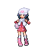

# Important Trainers

### PKMN Trainer Dawn

=== "Turtwig"

	| Pokémon | Attributes | Moves |
	|:-------:|------------|-------|
	|  | **Lv. 9** Chimchar **Ability:** Blaze **Nature:** ? **Item:** No Item | **1.** Scratch **2.** Leer **3.** Ember **4.** — |
	
=== "Chimchar"

	| Pokémon | Attributes | Moves |
	|:-------:|------------|-------|
	|  | **Lv. 9** Piplup **Ability:** Torrent **Nature:** ? **Item:** No Item | **1.** Pound **2.** Growl **3.** Bubble **4.** — |
	
=== "Piplup"

	| Pokémon | Attributes | Moves |
	|:-------:|------------|-------|
	|  | **Lv. 9** Turtwig **Ability:** Overgrow **Nature:** ? **Item:** No Item | **1.** Tackle **2.** Withdraw **3.** Absorb **4.** — |
	
### PKMN Trainer Lucas

=== "Turtwig"

	| Pokémon | Attributes | Moves |
	|:-------:|------------|-------|
	|  | **Lv. 9** Chimchar **Ability:** Blaze **Nature:** ? **Item:** No Item | **1.** Scratch **2.** Leer **3.** Ember **4.** — |
	
=== "Chimchar"

	| Pokémon | Attributes | Moves |
	|:-------:|------------|-------|
	|  | **Lv. 9** Piplup **Ability:** Torrent **Nature:** ? **Item:** No Item | **1.** Pound **2.** Growl **3.** Bubble **4.** — |
	
=== "Piplup"

	| Pokémon | Attributes | Moves |
	|:-------:|------------|-------|
	|  | **Lv. 9** Turtwig **Ability:** Overgrow **Nature:** ? **Item:** No Item | **1.** Tackle **2.** Withdraw **3.** Absorb **4.** — |
	
