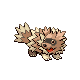

### Walking

| Sprite | Pokémon | Encounter Type | Level | Chance |
|:------:|---------|:--------------:|-------|--------|
|  | Shinx | {: style='max-width: 24px;' } | 5 - 6 | 20% |
|  | Zigzagoon | {: style='max-width: 24px;' } | 5 - 6 | 20% |
|  | Sentret | {: style='max-width: 24px;' } | 5 - 6 | 20% |
|  | Rattata | {: style='max-width: 24px;' } | 5 - 6 | 10% |
|  | Poochyena | {: style='max-width: 24px;' } | 5 - 6 | 10% |
|  | Growlithe | {: style='max-width: 24px;' } | 5 - 6 | 10% |
|  | Burmy | {: style='max-width: 24px;' } | 5 - 6 | 10% |
|  | Shinx | {: style='max-width: 24px;' } | 5 - 6 | 20% |
|  | Zigzagoon | {: style='max-width: 24px;' } | 5 - 6 | 20% |
|  | Sentret | {: style='max-width: 24px;' } | 5 - 6 | 20% |
|  | Rattata | {: style='max-width: 24px;' } | 5 - 6 | 10% |
|  | Poochyena | {: style='max-width: 24px;' } | 5 - 6 | 10% |
|  | Growlithe | {: style='max-width: 24px;' } | 5 - 6 | 10% |
|  | Burmy | {: style='max-width: 24px;' } | 5 - 6 | 10% |
|  | Shinx | {: style='max-width: 24px;' } | 5 - 6 | 20% |
|  | Zigzagoon | {: style='max-width: 24px;' } | 5 - 6 | 20% |
|  | Hoothoot | {: style='max-width: 24px;' } | 5 - 6 | 20% |
|  | Rattata | {: style='max-width: 24px;' } | 5 - 6 | 10% |
|  | Poochyena | {: style='max-width: 24px;' } | 5 - 6 | 10% |
|  | Growlithe | {: style='max-width: 24px;' } | 5 - 6 | 10% |
|  | Burmy | {: style='max-width: 24px;' } | 5 - 6 | 10% |
|  | Houndour | {: style='max-width: 24px;' } | 5 - 6 | 22% |

