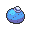

# Route 203 — Important Trainers

### PKMN Trainer Barry

=== "Turtwig"

	| Pokémon | Attributes | Item | Moves |
	|:-------:|------------|:----:|-------|
	|  | **Lv. 10** [Starly](../../pokemon/starly.md/) **Ability:** Reckless **Nature:** ?  | No Item | 1. Wing Attack 2. Tackle 3. Growl 4. — |
	|  | **Lv. 10** [Munchlax](../../pokemon/munchlax.md/) **Ability:** Thick Fat **Nature:** ? | No Item | 1. Tackle 2. Metronome 3. Amnesia 4. Rock Tomb |
	|  | **Lv. 11** [Chimchar](../../pokemon/chimchar.md/) **Ability:** Iron Fist **Nature:** ?  |  Oran Berry | 1. Ember 2. Fury Swipes 3. Taunt 4. — |
	
=== "Chimchar"

	| Pokémon | Attributes | Item | Moves |
	|:-------:|------------|:----:|-------|
	|  | **Lv. 10** [Starly](../../pokemon/starly.md/) **Ability:** Reckless **Nature:** ?  | No Item | 1. Wing Attack 2. Tackle 3. Growl 4. — |
	|  | **Lv. 10** [Munchlax](../../pokemon/munchlax.md/) **Ability:** Thick Fat **Nature:** ? | No Item | 1. Tackle 2. Metronome 3. Amnesia 4. Rock Tomb |
	|  | **Lv. 11** [Piplup](../../pokemon/piplup.md/) **Ability:** Torrent **Nature:** ?  |  Oran Berry | 1. Water Pulse 2. Pound 3. Peck 4. — |
	
=== "Piplup"

	| Pokémon | Attributes | Item | Moves |
	|:-------:|------------|:----:|-------|
	|  | **Lv. 10** [Starly](../../pokemon/starly.md/) **Ability:** Reckless **Nature:** ?  | No Item | 1. Wing Attack 2. Tackle 3. Growl 4. — |
	|  | **Lv. 10** [Munchlax](../../pokemon/munchlax.md/) **Ability:** Thick Fat **Nature:** ? | No Item | 1. Tackle 2. Metronome 3. Amnesia 4. Rock Tomb |
	|  | **Lv. 11** [Turtwig](../../pokemon/turtwig.md/) **Ability:** Overgrow **Nature:** ?  |  Oran Berry | 1. Razor Leaf 2. Tackle 3. Curse 4. — |
	
