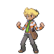
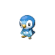

# Important Trainers

### PKMN Trainer Barry

=== "Turtwig"

	| Pokémon | Attributes | Moves |
	|:-------:|------------|-------|
	|  | **Lv. 11** Chimchar **Ability:** Iron Fist **Nature:** ? **Item:** Oran Berry | **1.** Ember **2.** Fury Swipes **3.** Taunt **4.** — |
	|  | **Lv. 10** Starly **Ability:** Reckless **Nature:** ? **Item:** No Item | **1.** Wing Attack **2.** Tackle **3.** Growl **4.** — |
	|  | **Lv. 10** Munchlax **Ability:** Thick Fat **Nature:** ? **Item:** No Item | **1.** Tackle **2.** Metronome **3.** Amnesia **4.** Rock Tomb |
	
=== "Chimchar"

	| Pokémon | Attributes | Moves |
	|:-------:|------------|-------|
	|  | **Lv. 11** Piplup **Ability:** Torrent **Nature:** ? **Item:** Oran Berry | **1.** Water Pulse **2.** Pound **3.** Peck **4.** — |
	|  | **Lv. 10** Starly **Ability:** Reckless **Nature:** ? **Item:** No Item | **1.** Wing Attack **2.** Tackle **3.** Growl **4.** — |
	|  | **Lv. 10** Munchlax **Ability:** Thick Fat **Nature:** ? **Item:** No Item | **1.** Tackle **2.** Metronome **3.** Amnesia **4.** Rock Tomb |
	
=== "Piplup"

	| Pokémon | Attributes | Moves |
	|:-------:|------------|-------|
	|  | **Lv. 11** Turtwig **Ability:** Overgrow **Nature:** ? **Item:** Oran Berry | **1.** Razor Leaf **2.** Tackle **3.** Curse **4.** — |
	|  | **Lv. 10** Starly **Ability:** Reckless **Nature:** ? **Item:** No Item | **1.** Wing Attack **2.** Tackle **3.** Growl **4.** — |
	|  | **Lv. 10** Munchlax **Ability:** Thick Fat **Nature:** ? **Item:** No Item | **1.** Tackle **2.** Metronome **3.** Amnesia **4.** Rock Tomb |
	
