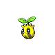

# Route 203 — Trainer Rosters

### Generic Trainers

| Trainer | P1 | P2 | P3 | P4 | P5 | P6 |
|:-------:|:--:|:--:|:--:|:--:|:--:|:--:|
|  Youngster Michael |  [Kricketot](../../pokemon/kricketot.md/) Lv. 9 |  [Zubat](../../pokemon/zubat.md/) Lv. 9 |  [Rattata](../../pokemon/rattata.md/) Lv. 9 |
| ") Youngster Dallas [(!)](#rematches) |  [Shinx](../../pokemon/shinx.md/) Lv. 10 |  [Sandshrew](../../pokemon/sandshrew.md/) Lv. 10 |
|  Youngster Sebastian |  [Makuhita](../../pokemon/makuhita.md/) Lv. 10 |  [Machop](../../pokemon/machop.md/) Lv. 10 |
|  Lass Kaitlin |  [Spearow](../../pokemon/spearow.md/) Lv. 9 |  [Cubone](../../pokemon/cubone.md/) Lv. 9 |  [Azurill](../../pokemon/azurill.md/) Lv. 9 |
| ") Lass Madeline [(!)](#rematches) |  [Psyduck](../../pokemon/psyduck.md/) Lv. 10 |  [Sunkern](../../pokemon/sunkern.md/) Lv. 10 |

### Rematches

| Trainer | P1 | P2 | P3 | P4 | P5 | P6 |
|:-------:|:--:|:--:|:--:|:--:|:--:|:--:|
| ") Youngster Dallas (3) |  [Luxio](../../pokemon/luxio.md/) Lv. 27 |  [Sandslash](../../pokemon/sandslash.md/) Lv. 27 |
| ") Youngster Dallas (5) |  [Luxio](../../pokemon/luxio.md/) Lv. 38 |  [Sandslash](../../pokemon/sandslash.md/) Lv. 38 |  [Bibarel](../../pokemon/bibarel.md/) Lv. 38 |
| ") Youngster Dallas (C) |  [Luxray](../../pokemon/luxray.md/) Lv. 69 |  [Sandslash](../../pokemon/sandslash.md/) Lv. 69 |  [Bibarel](../../pokemon/bibarel.md/) Lv. 69 |  [Golem](../../pokemon/golem.md/) Lv. 69 |
| ") Lass Madeline (3) |  [Psyduck](../../pokemon/psyduck.md/) Lv. 26 |  [Sunkern](../../pokemon/sunkern.md/) Lv. 26 |  [Buneary](../../pokemon/buneary.md/) Lv. 26 |
| ") Lass Madeline (5) |  [Golduck](../../pokemon/golduck.md/) Lv. 38 |  [Sunflora](../../pokemon/sunflora.md/) Lv. 38 |  [Lopunny](../../pokemon/lopunny.md/) Lv. 38 |
| ") Lass Madeline (8) |  [Golduck](../../pokemon/golduck.md/) Lv. 59 |  [Sunflora](../../pokemon/sunflora.md/) Lv. 59 |  [Lopunny](../../pokemon/lopunny.md/) Lv. 59 |

### Important Trainers

1. [PKMN Trainer Barry](important_trainers.md#pkmn-trainer-barry)
