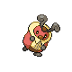

# Trainer Rosters

### Generic Trainers

| Trainer | P1 | P2 | P3 | P4 | P5 | P6 |
|:-------:|:--:|:--:|:--:|:--:|:--:|:--:|
|  Youngster Michael |  Kricketot Lv. 9 |  Zubat Lv. 9 |  Rattata Lv. 9 |
| ](../../assets/trainers/youngster.png "Youngster Dallas [(!)](#rematches)") Youngster Dallas [(!)](#rematches) |  Shinx Lv. 10 |  Sandshrew Lv. 10 |
|  Youngster Sebastian |  Makuhita Lv. 10 |  Machop Lv. 10 |
|  Lass Kaitlin |  Spearow Lv. 9 |  Cubone Lv. 9 |  Azurill Lv. 9 |
| ](../../assets/trainers/lass.png "Lass Madeline [(!)](#rematches)") Lass Madeline [(!)](#rematches) |  Psyduck Lv. 10 |  Sunkern Lv. 10 |

### Rematches

| Trainer | P1 | P2 | P3 | P4 | P5 | P6 |
|:-------:|:--:|:--:|:--:|:--:|:--:|:--:|
| ") Youngster Dallas (3) |  Luxio Lv. 27 |  Sandslash Lv. 27 |
| ") Youngster Dallas (5) |  Luxio Lv. 38 |  Sandslash Lv. 38 |  Bibarel Lv. 38 |
| ") Youngster Dallas (C) |  Luxray Lv. 69 |  Sandslash Lv. 69 |  Bibarel Lv. 69 |  Golem Lv. 69 |
| ") Lass Madeline (3) |  Psyduck Lv. 26 |  Sunkern Lv. 26 |  Buneary Lv. 26 |
| ") Lass Madeline (5) |  Golduck Lv. 38 |  Sunflora Lv. 38 |  Lopunny Lv. 38 |
| ") Lass Madeline (8) |  Golduck Lv. 59 |  Sunflora Lv. 59 |  Lopunny Lv. 59 |

### Important Trainers

1. [PKMN Trainer Barry](important_trainers.md#pkmn-trainer-barry)
