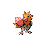

### Walking

| Sprite | Pokémon | Encounter Type | Level | Chance |
|:------:|---------|:--------------:|-------|--------|
|  | [Starly](../../pokemon/starly.md/) | {: style='max-width: 24px;' } | 7 - 8 | 25% |
|  | [Bidoof](../../pokemon/bidoof.md/) | {: style='max-width: 24px;' } | 7 - 8 | 20% |
|  | [Spearow](../../pokemon/spearow.md/) | {: style='max-width: 24px;' } | 7 - 8 | 15% |
|  | [Seedot](../../pokemon/seedot.md/) | {: style='max-width: 24px;' } | 7 - 8 | 10% |
|  | [Lotad](../../pokemon/lotad.md/) | {: style='max-width: 24px;' } | 7 - 8 | 10% |
|  | [Cubone](../../pokemon/cubone.md/) | {: style='max-width: 24px;' } | 7 - 8 | 10% |
|  | [Abra](../../pokemon/abra.md/) | {: style='max-width: 24px;' } | 7 - 8 | 10% |
|  | [Starly](../../pokemon/starly.md/) | {: style='max-width: 24px;' } | 7 - 8 | 25% |
|  | [Bidoof](../../pokemon/bidoof.md/) | {: style='max-width: 24px;' } | 7 - 8 | 20% |
|  | [Spearow](../../pokemon/spearow.md/) | {: style='max-width: 24px;' } | 7 - 8 | 15% |
|  | [Seedot](../../pokemon/seedot.md/) | {: style='max-width: 24px;' } | 7 - 8 | 10% |
|  | [Lotad](../../pokemon/lotad.md/) | {: style='max-width: 24px;' } | 7 - 8 | 10% |
|  | [Cubone](../../pokemon/cubone.md/) | {: style='max-width: 24px;' } | 7 - 8 | 10% |
|  | [Abra](../../pokemon/abra.md/) | {: style='max-width: 24px;' } | 7 - 8 | 10% |
|  | [Starly](../../pokemon/starly.md/) | {: style='max-width: 24px;' } | 7 - 8 | 25% |
|  | [Bidoof](../../pokemon/bidoof.md/) | {: style='max-width: 24px;' } | 7 - 8 | 20% |
|  | [Spearow](../../pokemon/spearow.md/) | {: style='max-width: 24px;' } | 7 - 8 | 15% |
|  | [Seedot](../../pokemon/seedot.md/) | {: style='max-width: 24px;' } | 7 - 8 | 10% |
|  | [Lotad](../../pokemon/lotad.md/) | {: style='max-width: 24px;' } | 7 - 8 | 10% |
|  | [Cubone](../../pokemon/cubone.md/) | {: style='max-width: 24px;' } | 7 - 8 | 10% |
|  | [Abra](../../pokemon/abra.md/) | {: style='max-width: 24px;' } | 7 - 8 | 10% |
|  | [Pineco](../../pokemon/pineco.md/) | {: style='max-width: 24px;' } | 7 - 8 | 22% |

### Surfing

| Sprite | Pokémon | Encounter Type | Level | Chance |
|:------:|---------|:--------------:|-------|--------|
|  | [Psyduck](../../pokemon/psyduck.md/) | {: style='max-width: 24px;' } | 20 - 40 | 90% |
|  | [Golduck](../../pokemon/golduck.md/) | {: style='max-width: 24px;' } | 20 - 40 | 10% |

### Fishing

| Sprite | Pokémon | Encounter Type | Level | Chance |
|:------:|---------|:--------------:|-------|--------|
|  | [Magikarp](../../pokemon/magikarp.md/) | {: style='max-width: 24px;' } | 10 | 65% |
|  | [Corphish](../../pokemon/corphish.md/) | {: style='max-width: 24px;' } | 10 | 35% |
|  | [Magikarp](../../pokemon/magikarp.md/) | {: style='max-width: 24px;' } | 25 | 60% |
|  | [Corphish](../../pokemon/corphish.md/) | {: style='max-width: 24px;' } | 25 | 35% |
|  | [Gyarados](../../pokemon/gyarados.md/) | {: style='max-width: 24px;' } | 50 | 60% |
|  | [Crawdaunt](../../pokemon/crawdaunt.md/) | {: style='max-width: 24px;' } | 50 | 35% |

