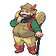
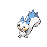
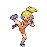

# Route 205 — Trainer Rosters

---

## South

### Generic Trainers

| Trainer | P1 | P2 | P3 | P4 | P5 | P6 |
|:-------:|:--:|:--:|:--:|:--:|:--:|:--:|
|  Hiker Daniel |  [Diglett](../../pokemon/diglett.md/) Lv. 15 |  [Shieldon](../../pokemon/shieldon.md/) Lv. 15 |  [Numel](../../pokemon/numel.md/) Lv. 15 |
| ") Aroma Lady Elizabeth [(!)](#rematches) |  [Chikorita](../../pokemon/chikorita.md/) Lv. 16 |  [Bulbasaur](../../pokemon/bulbasaur.md/) Lv. 16 |
|  Camper Jacob |  [Ponyta](../../pokemon/ponyta.md/) Lv. 15 |  [Mareep](../../pokemon/mareep.md/) Lv. 15 |  [Buizel](../../pokemon/buizel.md/) Lv. 15 |
|  Picnicker Siena |  [Pachirisu](../../pokemon/pachirisu.md/) Lv. 17 |
|  Hiker Nicholas |  [Shellos](../../pokemon/shellos.md/) Lv. 16 |  [Onix](../../pokemon/onix.md/) Lv. 16 |
|  Battle Girl Kelsey |  [Machop](../../pokemon/machop.md/) Lv. 16 |  [Mankey](../../pokemon/mankey.md/) Lv. 16 |  [Meditite](../../pokemon/meditite.md/) Lv. 16 |
| ") Picnicker Karina [(!)](#rematches) |  [Piplup](../../pokemon/piplup.md/) Lv. 16 |  [Chimchar](../../pokemon/chimchar.md/) Lv. 16 |
| ") Camper Zackary [(!)](#rematches) |  [Aipom](../../pokemon/aipom.md/) Lv. 15 |  [Slakoth](../../pokemon/slakoth.md/) Lv. 15 |  [Taillow](../../pokemon/taillow.md/) Lv. 15 |

### Rematches

| Trainer | P1 | P2 | P3 | P4 | P5 | P6 |
|:-------:|:--:|:--:|:--:|:--:|:--:|:--:|
| ") Aroma Lady Elizabeth (3) |  [Bayleef](../../pokemon/bayleef.md/) Lv. 27 |  [Ivysaur](../../pokemon/ivysaur.md/) Lv. 27 |
| ") Aroma Lady Elizabeth (5) |  [Meganium](../../pokemon/meganium.md/) Lv. 39 |  [Venusaur](../../pokemon/venusaur.md/) Lv. 39 |
| ") Aroma Lady Elizabeth (C) |  [Meganium](../../pokemon/meganium.md/) Lv. 71 |  [Venusaur](../../pokemon/venusaur.md/) Lv. 71 |
| ") Camper Zackary (3) |  [Aipom](../../pokemon/aipom.md/) Lv. 26 |  [Vigoroth](../../pokemon/vigoroth.md/) Lv. 26 |  [Swellow](../../pokemon/swellow.md/) Lv. 26 |
| ") Camper Zackary (5) |  [Ambipom](../../pokemon/ambipom.md/) Lv. 38 |  [Vigoroth](../../pokemon/vigoroth.md/) Lv. 38 |  [Swellow](../../pokemon/swellow.md/) Lv. 38 |
| ") Camper Zackary (C) |  [Ambipom](../../pokemon/ambipom.md/) Lv. 70 |  [Slaking](../../pokemon/slaking.md/) Lv. 70 |  [Swellow](../../pokemon/swellow.md/) Lv. 70 |
| ") Picnicker Karina (3) |  [Prinplup](../../pokemon/prinplup.md/) Lv. 27 |  [Monferno](../../pokemon/monferno.md/) Lv. 27 |
| ") Picnicker Karina (5) |  [Empoleon](../../pokemon/empoleon.md/) Lv. 39 |  [Infernape](../../pokemon/infernape.md/) Lv. 39 |
| ") Picnicker Karina (C) |  [Empoleon](../../pokemon/empoleon.md/) Lv. 71 |  [Infernape](../../pokemon/infernape.md/) Lv. 71 |

---

## North

### Generic Trainers

| Trainer | P1 | P2 | P3 | P4 | P5 | P6 |
|:-------:|:--:|:--:|:--:|:--:|:--:|:--:|
| ") Fisherman Joseph [(!)](#rematches) |  [Goldeen](../../pokemon/goldeen.md/) Lv. 18 |  [Poliwag](../../pokemon/poliwag.md/) Lv. 18 |  [Corphish](../../pokemon/corphish.md/) Lv. 18 |
|  Fisherman Andrew |  [Magikarp](../../pokemon/magikarp.md/) Lv. 18 |  [Feebas](../../pokemon/feebas.md/) Lv. 18 |  [Magikarp](../../pokemon/magikarp.md/) Lv. 18 |
|  Fisherman Zachary |  [Krabby](../../pokemon/krabby.md/) Lv. 19 |  [Finneon](../../pokemon/finneon.md/) Lv. 19 |

### Rematches

| Trainer | P1 | P2 | P3 | P4 | P5 | P6 |
|:-------:|:--:|:--:|:--:|:--:|:--:|:--:|
| ") Fisherman Joseph (5) |  [Seaking](../../pokemon/seaking.md/) Lv. 38 |  [Poliwhirl](../../pokemon/poliwhirl.md/) Lv. 38 |  [Crawdaunt](../../pokemon/crawdaunt.md/) Lv. 38 |
| ") Fisherman Joseph (C) |  [Seaking](../../pokemon/seaking.md/) Lv. 70 |  [Politoed](../../pokemon/politoed.md/) Lv. 70 |  [Crawdaunt](../../pokemon/crawdaunt.md/) Lv. 70 |

