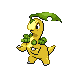
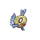

# Trainer Rosters

---

## South

### Generic Trainers

| Trainer | P1 | P2 | P3 | P4 | P5 | P6 |
|:-------:|:--:|:--:|:--:|:--:|:--:|:--:|
|  Hiker Daniel |  Diglett Lv. 15 |  Shieldon Lv. 15 |  Numel Lv. 15 |
| ](../../assets/trainers/aroma_lady.png "Aroma Lady Elizabeth [(!)](#rematches)") Aroma Lady Elizabeth [(!)](#rematches) |  Chikorita Lv. 16 |  Bulbasaur Lv. 16 |
|  Camper Jacob |  Ponyta Lv. 15 |  Mareep Lv. 15 |  Buizel Lv. 15 |
|  Picnicker Siena |  Pachirisu Lv. 17 |
|  Hiker Nicholas |  Shellos Lv. 16 |  Onix Lv. 16 |
|  Battle Girl Kelsey |  Machop Lv. 16 |  Mankey Lv. 16 |  Meditite Lv. 16 |
| ](../../assets/trainers/picnicker.png "Picnicker Karina [(!)](#rematches)") Picnicker Karina [(!)](#rematches) |  Piplup Lv. 16 |  Chimchar Lv. 16 |
| ](../../assets/trainers/camper.png "Camper Zackary [(!)](#rematches)") Camper Zackary [(!)](#rematches) |  Aipom Lv. 15 |  Slakoth Lv. 15 |  Taillow Lv. 15 |

### Rematches

| Trainer | P1 | P2 | P3 | P4 | P5 | P6 |
|:-------:|:--:|:--:|:--:|:--:|:--:|:--:|
| ") Aroma Lady Elizabeth (3) |  Bayleef Lv. 27 |  Ivysaur Lv. 27 |
| ") Aroma Lady Elizabeth (5) |  Meganium Lv. 39 |  Venusaur Lv. 39 |
| ") Aroma Lady Elizabeth (C) |  Meganium Lv. 71 |  Venusaur Lv. 71 |
| ") Camper Zackary (3) |  Aipom Lv. 26 |  Vigoroth Lv. 26 |  Swellow Lv. 26 |
| ") Camper Zackary (5) |  Ambipom Lv. 38 |  Vigoroth Lv. 38 |  Swellow Lv. 38 |
| ") Camper Zackary (C) |  Ambipom Lv. 70 |  Slaking Lv. 70 |  Swellow Lv. 70 |
| ") Picnicker Karina (3) |  Prinplup Lv. 27 |  Monferno Lv. 27 |
| ") Picnicker Karina (5) |  Empoleon Lv. 39 |  Infernape Lv. 39 |
| ") Picnicker Karina (C) |  Empoleon Lv. 71 |  Infernape Lv. 71 |

---

## North

### Generic Trainers

| Trainer | P1 | P2 | P3 | P4 | P5 | P6 |
|:-------:|:--:|:--:|:--:|:--:|:--:|:--:|
| ](../../assets/trainers/fisherman.png "Fisherman Joseph [(!)](#rematches)") Fisherman Joseph [(!)](#rematches) |  Goldeen Lv. 18 |  Poliwag Lv. 18 |  Corphish Lv. 18 |
|  Fisherman Andrew |  Magikarp Lv. 18 |  Feebas Lv. 18 |  Magikarp Lv. 18 |
|  Fisherman Zachary |  Krabby Lv. 19 |  Finneon Lv. 19 |

### Rematches

| Trainer | P1 | P2 | P3 | P4 | P5 | P6 |
|:-------:|:--:|:--:|:--:|:--:|:--:|:--:|
| ") Fisherman Joseph (5) |  Seaking Lv. 38 |  Poliwhirl Lv. 38 |  Crawdaunt Lv. 38 |
| ") Fisherman Joseph (C) |  Seaking Lv. 70 |  Politoed Lv. 70 |  Crawdaunt Lv. 70 |

