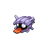

# Route 205 — Wild Pokémon

---

## South

### Walking

| Sprite | Pokémon | Encounter Type | Level | Chance |
|:------:|---------|:--------------:|-------|--------|
|  | [Shellos](../../pokemon/shellos.md/) | {: style='max-width: 24px;' } | 11 - 13 | 30% |
|  | [Mareep](../../pokemon/mareep.md/) | {: style='max-width: 24px;' } | 11 - 13 | 20% |
|  | [Buizel](../../pokemon/buizel.md/) | {: style='max-width: 24px;' } | 11 - 13 | 20% |
|  | [Hoppip](../../pokemon/hoppip.md/) | {: style='max-width: 24px;' } | 11 - 13 | 20% |
|  | [Pachirisu](../../pokemon/pachirisu.md/) | {: style='max-width: 24px;' } | 11 - 13 | 10% |
|  | [Shellos](../../pokemon/shellos.md/) | {: style='max-width: 24px;' } | 11 - 13 | 30% |
|  | [Mareep](../../pokemon/mareep.md/) | {: style='max-width: 24px;' } | 11 - 13 | 20% |
|  | [Buizel](../../pokemon/buizel.md/) | {: style='max-width: 24px;' } | 11 - 13 | 20% |
|  | [Hoppip](../../pokemon/hoppip.md/) | {: style='max-width: 24px;' } | 11 - 13 | 20% |
|  | [Pachirisu](../../pokemon/pachirisu.md/) | {: style='max-width: 24px;' } | 11 - 13 | 10% |
|  | [Shellos](../../pokemon/shellos.md/) | {: style='max-width: 24px;' } | 11 - 13 | 30% |
|  | [Mareep](../../pokemon/mareep.md/) | {: style='max-width: 24px;' } | 11 - 13 | 20% |
|  | [Buizel](../../pokemon/buizel.md/) | {: style='max-width: 24px;' } | 11 - 13 | 20% |
|  | [Venonat](../../pokemon/venonat.md/) | {: style='max-width: 24px;' } | 11 - 13 | 20% |
|  | [Pachirisu](../../pokemon/pachirisu.md/) | {: style='max-width: 24px;' } | 11 - 13 | 10% |
|  | [Plusle](../../pokemon/plusle.md/) | {: style='max-width: 24px;' } | 11 - 13 | 11% |
|  | [Minun](../../pokemon/minun.md/) | {: style='max-width: 24px;' } | 11 - 13 | 11% |

### Surfing

| Sprite | Pokémon | Encounter Type | Level | Chance |
|:------:|---------|:--------------:|-------|--------|
|  | [Shellos](../../pokemon/shellos.md/) | {: style='max-width: 24px;' } | 20 - 40 | 60% |
|  | [Tentacool](../../pokemon/tentacool.md/) | {: style='max-width: 24px;' } | 20 - 40 | 30% |
|  | [Gastrodon](../../pokemon/gastrodon.md/) | {: style='max-width: 24px;' } | 20 - 40 | 5% |
|  | [Tentacruel](../../pokemon/tentacruel.md/) | {: style='max-width: 24px;' } | 20 - 40 | 5% |

### Fishing

| Sprite | Pokémon | Encounter Type | Level | Chance |
|:------:|---------|:--------------:|-------|--------|
|  | [Magikarp](../../pokemon/magikarp.md/) | {: style='max-width: 24px;' } | 10 | 60% |
|  | [Shellder](../../pokemon/shellder.md/) | {: style='max-width: 24px;' } | 10 | 30% |
|  | [Chinchou](../../pokemon/chinchou.md/) | {: style='max-width: 24px;' } | 10 | 10% |
|  | [Magikarp](../../pokemon/magikarp.md/) | {: style='max-width: 24px;' } | 25 | 60% |
|  | [Shellder](../../pokemon/shellder.md/) | {: style='max-width: 24px;' } | 25 | 30% |
|  | [Chinchou](../../pokemon/chinchou.md/) | {: style='max-width: 24px;' } | 25 | 10% |
|  | [Gyarados](../../pokemon/gyarados.md/) | {: style='max-width: 24px;' } | 50 | 60% |
|  | [Cloyster](../../pokemon/cloyster.md/) | {: style='max-width: 24px;' } | 50 | 30% |
|  | [Lanturn](../../pokemon/lanturn.md/) | {: style='max-width: 24px;' } | 50 | 10% |

### Honey Tree

| Sprite | Pokémon | Encounter Type | Level | Chance |
|:------:|---------|:--------------:|-------|--------|
|  | [Combee](../../pokemon/combee.md/) | {: style='max-width: 24px;' } | 12 | 30% |
|  | [Burmy](../../pokemon/burmy.md/) | {: style='max-width: 24px;' } | 12 | 20% |
|  | [Pineco](../../pokemon/pineco.md/) | {: style='max-width: 24px;' } | 12 | 20% |
|  | [Wurmple](../../pokemon/wurmple.md/) | {: style='max-width: 24px;' } | 12 | 20% |
|  | [Heracross](../../pokemon/heracross.md/) | {: style='max-width: 24px;' } | 12 | 10% |

---

## North

### Walking

| Sprite | Pokémon | Encounter Type | Level | Chance |
|:------:|---------|:--------------:|-------|--------|
|  | [Bidoof](../../pokemon/bidoof.md/) | {: style='max-width: 24px;' } | 15 - 17 | 20% |
|  | [Slowpoke](../../pokemon/slowpoke.md/) | {: style='max-width: 24px;' } | 15 - 17 | 20% |
|  | [Marill](../../pokemon/marill.md/) | {: style='max-width: 24px;' } | 15 - 17 | 20% |
|  | [Croagunk](../../pokemon/croagunk.md/) | {: style='max-width: 24px;' } | 15 - 17 | 10% |
|  | [Exeggcute](../../pokemon/exeggcute.md/) | {: style='max-width: 24px;' } | 15 - 17 | 10% |
|  | [Volbeat](../../pokemon/volbeat.md/) | {: style='max-width: 24px;' } | 15 - 17 | 10% |
|  | [Illumise](../../pokemon/illumise.md/) | {: style='max-width: 24px;' } | 15 - 17 | 10% |
|  | [Bidoof](../../pokemon/bidoof.md/) | {: style='max-width: 24px;' } | 15 - 17 | 20% |
|  | [Slowpoke](../../pokemon/slowpoke.md/) | {: style='max-width: 24px;' } | 15 - 17 | 20% |
|  | [Marill](../../pokemon/marill.md/) | {: style='max-width: 24px;' } | 15 - 17 | 20% |
|  | [Croagunk](../../pokemon/croagunk.md/) | {: style='max-width: 24px;' } | 15 - 17 | 10% |
|  | [Exeggcute](../../pokemon/exeggcute.md/) | {: style='max-width: 24px;' } | 15 - 17 | 10% |
|  | [Volbeat](../../pokemon/volbeat.md/) | {: style='max-width: 24px;' } | 15 - 17 | 10% |
|  | [Illumise](../../pokemon/illumise.md/) | {: style='max-width: 24px;' } | 15 - 17 | 10% |
|  | [Bidoof](../../pokemon/bidoof.md/) | {: style='max-width: 24px;' } | 15 - 17 | 20% |
|  | [Slowpoke](../../pokemon/slowpoke.md/) | {: style='max-width: 24px;' } | 15 - 17 | 20% |
|  | [Marill](../../pokemon/marill.md/) | {: style='max-width: 24px;' } | 15 - 17 | 20% |
|  | [Croagunk](../../pokemon/croagunk.md/) | {: style='max-width: 24px;' } | 15 - 17 | 10% |
|  | [Exeggcute](../../pokemon/exeggcute.md/) | {: style='max-width: 24px;' } | 15 - 17 | 10% |
|  | [Volbeat](../../pokemon/volbeat.md/) | {: style='max-width: 24px;' } | 15 - 17 | 10% |
|  | [Illumise](../../pokemon/illumise.md/) | {: style='max-width: 24px;' } | 15 - 17 | 10% |
|  | [Yanma](../../pokemon/yanma.md/) | {: style='max-width: 24px;' } | 15 - 17 | 22% |

### Surfing

| Sprite | Pokémon | Encounter Type | Level | Chance |
|:------:|---------|:--------------:|-------|--------|
|  | [Marill](../../pokemon/marill.md/) | {: style='max-width: 24px;' } | 20 - 40 | 90% |
|  | [Azumarill](../../pokemon/azumarill.md/) | {: style='max-width: 24px;' } | 20 - 40 | 10% |

### Fishing

| Sprite | Pokémon | Encounter Type | Level | Chance |
|:------:|---------|:--------------:|-------|--------|
|  | [Magikarp](../../pokemon/magikarp.md/) | {: style='max-width: 24px;' } | 10 | 65% |
|  | [Corphish](../../pokemon/corphish.md/) | {: style='max-width: 24px;' } | 10 | 35% |
|  | [Magikarp](../../pokemon/magikarp.md/) | {: style='max-width: 24px;' } | 25 | 65% |
|  | [Corphish](../../pokemon/corphish.md/) | {: style='max-width: 24px;' } | 25 | 35% |
|  | [Gyarados](../../pokemon/gyarados.md/) | {: style='max-width: 24px;' } | 50 | 65% |
|  | [Crawdaunt](../../pokemon/crawdaunt.md/) | {: style='max-width: 24px;' } | 50 | 35% |

### Honey Tree

| Sprite | Pokémon | Encounter Type | Level | Chance |
|:------:|---------|:--------------:|-------|--------|
|  | [Starly](../../pokemon/starly.md/) | {: style='max-width: 24px;' } | 16 | 30% |
|  | [Pidgey](../../pokemon/pidgey.md/) | {: style='max-width: 24px;' } | 16 | 20% |
|  | [Hoothoot](../../pokemon/hoothoot.md/) | {: style='max-width: 24px;' } | 16 | 20% |
|  | [Taillow](../../pokemon/taillow.md/) | {: style='max-width: 24px;' } | 16 | 20% |
|  | [Farfetch'd](../../pokemon/farfetchd.md/) | {: style='max-width: 24px;' } | 16 | 10% |

