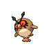

---

## South

### Walking

| Sprite | Pokémon | Encounter Type | Level | Chance |
|:------:|---------|:--------------:|-------|--------|
|  | Shellos | {: style='max-width: 24px;' } | 11 - 13 | 30% |
|  | Mareep | {: style='max-width: 24px;' } | 11 - 13 | 20% |
|  | Buizel | {: style='max-width: 24px;' } | 11 - 13 | 20% |
|  | Hoppip | {: style='max-width: 24px;' } | 11 - 13 | 20% |
|  | Pachirisu | {: style='max-width: 24px;' } | 11 - 13 | 10% |
|  | Shellos | {: style='max-width: 24px;' } | 11 - 13 | 30% |
|  | Mareep | {: style='max-width: 24px;' } | 11 - 13 | 20% |
|  | Buizel | {: style='max-width: 24px;' } | 11 - 13 | 20% |
|  | Hoppip | {: style='max-width: 24px;' } | 11 - 13 | 20% |
|  | Pachirisu | {: style='max-width: 24px;' } | 11 - 13 | 10% |
|  | Shellos | {: style='max-width: 24px;' } | 11 - 13 | 30% |
|  | Mareep | {: style='max-width: 24px;' } | 11 - 13 | 20% |
|  | Buizel | {: style='max-width: 24px;' } | 11 - 13 | 20% |
|  | Venonat | {: style='max-width: 24px;' } | 11 - 13 | 20% |
|  | Pachirisu | {: style='max-width: 24px;' } | 11 - 13 | 10% |
|  | Plusle | {: style='max-width: 24px;' } | 11 - 13 | 11% |
|  | Minun | {: style='max-width: 24px;' } | 11 - 13 | 11% |

### Surfing

| Sprite | Pokémon | Encounter Type | Level | Chance |
|:------:|---------|:--------------:|-------|--------|
|  | Shellos | {: style='max-width: 24px;' } | 20 - 40 | 60% |
|  | Tentacool | {: style='max-width: 24px;' } | 20 - 40 | 30% |
|  | Gastrodon | {: style='max-width: 24px;' } | 20 - 40 | 5% |
|  | Tentacruel | {: style='max-width: 24px;' } | 20 - 40 | 5% |

### Fishing

| Sprite | Pokémon | Encounter Type | Level | Chance |
|:------:|---------|:--------------:|-------|--------|
|  | Magikarp | {: style='max-width: 24px;' } | 10 | 60% |
|  | Shellder | {: style='max-width: 24px;' } | 10 | 30% |
|  | Chinchou | {: style='max-width: 24px;' } | 10 | 10% |
|  | Magikarp | {: style='max-width: 24px;' } | 25 | 60% |
|  | Shellder | {: style='max-width: 24px;' } | 25 | 30% |
|  | Chinchou | {: style='max-width: 24px;' } | 25 | 10% |
|  | Gyarados | {: style='max-width: 24px;' } | 50 | 60% |
|  | Cloyster | {: style='max-width: 24px;' } | 50 | 30% |
|  | Lanturn | {: style='max-width: 24px;' } | 50 | 10% |

### Honey Tree

| Sprite | Pokémon | Encounter Type | Level | Chance |
|:------:|---------|:--------------:|-------|--------|
|  | Combee | {: style='max-width: 24px;' } | 12 | 30% |
|  | Burmy | {: style='max-width: 24px;' } | 12 | 20% |
|  | Pineco | {: style='max-width: 24px;' } | 12 | 20% |
|  | Wurmple | {: style='max-width: 24px;' } | 12 | 20% |
|  | Heracross | {: style='max-width: 24px;' } | 12 | 10% |

---

## North

### Walking

| Sprite | Pokémon | Encounter Type | Level | Chance |
|:------:|---------|:--------------:|-------|--------|
|  | Bidoof | {: style='max-width: 24px;' } | 15 - 17 | 20% |
|  | Slowpoke | {: style='max-width: 24px;' } | 15 - 17 | 20% |
|  | Marill | {: style='max-width: 24px;' } | 15 - 17 | 20% |
|  | Croagunk | {: style='max-width: 24px;' } | 15 - 17 | 10% |
|  | Exeggcute | {: style='max-width: 24px;' } | 15 - 17 | 10% |
|  | Volbeat | {: style='max-width: 24px;' } | 15 - 17 | 10% |
|  | Illumise | {: style='max-width: 24px;' } | 15 - 17 | 10% |
|  | Bidoof | {: style='max-width: 24px;' } | 15 - 17 | 20% |
|  | Slowpoke | {: style='max-width: 24px;' } | 15 - 17 | 20% |
|  | Marill | {: style='max-width: 24px;' } | 15 - 17 | 20% |
|  | Croagunk | {: style='max-width: 24px;' } | 15 - 17 | 10% |
|  | Exeggcute | {: style='max-width: 24px;' } | 15 - 17 | 10% |
|  | Volbeat | {: style='max-width: 24px;' } | 15 - 17 | 10% |
|  | Illumise | {: style='max-width: 24px;' } | 15 - 17 | 10% |
|  | Bidoof | {: style='max-width: 24px;' } | 15 - 17 | 20% |
|  | Slowpoke | {: style='max-width: 24px;' } | 15 - 17 | 20% |
|  | Marill | {: style='max-width: 24px;' } | 15 - 17 | 20% |
|  | Croagunk | {: style='max-width: 24px;' } | 15 - 17 | 10% |
|  | Exeggcute | {: style='max-width: 24px;' } | 15 - 17 | 10% |
|  | Volbeat | {: style='max-width: 24px;' } | 15 - 17 | 10% |
|  | Illumise | {: style='max-width: 24px;' } | 15 - 17 | 10% |
|  | Yanma | {: style='max-width: 24px;' } | 15 - 17 | 22% |

### Surfing

| Sprite | Pokémon | Encounter Type | Level | Chance |
|:------:|---------|:--------------:|-------|--------|
|  | Marill | {: style='max-width: 24px;' } | 20 - 40 | 90% |
|  | Azumarill | {: style='max-width: 24px;' } | 20 - 40 | 10% |

### Fishing

| Sprite | Pokémon | Encounter Type | Level | Chance |
|:------:|---------|:--------------:|-------|--------|
|  | Magikarp | {: style='max-width: 24px;' } | 10 | 65% |
|  | Corphish | {: style='max-width: 24px;' } | 10 | 35% |
|  | Magikarp | {: style='max-width: 24px;' } | 25 | 65% |
|  | Corphish | {: style='max-width: 24px;' } | 25 | 35% |
|  | Gyarados | {: style='max-width: 24px;' } | 50 | 65% |
|  | Crawdaunt | {: style='max-width: 24px;' } | 50 | 35% |

### Honey Tree

| Sprite | Pokémon | Encounter Type | Level | Chance |
|:------:|---------|:--------------:|-------|--------|
|  | Starly | {: style='max-width: 24px;' } | 16 | 30% |
|  | Pidgey | {: style='max-width: 24px;' } | 16 | 20% |
|  | Hoothoot | {: style='max-width: 24px;' } | 16 | 20% |
|  | Taillow | {: style='max-width: 24px;' } | 16 | 20% |
|  | Farfetch'd | {: style='max-width: 24px;' } | 16 | 10% |

