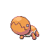

# Trainer Rosters

### Generic Trainers

| Trainer | P1 | P2 | P3 | P4 | P5 | P6 |
|:-------:|:--:|:--:|:--:|:--:|:--:|:--:|
|  Camper Anthony |  [Magby](../../pokemon/magby.md/) Lv. 24 |  [Trapinch](../../pokemon/trapinch.md/) Lv. 24 |  [Charmander](../../pokemon/charmander.md/) Lv. 24 |
|  Picnicker Lauren |  [Smoochum](../../pokemon/smoochum.md/) Lv. 24 |  [Snubbull](../../pokemon/snubbull.md/) Lv. 24 |  [Treecko](../../pokemon/treecko.md/) Lv. 24 |
|  Youngster Austin |  [Lombre](../../pokemon/lombre.md/) Lv. 25 |  [Gligar](../../pokemon/gligar.md/) Lv. 25 |
|  Hiker Justin |  [Graveler](../../pokemon/graveler.md/) Lv. 25 |  [Sandslash](../../pokemon/sandslash.md/) Lv. 25 |
|  Hiker Kevin |  [Dunsparce](../../pokemon/dunsparce.md/) Lv. 25 |  [Dunsparce](../../pokemon/dunsparce.md/) Lv. 25 |
| ") Battle Girl Helen [(!)](#rematches) |  [Tyrogue](../../pokemon/tyrogue.md/) Lv. 26 |  [Meditite](../../pokemon/meditite.md/) Lv. 26 |  [Hariyama](../../pokemon/hariyama.md/) Lv. 26 |

### Rematches

| Trainer | P1 | P2 | P3 | P4 | P5 | P6 |
|:-------:|:--:|:--:|:--:|:--:|:--:|:--:|
| ") Battle Girl Helen (3) |  [Tyrogue](../../pokemon/tyrogue.md/) Lv. 28 |  [Meditite](../../pokemon/meditite.md/) Lv. 28 |  [Hariyama](../../pokemon/hariyama.md/) Lv. 28 |
| ") Battle Girl Helen (7) |  [Hitmontop](../../pokemon/hitmontop.md/) Lv. 54 |  [Medicham](../../pokemon/medicham.md/) Lv. 54 |  [Hariyama](../../pokemon/hariyama.md/) Lv. 54 |
| ") Battle Girl Helen (C) |  [Hitmontop](../../pokemon/hitmontop.md/) Lv. 72 |  [Medicham](../../pokemon/medicham.md/) Lv. 72 |  [Hariyama](../../pokemon/hariyama.md/) Lv. 72 |

### Important Trainers

1. [PKMN Trainer Dawn](important_trainers.md#pkmn-trainer-dawn)
1. [PKMN Trainer Lucas](important_trainers.md#pkmn-trainer-lucas)
