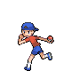

# Trainer Rosters

### Generic Trainers

| Trainer | P1 | P2 | P3 | P4 | P5 | P6 |
|:-------:|:--:|:--:|:--:|:--:|:--:|:--:|
|  Camper Anthony |  Magby Lv. 24 |  Trapinch Lv. 24 |  Charmander Lv. 24 |
|  Picnicker Lauren |  Smoochum Lv. 24 |  Snubbull Lv. 24 |  Treecko Lv. 24 |
|  Youngster Austin |  Lombre Lv. 25 |  Gligar Lv. 25 |
|  Hiker Justin |  Graveler Lv. 25 |  Sandslash Lv. 25 |
|  Hiker Kevin |  Dunsparce Lv. 25 |  Dunsparce Lv. 25 |
| ](../../assets/trainers/battle_girl.png) Battle Girl Helen [(!)](#rematches) |  Tyrogue Lv. 26 |  Meditite Lv. 26 |  Hariyama Lv. 26 |

### Rematches

| Trainer | P1 | P2 | P3 | P4 | P5 | P6 |
|:-------:|:--:|:--:|:--:|:--:|:--:|:--:|
|  Battle Girl Helen (3) |  Tyrogue Lv. 28 |  Meditite Lv. 28 |  Hariyama Lv. 28 |
|  Battle Girl Helen (7) |  Hitmontop Lv. 54 |  Medicham Lv. 54 |  Hariyama Lv. 54 |
|  Battle Girl Helen (C) |  Hitmontop Lv. 72 |  Medicham Lv. 72 |  Hariyama Lv. 72 |

### Important Trainers

1. [PKMN Trainer Dawn](important_trainers.md#pkmn-trainer-dawn)
1. [PKMN Trainer Lucas](important_trainers.md#pkmn-trainer-lucas)
