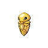

# Route 207 — Wild Pokémon

### Walking

| Sprite | Pokémon | Encounter Type | Level | Chance |
|:------:|---------|:--------------:|-------|--------|
|  | [Machop](../../pokemon/machop.md/) | {: style='max-width: 24px;' } | 9 - 10 | 30% |
|  | [Rhyhorn](../../pokemon/rhyhorn.md/) | {: style='max-width: 24px;' } | 9 - 10 | 20% |
|  | [Ponyta](../../pokemon/ponyta.md/) | {: style='max-width: 24px;' } | 9 - 10 | 20% |
|  | [Phanpy](../../pokemon/phanpy.md/) | {: style='max-width: 24px;' } | 9 - 10 | 20% |
|  | [Larvitar](../../pokemon/larvitar.md/) | {: style='max-width: 24px;' } | 9 - 10 | 10% |
|  | [Machop](../../pokemon/machop.md/) | {: style='max-width: 24px;' } | 9 - 10 | 30% |
|  | [Rhyhorn](../../pokemon/rhyhorn.md/) | {: style='max-width: 24px;' } | 9 - 10 | 20% |
|  | [Ponyta](../../pokemon/ponyta.md/) | {: style='max-width: 24px;' } | 9 - 10 | 20% |
|  | [Phanpy](../../pokemon/phanpy.md/) | {: style='max-width: 24px;' } | 9 - 10 | 20% |
|  | [Larvitar](../../pokemon/larvitar.md/) | {: style='max-width: 24px;' } | 9 - 10 | 10% |
|  | [Machop](../../pokemon/machop.md/) | {: style='max-width: 24px;' } | 9 - 10 | 30% |
|  | [Rhyhorn](../../pokemon/rhyhorn.md/) | {: style='max-width: 24px;' } | 9 - 10 | 20% |
|  | [Ponyta](../../pokemon/ponyta.md/) | {: style='max-width: 24px;' } | 9 - 10 | 20% |
|  | [Phanpy](../../pokemon/phanpy.md/) | {: style='max-width: 24px;' } | 9 - 10 | 20% |
|  | [Larvitar](../../pokemon/larvitar.md/) | {: style='max-width: 24px;' } | 9 - 10 | 10% |
|  | [Stantler](../../pokemon/stantler.md/) | {: style='max-width: 24px;' } | 9 - 10 | 22% |

### Honey Tree

| Sprite | Pokémon | Encounter Type | Level | Chance |
|:------:|---------|:--------------:|-------|--------|
|  | [Aipom](../../pokemon/aipom.md/) | {: style='max-width: 24px;' } | 21 | 30% |
|  | [Slakoth](../../pokemon/slakoth.md/) | {: style='max-width: 24px;' } | 21 | 20% |
|  | [Metapod](../../pokemon/metapod.md/) | {: style='max-width: 24px;' } | 21 | 20% |
|  | [Kakuna](../../pokemon/kakuna.md/) | {: style='max-width: 24px;' } | 21 | 20% |
|  | [Munchlax](../../pokemon/munchlax.md/) | {: style='max-width: 24px;' } | 21 | 10% |

