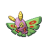

# Important Trainers

### Elite Four Aaron

| Pokémon | Attributes | Moves |
|:-------:|------------|-------|
|  | **Lv. 31** Dustox **Ability:** Shield Dust **Nature:** Calm **Item:** Leftovers | **1.** Bug Buzz **2.** Toxic **3.** Protect **4.** Moonlight |
|  | **Lv. 31** Beautifly **Ability:** Swarm **Nature:** Mild **Item:** Focus Sash | **1.** Bug Buzz **2.** Air Slash **3.** Energy Ball **4.** Psychic |
|  | **Lv. 31** Venomoth **Ability:** Tinted Lens **Nature:** Naive **Item:** Wise Glasses | **1.** Bug Buzz **2.** Psychic **3.** Sludge Bomb **4.** Sleep Powder |
|  | **Lv. 31** Scizor **Ability:** Technician **Nature:** Adamant **Item:** Muscle Band | **1.** X-Scissor **2.** Bullet Punch **3.** Iron Head **4.** Swords Dance |
|  | **Lv. 32** Drapion **Ability:** Sniper **Nature:** Jolly **Item:** Scope Lens | **1.** Cross Poison **2.** X-Scissor **3.** Night Slash **4.** Swords Dance |

