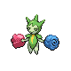
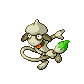

# Route 208 — Trainer Rosters

### Generic Trainers

| Trainer | P1 | P2 | P3 | P4 | P5 | P6 |
|:-------:|:--:|:--:|:--:|:--:|:--:|:--:|
|  Hiker Robert |  [Marowak](../../pokemon/marowak.md/) Lv. 28 |
|  Hiker Jonathan |  [Hippopotas](../../pokemon/hippopotas.md/) Lv. 26 |  [Shuckle](../../pokemon/shuckle.md/) Lv. 26 |  [Bronzor](../../pokemon/bronzor.md/) Lv. 26 |
|  Black Belt Kyle |  [Machoke](../../pokemon/machoke.md/) Lv. 29 |
|  Aroma Lady Hannah |  [Roselia](../../pokemon/roselia.md/) Lv. 27 |  [Sunflora](../../pokemon/sunflora.md/) Lv. 27 |
| ") Artist William [(!)](#rematches) |  [Smeargle](../../pokemon/smeargle.md/) Lv. 26 |  [Smeargle](../../pokemon/smeargle.md/) Lv. 26 |  [Smeargle](../../pokemon/smeargle.md/) Lv. 26 |
|  Fisherman Cody |  [Whiscash](../../pokemon/whiscash.md/) Lv. 44 |  [Gyarados](../../pokemon/gyarados.md/) Lv. 44 |
|  Hiker Alexander |  [Graveler](../../pokemon/graveler.md/) Lv. 28 |

### Rematches

| Trainer | P1 | P2 | P3 | P4 | P5 | P6 |
|:-------:|:--:|:--:|:--:|:--:|:--:|:--:|
| ") Artist William (5) |  [Smeargle](../../pokemon/smeargle.md/) Lv. 38 |  [Smeargle](../../pokemon/smeargle.md/) Lv. 38 |  [Smeargle](../../pokemon/smeargle.md/) Lv. 38 |
| ") Artist William (8) |  [Smeargle](../../pokemon/smeargle.md/) Lv. 53 |  [Smeargle](../../pokemon/smeargle.md/) Lv. 53 |  [Smeargle](../../pokemon/smeargle.md/) Lv. 53 |
| ") Artist William (C) |  [Smeargle](../../pokemon/smeargle.md/) Lv. 70 |  [Smeargle](../../pokemon/smeargle.md/) Lv. 70 |  [Smeargle](../../pokemon/smeargle.md/) Lv. 70 |

### Important Trainers

1. [Elite Four Aaron](important_trainers.md#elite-four-aaron)
