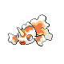

### Morning

| Sprite | Pokémon | Encounter Type | Level | Chance |
|:------:|---------|:--------------:|-------|--------|
|  | Bibarel | {: style='max-width: 24px;' } | 23 - 24 | 20% |
|  | Roselia | {: style='max-width: 24px;' } | 23 - 24 | 20% |
|  | Skitty | {: style='max-width: 24px;' } | 23 - 24 | 10% |
|  | Jigglypuff | {: style='max-width: 24px;' } | 23 - 24 | 10% |
|  | Kirlia | {: style='max-width: 24px;' } | 23 - 24 | 10% |
|  | Zangoose | {: style='max-width: 24px;' } | 23 - 24 | 10% |
|  | Seviper | {: style='max-width: 24px;' } | 23 - 24 | 10% |
|  | Smeargle | {: style='max-width: 24px;' } | 23 - 24 | 10% |

### Day

| Sprite | Pokémon | Encounter Type | Level | Chance |
|:------:|---------|:--------------:|-------|--------|
|  | Bibarel | {: style='max-width: 24px;' } | 23 - 24 | 20% |
|  | Roselia | {: style='max-width: 24px;' } | 23 - 24 | 20% |
|  | Skitty | {: style='max-width: 24px;' } | 23 - 24 | 10% |
|  | Jigglypuff | {: style='max-width: 24px;' } | 23 - 24 | 10% |
|  | Kirlia | {: style='max-width: 24px;' } | 23 - 24 | 10% |
|  | Zangoose | {: style='max-width: 24px;' } | 23 - 24 | 10% |
|  | Seviper | {: style='max-width: 24px;' } | 23 - 24 | 10% |
|  | Smeargle | {: style='max-width: 24px;' } | 23 - 24 | 10% |

### Night

| Sprite | Pokémon | Encounter Type | Level | Chance |
|:------:|---------|:--------------:|-------|--------|
|  | Bibarel | {: style='max-width: 24px;' } | 23 - 24 | 20% |
|  | Roselia | {: style='max-width: 24px;' } | 23 - 24 | 20% |
|  | Skitty | {: style='max-width: 24px;' } | 23 - 24 | 10% |
|  | Jigglypuff | {: style='max-width: 24px;' } | 23 - 24 | 10% |
|  | Kirlia | {: style='max-width: 24px;' } | 23 - 24 | 10% |
|  | Zangoose | {: style='max-width: 24px;' } | 23 - 24 | 10% |
|  | Seviper | {: style='max-width: 24px;' } | 23 - 24 | 10% |
|  | Smeargle | {: style='max-width: 24px;' } | 23 - 24 | 10% |

### Poke Radar

| Sprite | Pokémon | Encounter Type | Level | Chance |
|:------:|---------|:--------------:|-------|--------|
|  | Dunsparce | {: style='max-width: 24px;' } | ? | 22% |

### Surf

| Sprite | Pokémon | Encounter Type | Level | Chance |
|:------:|---------|:--------------:|-------|--------|
|  | Psyduck | {: style='max-width: 24px;' } | 20 - 40 | 90% |
|  | Golduck | {: style='max-width: 24px;' } | 20 - 40 | 10% |

### Old Rod

| Sprite | Pokémon | Encounter Type | Level | Chance |
|:------:|---------|:--------------:|-------|--------|
|  | Magikarp | {: style='max-width: 24px;' } | 10 | 60% |
|  | Goldeen | {: style='max-width: 24px;' } | 10 | 30% |
|  | Remoraid | {: style='max-width: 24px;' } | 10 | 10% |

### Good Rod

| Sprite | Pokémon | Encounter Type | Level | Chance |
|:------:|---------|:--------------:|-------|--------|
|  | Magikarp | {: style='max-width: 24px;' } | 25 | 60% |
|  | Goldeen | {: style='max-width: 24px;' } | 25 | 30% |
|  | Remoraid | {: style='max-width: 24px;' } | 25 | 10% |

### Super Rod

| Sprite | Pokémon | Encounter Type | Level | Chance |
|:------:|---------|:--------------:|-------|--------|
|  | Gyarados | {: style='max-width: 24px;' } | 50 | 60% |
|  | Seaking | {: style='max-width: 24px;' } | 50 | 30% |
|  | Octillery | {: style='max-width: 24px;' } | 50 | 10% |

### Honey Tree

| Sprite | Pokémon | Encounter Type | Level | Chance |
|:------:|---------|:--------------:|-------|--------|
|  | Cherubi | {: style='max-width: 24px;' } | 23 | 30% |
|  | Shroomish | {: style='max-width: 24px;' } | 23 | 20% |
|  | Exeggcute | {: style='max-width: 24px;' } | 23 | 20% |
|  | Seedot | {: style='max-width: 24px;' } | 23 | 20% |
|  | Tangela | {: style='max-width: 24px;' } | 23 | 10% |

