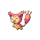
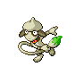

### Walking

| Sprite | Pokémon | Encounter Type | Level | Chance |
|:------:|---------|:--------------:|-------|--------|
|  | [Bibarel](../../pokemon/bibarel.md/) | {: style='max-width: 24px;' } | 23 - 24 | 20% |
|  | [Roselia](../../pokemon/roselia.md/) | {: style='max-width: 24px;' } | 23 - 24 | 20% |
|  | [Skitty](../../pokemon/skitty.md/) | {: style='max-width: 24px;' } | 23 - 24 | 10% |
|  | [Jigglypuff](../../pokemon/jigglypuff.md/) | {: style='max-width: 24px;' } | 23 - 24 | 10% |
|  | [Kirlia](../../pokemon/kirlia.md/) | {: style='max-width: 24px;' } | 23 - 24 | 10% |
|  | [Zangoose](../../pokemon/zangoose.md/) | {: style='max-width: 24px;' } | 23 - 24 | 10% |
|  | [Seviper](../../pokemon/seviper.md/) | {: style='max-width: 24px;' } | 23 - 24 | 10% |
|  | [Smeargle](../../pokemon/smeargle.md/) | {: style='max-width: 24px;' } | 23 - 24 | 10% |
|  | [Bibarel](../../pokemon/bibarel.md/) | {: style='max-width: 24px;' } | 23 - 24 | 20% |
|  | [Roselia](../../pokemon/roselia.md/) | {: style='max-width: 24px;' } | 23 - 24 | 20% |
|  | [Skitty](../../pokemon/skitty.md/) | {: style='max-width: 24px;' } | 23 - 24 | 10% |
|  | [Jigglypuff](../../pokemon/jigglypuff.md/) | {: style='max-width: 24px;' } | 23 - 24 | 10% |
|  | [Kirlia](../../pokemon/kirlia.md/) | {: style='max-width: 24px;' } | 23 - 24 | 10% |
|  | [Zangoose](../../pokemon/zangoose.md/) | {: style='max-width: 24px;' } | 23 - 24 | 10% |
|  | [Seviper](../../pokemon/seviper.md/) | {: style='max-width: 24px;' } | 23 - 24 | 10% |
|  | [Smeargle](../../pokemon/smeargle.md/) | {: style='max-width: 24px;' } | 23 - 24 | 10% |
|  | [Bibarel](../../pokemon/bibarel.md/) | {: style='max-width: 24px;' } | 23 - 24 | 20% |
|  | [Roselia](../../pokemon/roselia.md/) | {: style='max-width: 24px;' } | 23 - 24 | 20% |
|  | [Skitty](../../pokemon/skitty.md/) | {: style='max-width: 24px;' } | 23 - 24 | 10% |
|  | [Jigglypuff](../../pokemon/jigglypuff.md/) | {: style='max-width: 24px;' } | 23 - 24 | 10% |
|  | [Kirlia](../../pokemon/kirlia.md/) | {: style='max-width: 24px;' } | 23 - 24 | 10% |
|  | [Zangoose](../../pokemon/zangoose.md/) | {: style='max-width: 24px;' } | 23 - 24 | 10% |
|  | [Seviper](../../pokemon/seviper.md/) | {: style='max-width: 24px;' } | 23 - 24 | 10% |
|  | [Smeargle](../../pokemon/smeargle.md/) | {: style='max-width: 24px;' } | 23 - 24 | 10% |
|  | [Dunsparce](../../pokemon/dunsparce.md/) | {: style='max-width: 24px;' } | 23 - 24 | 22% |

### Surfing

| Sprite | Pokémon | Encounter Type | Level | Chance |
|:------:|---------|:--------------:|-------|--------|
|  | [Psyduck](../../pokemon/psyduck.md/) | {: style='max-width: 24px;' } | 20 - 40 | 90% |
|  | [Golduck](../../pokemon/golduck.md/) | {: style='max-width: 24px;' } | 20 - 40 | 10% |

### Fishing

| Sprite | Pokémon | Encounter Type | Level | Chance |
|:------:|---------|:--------------:|-------|--------|
|  | [Magikarp](../../pokemon/magikarp.md/) | {: style='max-width: 24px;' } | 10 | 60% |
|  | [Goldeen](../../pokemon/goldeen.md/) | {: style='max-width: 24px;' } | 10 | 30% |
|  | [Remoraid](../../pokemon/remoraid.md/) | {: style='max-width: 24px;' } | 10 | 10% |
|  | [Magikarp](../../pokemon/magikarp.md/) | {: style='max-width: 24px;' } | 25 | 60% |
|  | [Goldeen](../../pokemon/goldeen.md/) | {: style='max-width: 24px;' } | 25 | 30% |
|  | [Remoraid](../../pokemon/remoraid.md/) | {: style='max-width: 24px;' } | 25 | 10% |
|  | [Gyarados](../../pokemon/gyarados.md/) | {: style='max-width: 24px;' } | 50 | 60% |
|  | [Seaking](../../pokemon/seaking.md/) | {: style='max-width: 24px;' } | 50 | 30% |
|  | [Octillery](../../pokemon/octillery.md/) | {: style='max-width: 24px;' } | 50 | 10% |

### Honey Tree

| Sprite | Pokémon | Encounter Type | Level | Chance |
|:------:|---------|:--------------:|-------|--------|
|  | [Cherubi](../../pokemon/cherubi.md/) | {: style='max-width: 24px;' } | 23 | 30% |
|  | [Shroomish](../../pokemon/shroomish.md/) | {: style='max-width: 24px;' } | 23 | 20% |
|  | [Exeggcute](../../pokemon/exeggcute.md/) | {: style='max-width: 24px;' } | 23 | 20% |
|  | [Seedot](../../pokemon/seedot.md/) | {: style='max-width: 24px;' } | 23 | 20% |
|  | [Tangela](../../pokemon/tangela.md/) | {: style='max-width: 24px;' } | 23 | 10% |

