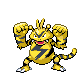

# Route 209 — Trainer Rosters

### Generic Trainers

| Trainer | P1 | P2 | P3 | P4 | P5 | P6 |
|:-------:|:--:|:--:|:--:|:--:|:--:|:--:|
| ") PKMN Breeder Albert [(!)](#rematches) |  [Tyrogue](../../pokemon/tyrogue.md/) Lv. 26 |  [Chingling](../../pokemon/chingling.md/) Lv. 26 |  [Bonsly](../../pokemon/bonsly.md/) Lv. 26 |  [Magby](../../pokemon/magby.md/) Lv. 26 |  [Elekid](../../pokemon/elekid.md/) Lv. 26 |  [Mime Jr.](../../pokemon/mime-jr.md/) Lv. 26 |
|  Twins Emma & Lil |  [Vaporeon](../../pokemon/vaporeon.md/) Lv. 30 |  [Flareon](../../pokemon/flareon.md/) Lv. 30 |
| ") Poke Kid Danielle [(!)](#rematches) |  [Pichu](../../pokemon/pichu.md/) Lv. 28 |  [Pikachu](../../pokemon/pikachu.md/) Lv. 29 |  [Raichu](../../pokemon/raichu.md/) Lv. 30 |
| ") PKMN Breeder Jennifer [(!)](#rematches) |  [Azurill](../../pokemon/azurill.md/) Lv. 26 |  [Togepi](../../pokemon/togepi.md/) Lv. 26 |  [Cleffa](../../pokemon/cleffa.md/) Lv. 26 |  [Igglybuff](../../pokemon/igglybuff.md/) Lv. 26 |  [Smoochum](../../pokemon/smoochum.md/) Lv. 26 |  [Budew](../../pokemon/budew.md/) Lv. 26 |
|  Cowgirl Shelley |  [Ponyta](../../pokemon/ponyta.md/) Lv. 30 |  [Bibarel](../../pokemon/bibarel.md/) Lv. 30 |
|  Jogger Richard |  [Dodrio](../../pokemon/dodrio.md/) Lv. 31 |
|  Jogger Raul |  [Fearow](../../pokemon/fearow.md/) Lv. 31 |
|  Young Couple Ty & Sue |  [Illumise](../../pokemon/illumise.md/) Lv. 31 |  [Volbeat](../../pokemon/volbeat.md/) Lv. 31 |

### Rematches

| Trainer | P1 | P2 | P3 | P4 | P5 | P6 |
|:-------:|:--:|:--:|:--:|:--:|:--:|:--:|
| ") PKMN Breeder Albert (5) |  [Hitmontop](../../pokemon/hitmontop.md/) Lv. 37 |  [Chimecho](../../pokemon/chimecho.md/) Lv. 37 |  [Sudowoodo](../../pokemon/sudowoodo.md/) Lv. 37 |  [Magmar](../../pokemon/magmar.md/) Lv. 37 |  [Electabuzz](../../pokemon/electabuzz.md/) Lv. 37 |  [Mr. Mime](../../pokemon/mr-mime.md/) Lv. 37 |
| ") PKMN Breeder Albert (8) |  [Hitmontop](../../pokemon/hitmontop.md/) Lv. 57 |  [Chimecho](../../pokemon/chimecho.md/) Lv. 57 |  [Sudowoodo](../../pokemon/sudowoodo.md/) Lv. 57 |  [Magmar](../../pokemon/magmar.md/) Lv. 57 |  [Electabuzz](../../pokemon/electabuzz.md/) Lv. 57 |  [Mr. Mime](../../pokemon/mr-mime.md/) Lv. 57 |
| ") PKMN Breeder Albert (C) |  [Hitmontop](../../pokemon/hitmontop.md/) Lv. 68 |  [Chimecho](../../pokemon/chimecho.md/) Lv. 68 |  [Sudowoodo](../../pokemon/sudowoodo.md/) Lv. 68 |  [Magmar](../../pokemon/magmar.md/) Lv. 68 |  [Electabuzz](../../pokemon/electabuzz.md/) Lv. 68 |  [Mr. Mime](../../pokemon/mr-mime.md/) Lv. 68 |
| ") Poke Kid Danielle (5) |  [Pikachu](../../pokemon/pikachu.md/) Lv. 37 |  [Pikachu](../../pokemon/pikachu.md/) Lv. 37 |  [Raichu](../../pokemon/raichu.md/) Lv. 38 |
| ") Poke Kid Danielle (8) |  [Pikachu](../../pokemon/pikachu.md/) Lv. 57 |  [Raichu](../../pokemon/raichu.md/) Lv. 58 |  [Raichu](../../pokemon/raichu.md/) Lv. 58 |
| ") Poke Kid Danielle (C) |  [Raichu](../../pokemon/raichu.md/) Lv. 69 |  [Raichu](../../pokemon/raichu.md/) Lv. 69 |  [Raichu](../../pokemon/raichu.md/) Lv. 69 |
| ") PKMN Breeder Jennifer (5) |  [Marill](../../pokemon/marill.md/) Lv. 37 |  [Togetic](../../pokemon/togetic.md/) Lv. 37 |  [Clefairy](../../pokemon/clefairy.md/) Lv. 37 |  [Jigglypuff](../../pokemon/jigglypuff.md/) Lv. 37 |  [Jynx](../../pokemon/jynx.md/) Lv. 37 |  [Roselia](../../pokemon/roselia.md/) Lv. 37 |
| ") PKMN Breeder Jennifer (8) |  [Azumarill](../../pokemon/azumarill.md/) Lv. 57 |  [Togekiss](../../pokemon/togekiss.md/) Lv. 57 |  [Clefable](../../pokemon/clefable.md/) Lv. 57 |  [Wigglytuff](../../pokemon/wigglytuff.md/) Lv. 57 |  [Jynx](../../pokemon/jynx.md/) Lv. 57 |  [Roserade](../../pokemon/roserade.md/) Lv. 57 |
| ") PKMN Breeder Jennifer (C) |  [Azumarill](../../pokemon/azumarill.md/) Lv. 68 |  [Togekiss](../../pokemon/togekiss.md/) Lv. 68 |  [Clefable](../../pokemon/clefable.md/) Lv. 68 |  [Wigglytuff](../../pokemon/wigglytuff.md/) Lv. 68 |  [Jynx](../../pokemon/jynx.md/) Lv. 68 |  [Roserade](../../pokemon/roserade.md/) Lv. 68 |

