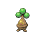

### Walking

| Sprite | Pokémon | Encounter Type | Level | Chance |
|:------:|---------|:--------------:|-------|--------|
|  | Staravia | {: style='max-width: 24px;' } | 24 - 26 | 20% |
|  | Glameow | {: style='max-width: 24px;' } | 24 - 26 | 20% |
|  | Vulpix | {: style='max-width: 24px;' } | 24 - 26 | 10% |
|  | Bonsly | {: style='max-width: 24px;' } | 24 - 26 | 10% |
|  | Mime Jr. | {: style='max-width: 24px;' } | 24 - 26 | 10% |
|  | Snubbull | {: style='max-width: 24px;' } | 24 - 26 | 10% |
|  | Meowth | {: style='max-width: 24px;' } | 24 - 26 | 10% |
|  | Chansey | {: style='max-width: 24px;' } | 24 - 26 | 10% |
|  | Staravia | {: style='max-width: 24px;' } | 24 - 26 | 20% |
|  | Glameow | {: style='max-width: 24px;' } | 24 - 26 | 20% |
|  | Vulpix | {: style='max-width: 24px;' } | 24 - 26 | 10% |
|  | Bonsly | {: style='max-width: 24px;' } | 24 - 26 | 10% |
|  | Mime Jr. | {: style='max-width: 24px;' } | 24 - 26 | 10% |
|  | Snubbull | {: style='max-width: 24px;' } | 24 - 26 | 10% |
|  | Meowth | {: style='max-width: 24px;' } | 24 - 26 | 10% |
|  | Chansey | {: style='max-width: 24px;' } | 24 - 26 | 10% |
|  | Staravia | {: style='max-width: 24px;' } | 24 - 26 | 20% |
|  | Glameow | {: style='max-width: 24px;' } | 24 - 26 | 20% |
|  | Vulpix | {: style='max-width: 24px;' } | 24 - 26 | 10% |
|  | Bonsly | {: style='max-width: 24px;' } | 24 - 26 | 10% |
|  | Mime Jr. | {: style='max-width: 24px;' } | 24 - 26 | 10% |
|  | Snubbull | {: style='max-width: 24px;' } | 24 - 26 | 10% |
|  | Meowth | {: style='max-width: 24px;' } | 24 - 26 | 10% |
|  | Chansey | {: style='max-width: 24px;' } | 24 - 26 | 10% |
|  | Purugly | {: style='max-width: 24px;' } | 24 - 26 | 22% |

### Surfing

| Sprite | Pokémon | Encounter Type | Level | Chance |
|:------:|---------|:--------------:|-------|--------|
|  | Psyduck | {: style='max-width: 24px;' } | 20 - 40 | 90% |
|  | Golduck | {: style='max-width: 24px;' } | 20 - 40 | 10% |

### Fishing

| Sprite | Pokémon | Encounter Type | Level | Chance |
|:------:|---------|:--------------:|-------|--------|
|  | Magikarp | {: style='max-width: 24px;' } | 10 | 65% |
|  | Goldeen | {: style='max-width: 24px;' } | 10 | 35% |
|  | Magikarp | {: style='max-width: 24px;' } | 25 | 65% |
|  | Goldeen | {: style='max-width: 24px;' } | 25 | 35% |
|  | Gyarados | {: style='max-width: 24px;' } | 50 | 65% |
|  | Seaking | {: style='max-width: 24px;' } | 50 | 35% |

### Honey Tree

| Sprite | Pokémon | Encounter Type | Level | Chance |
|:------:|---------|:--------------:|-------|--------|
|  | Staravia | {: style='max-width: 24px;' } | 27 | 30% |
|  | Pidgeotto | {: style='max-width: 24px;' } | 27 | 20% |
|  | Noctowl | {: style='max-width: 24px;' } | 27 | 20% |
|  | Swellow | {: style='max-width: 24px;' } | 27 | 20% |
|  | Farfetch'd | {: style='max-width: 24px;' } | 27 | 10% |

