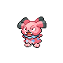

# Route 209 — Wild Pokémon

### Walking

| Sprite | Pokémon | Encounter Type | Level | Chance |
|:------:|---------|:--------------:|-------|--------|
|  | [Staravia](../../pokemon/staravia.md/) | {: style='max-width: 24px;' } | 24 - 26 | 20% |
|  | [Glameow](../../pokemon/glameow.md/) | {: style='max-width: 24px;' } | 24 - 26 | 20% |
|  | [Vulpix](../../pokemon/vulpix.md/) | {: style='max-width: 24px;' } | 24 - 26 | 10% |
|  | [Bonsly](../../pokemon/bonsly.md/) | {: style='max-width: 24px;' } | 24 - 26 | 10% |
|  | [Mime Jr.](../../pokemon/mime-jr.md/) | {: style='max-width: 24px;' } | 24 - 26 | 10% |
|  | [Snubbull](../../pokemon/snubbull.md/) | {: style='max-width: 24px;' } | 24 - 26 | 10% |
|  | [Meowth](../../pokemon/meowth.md/) | {: style='max-width: 24px;' } | 24 - 26 | 10% |
|  | [Chansey](../../pokemon/chansey.md/) | {: style='max-width: 24px;' } | 24 - 26 | 10% |
|  | [Staravia](../../pokemon/staravia.md/) | {: style='max-width: 24px;' } | 24 - 26 | 20% |
|  | [Glameow](../../pokemon/glameow.md/) | {: style='max-width: 24px;' } | 24 - 26 | 20% |
|  | [Vulpix](../../pokemon/vulpix.md/) | {: style='max-width: 24px;' } | 24 - 26 | 10% |
|  | [Bonsly](../../pokemon/bonsly.md/) | {: style='max-width: 24px;' } | 24 - 26 | 10% |
|  | [Mime Jr.](../../pokemon/mime-jr.md/) | {: style='max-width: 24px;' } | 24 - 26 | 10% |
|  | [Snubbull](../../pokemon/snubbull.md/) | {: style='max-width: 24px;' } | 24 - 26 | 10% |
|  | [Meowth](../../pokemon/meowth.md/) | {: style='max-width: 24px;' } | 24 - 26 | 10% |
|  | [Chansey](../../pokemon/chansey.md/) | {: style='max-width: 24px;' } | 24 - 26 | 10% |
|  | [Staravia](../../pokemon/staravia.md/) | {: style='max-width: 24px;' } | 24 - 26 | 20% |
|  | [Glameow](../../pokemon/glameow.md/) | {: style='max-width: 24px;' } | 24 - 26 | 20% |
|  | [Vulpix](../../pokemon/vulpix.md/) | {: style='max-width: 24px;' } | 24 - 26 | 10% |
|  | [Bonsly](../../pokemon/bonsly.md/) | {: style='max-width: 24px;' } | 24 - 26 | 10% |
|  | [Mime Jr.](../../pokemon/mime-jr.md/) | {: style='max-width: 24px;' } | 24 - 26 | 10% |
|  | [Snubbull](../../pokemon/snubbull.md/) | {: style='max-width: 24px;' } | 24 - 26 | 10% |
|  | [Meowth](../../pokemon/meowth.md/) | {: style='max-width: 24px;' } | 24 - 26 | 10% |
|  | [Chansey](../../pokemon/chansey.md/) | {: style='max-width: 24px;' } | 24 - 26 | 10% |
|  | [Purugly](../../pokemon/purugly.md/) | {: style='max-width: 24px;' } | 24 - 26 | 22% |

### Surfing

| Sprite | Pokémon | Encounter Type | Level | Chance |
|:------:|---------|:--------------:|-------|--------|
|  | [Psyduck](../../pokemon/psyduck.md/) | {: style='max-width: 24px;' } | 20 - 40 | 90% |
|  | [Golduck](../../pokemon/golduck.md/) | {: style='max-width: 24px;' } | 20 - 40 | 10% |

### Fishing

| Sprite | Pokémon | Encounter Type | Level | Chance |
|:------:|---------|:--------------:|-------|--------|
|  | [Magikarp](../../pokemon/magikarp.md/) | {: style='max-width: 24px;' } | 10 | 65% |
|  | [Goldeen](../../pokemon/goldeen.md/) | {: style='max-width: 24px;' } | 10 | 35% |
|  | [Magikarp](../../pokemon/magikarp.md/) | {: style='max-width: 24px;' } | 25 | 65% |
|  | [Goldeen](../../pokemon/goldeen.md/) | {: style='max-width: 24px;' } | 25 | 35% |
|  | [Gyarados](../../pokemon/gyarados.md/) | {: style='max-width: 24px;' } | 50 | 65% |
|  | [Seaking](../../pokemon/seaking.md/) | {: style='max-width: 24px;' } | 50 | 35% |

### Honey Tree

| Sprite | Pokémon | Encounter Type | Level | Chance |
|:------:|---------|:--------------:|-------|--------|
|  | [Staravia](../../pokemon/staravia.md/) | {: style='max-width: 24px;' } | 27 | 30% |
|  | [Pidgeotto](../../pokemon/pidgeotto.md/) | {: style='max-width: 24px;' } | 27 | 20% |
|  | [Noctowl](../../pokemon/noctowl.md/) | {: style='max-width: 24px;' } | 27 | 20% |
|  | [Swellow](../../pokemon/swellow.md/) | {: style='max-width: 24px;' } | 27 | 20% |
|  | [Farfetch'd](../../pokemon/farfetchd.md/) | {: style='max-width: 24px;' } | 27 | 10% |

