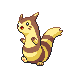
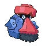

# Route 210 — Trainer Rosters

---

## South

### Generic Trainers

| Trainer | P1 | P2 | P3 | P4 | P5 | P6 |
|:-------:|:--:|:--:|:--:|:--:|:--:|:--:|
|  Twins Teri & Tia |  [Furret](../../pokemon/furret.md/) Lv. 32 |  [Linoone](../../pokemon/linoone.md/) Lv. 32 |
|  Jogger Wyatt |  [Electrode](../../pokemon/electrode.md/) Lv. 33 |
|  PKMN Breeder Kahlil |  [Riolu](../../pokemon/riolu.md/) Lv. 31 |  [Chingling](../../pokemon/chingling.md/) Lv. 31 |  [Munchlax](../../pokemon/munchlax.md/) Lv. 31 |
|  PKMN Breeder Amber |  [Mantyke](../../pokemon/mantyke.md/) Lv. 31 |  [Happiny](../../pokemon/happiny.md/) Lv. 31 |  [Wynaut](../../pokemon/wynaut.md/) Lv. 31 |
|  Belle & Pa Ava & Matt |  [Tauros](../../pokemon/tauros.md/) Lv. 33 |  [Miltank](../../pokemon/miltank.md/) Lv. 33 |
| ") Rancher Marco [(!)](#rematches) |  [Rapidash](../../pokemon/rapidash.md/) Lv. 33 |
|  Collector Fernando |  [Dratini](../../pokemon/dratini.md/) Lv. 31 |  [Dragonair](../../pokemon/dragonair.md/) Lv. 33 |
|  Collector Edwin |  [Bagon](../../pokemon/bagon.md/) Lv. 31 |  [Shelgon](../../pokemon/shelgon.md/) Lv. 33 |
|  Waitress Kati |  [Clefable](../../pokemon/clefable.md/) Lv. 33 |

### Rematches

| Trainer | P1 | P2 | P3 | P4 | P5 | P6 |
|:-------:|:--:|:--:|:--:|:--:|:--:|:--:|
| ") Rancher Marco (8) |  [Rapidash](../../pokemon/rapidash.md/) Lv. 59 |  [Tauros](../../pokemon/tauros.md/) Lv. 59 |  [Miltank](../../pokemon/miltank.md/) Lv. 59 |
| ") Rancher Marco (C) |  [Rapidash](../../pokemon/rapidash.md/) Lv. 70 |  [Tauros](../../pokemon/tauros.md/) Lv. 70 |  [Miltank](../../pokemon/miltank.md/) Lv. 70 |

---

## North

### Generic Trainers

| Trainer | P1 | P2 | P3 | P4 | P5 | P6 |
|:-------:|:--:|:--:|:--:|:--:|:--:|:--:|
|  Ninja Boy Fabian |  [Toxicroak](../../pokemon/toxicroak.md/) Lv. 41 |
|  Ninja Boy Brennan |  [Ninjask](../../pokemon/ninjask.md/) Lv. 41 |
|  Ninja Boy Bruce |  [Skuntank](../../pokemon/skuntank.md/) Lv. 41 |
|  Ninja Boy Joel |  [Scyther](../../pokemon/scyther.md/) Lv. 39 |  [Spinda](../../pokemon/spinda.md/) Lv. 39 |  [Golbat](../../pokemon/golbat.md/) Lv. 39 |
|  Ace Trainer Alyssa |  [Ambipom](../../pokemon/ambipom.md/) Lv. 42 |  [Starmie](../../pokemon/starmie.md/) Lv. 42 |  [Torterra](../../pokemon/torterra.md/) Lv. 42 |
|  Double Team Zac & Jen |  [Gyarados](../../pokemon/gyarados.md/) Lv. 42 |  [Gliscor](../../pokemon/gliscor.md/) Lv. 42 |  [Victreebel](../../pokemon/victreebel.md/) Lv. 42 |  [Typhlosion](../../pokemon/typhlosion.md/) Lv. 42 |  [Ursaring](../../pokemon/ursaring.md/) Lv. 42 |  [Ampharos](../../pokemon/ampharos.md/) Lv. 42 |
|  Ace Trainer Ernest |  [Politoed](../../pokemon/politoed.md/) Lv. 41 |  [Pinsir](../../pokemon/pinsir.md/) Lv. 41 |  [Probopass](../../pokemon/probopass.md/) Lv. 41 |  [Xatu](../../pokemon/xatu.md/) Lv. 41 |
|  Ninja Boy Davido |  [Ninetales](../../pokemon/ninetales.md/) Lv. 41 |
|  Black Belt Adam |  [Machamp](../../pokemon/machamp.md/) Lv. 42 |  [Blaziken](../../pokemon/blaziken.md/) Lv. 42 |  [Heracross](../../pokemon/heracross.md/) Lv. 42 |
|  Ninja Boy Nathan |  [Swalot](../../pokemon/swalot.md/) Lv. 39 |  [Dustox](../../pokemon/dustox.md/) Lv. 39 |  [Mothim](../../pokemon/mothim.md/) Lv. 39 |
| ") Bird Keeper Brianna [(!)](#rematches) |  [Dodrio](../../pokemon/dodrio.md/) Lv. 42 |  [Pidgeot](../../pokemon/pidgeot.md/) Lv. 42 |  [Skarmory](../../pokemon/skarmory.md/) Lv. 42 |
| ") Veteran Brian [(!)](#rematches) |  [Tangrowth](../../pokemon/tangrowth.md/) Lv. 43 |  [Rapidash](../../pokemon/rapidash.md/) Lv. 43 |  [Feraligatr](../../pokemon/feraligatr.md/) Lv. 43 |
| ") Dragon Tamer Patrick [(!)](#rematches) |  [Gabite](../../pokemon/gabite.md/) Lv. 41 |  [Shelgon](../../pokemon/shelgon.md/) Lv. 41 |  [Vibrava](../../pokemon/vibrava.md/) Lv. 41 |  [Dragonair](../../pokemon/dragonair.md/) Lv. 41 |

### Rematches

| Trainer | P1 | P2 | P3 | P4 | P5 | P6 |
|:-------:|:--:|:--:|:--:|:--:|:--:|:--:|
| ") Bird Keeper Brianna (8) |  [Dodrio](../../pokemon/dodrio.md/) Lv. 60 |  [Pidgeot](../../pokemon/pidgeot.md/) Lv. 60 |  [Skarmory](../../pokemon/skarmory.md/) Lv. 60 |
| ") Bird Keeper Brianna (C) |  [Dodrio](../../pokemon/dodrio.md/) Lv. 71 |  [Pidgeot](../../pokemon/pidgeot.md/) Lv. 71 |  [Skarmory](../../pokemon/skarmory.md/) Lv. 71 |
| ") Veteran Brian (8) |  [Tangrowth](../../pokemon/tangrowth.md/) Lv. 61 |  [Rapidash](../../pokemon/rapidash.md/) Lv. 61 |  [Feraligatr](../../pokemon/feraligatr.md/) Lv. 61 |
| ") Veteran Brian (C) |  [Tangrowth](../../pokemon/tangrowth.md/) Lv. 75 |  [Rapidash](../../pokemon/rapidash.md/) Lv. 75 |  [Feraligatr](../../pokemon/feraligatr.md/) Lv. 75 |
| ") Dragon Tamer Patrick (8) |  [Gabite](../../pokemon/gabite.md/) Lv. 58 |  [Shelgon](../../pokemon/shelgon.md/) Lv. 58 |  [Vibrava](../../pokemon/vibrava.md/) Lv. 58 |  [Dragonair](../../pokemon/dragonair.md/) Lv. 58 |
| ") Dragon Tamer Patrick (C) |  [Garchomp](../../pokemon/garchomp.md/) Lv. 70 |  [Salamence](../../pokemon/salamence.md/) Lv. 70 |  [Flygon](../../pokemon/flygon.md/) Lv. 70 |  [Dragonite](../../pokemon/dragonite.md/) Lv. 70 |

### Important Trainers

1. [PKMN Trainer Dawn](important_trainers.md#pkmn-trainer-dawn)
1. [PKMN Trainer Lucas](important_trainers.md#pkmn-trainer-lucas)
