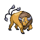
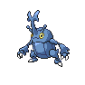

# Trainer Rosters

---

## South

### Generic Trainers

| Trainer | P1 | P2 | P3 | P4 | P5 | P6 |
|:-------:|:--:|:--:|:--:|:--:|:--:|:--:|
|  Twins Teri & Tia |  Furret Lv. 32 |  Linoone Lv. 32 |
|  Jogger Wyatt |  Electrode Lv. 33 |
|  PKMN Breeder Kahlil |  Riolu Lv. 31 |  Chingling Lv. 31 |  Munchlax Lv. 31 |
|  PKMN Breeder Amber |  Mantyke Lv. 31 |  Happiny Lv. 31 |  Wynaut Lv. 31 |
|  Belle & Pa Ava & Matt |  Tauros Lv. 33 |  Miltank Lv. 33 |
| ](../../assets/trainers/rancher.png) Rancher Marco [(!)](#rematches) |  Rapidash Lv. 33 |
|  Collector Fernando |  Dratini Lv. 31 |  Dragonair Lv. 33 |
|  Collector Edwin |  Bagon Lv. 31 |  Shelgon Lv. 33 |
|  Waitress Kati |  Clefable Lv. 33 |

### Rematches

| Trainer | P1 | P2 | P3 | P4 | P5 | P6 |
|:-------:|:--:|:--:|:--:|:--:|:--:|:--:|
|  Rancher Marco (8) |  Rapidash Lv. 59 |  Tauros Lv. 59 |  Miltank Lv. 59 |
|  Rancher Marco (C) |  Rapidash Lv. 70 |  Tauros Lv. 70 |  Miltank Lv. 70 |

---

## North

### Generic Trainers

| Trainer | P1 | P2 | P3 | P4 | P5 | P6 |
|:-------:|:--:|:--:|:--:|:--:|:--:|:--:|
|  Ninja Boy Fabian |  Toxicroak Lv. 41 |
|  Ninja Boy Brennan |  Ninjask Lv. 41 |
|  Ninja Boy Bruce |  Skuntank Lv. 41 |
|  Ninja Boy Joel |  Scyther Lv. 39 |  Spinda Lv. 39 |  Golbat Lv. 39 |
|  Ace Trainer Alyssa |  Ambipom Lv. 42 |  Starmie Lv. 42 |  Torterra Lv. 42 |
|  Double Team Zac & Jen |  Gyarados Lv. 42 |  Gliscor Lv. 42 |  Victreebel Lv. 42 |  Typhlosion Lv. 42 |  Ursaring Lv. 42 |  Ampharos Lv. 42 |
|  Ace Trainer Ernest |  Politoed Lv. 41 |  Pinsir Lv. 41 |  Probopass Lv. 41 |  Xatu Lv. 41 |
|  Ninja Boy Davido |  Ninetales Lv. 41 |
|  Black Belt Adam |  Machamp Lv. 42 |  Blaziken Lv. 42 |  Heracross Lv. 42 |
|  Ninja Boy Nathan |  Swalot Lv. 39 |  Dustox Lv. 39 |  Mothim Lv. 39 |
| ](../../assets/trainers/bird_keeper.png) Bird Keeper Brianna [(!)](#rematches) |  Dodrio Lv. 42 |  Pidgeot Lv. 42 |  Skarmory Lv. 42 |
| ](../../assets/trainers/veteran.png) Veteran Brian [(!)](#rematches) |  Tangrowth Lv. 43 |  Rapidash Lv. 43 |  Feraligatr Lv. 43 |
| ](../../assets/trainers/dragon_tamer.png) Dragon Tamer Patrick [(!)](#rematches) |  Gabite Lv. 41 |  Shelgon Lv. 41 |  Vibrava Lv. 41 |  Dragonair Lv. 41 |

### Rematches

| Trainer | P1 | P2 | P3 | P4 | P5 | P6 |
|:-------:|:--:|:--:|:--:|:--:|:--:|:--:|
|  Bird Keeper Brianna (8) |  Dodrio Lv. 60 |  Pidgeot Lv. 60 |  Skarmory Lv. 60 |
|  Bird Keeper Brianna (C) |  Dodrio Lv. 71 |  Pidgeot Lv. 71 |  Skarmory Lv. 71 |
|  Veteran Brian (8) |  Tangrowth Lv. 61 |  Rapidash Lv. 61 |  Feraligatr Lv. 61 |
|  Veteran Brian (C) |  Tangrowth Lv. 75 |  Rapidash Lv. 75 |  Feraligatr Lv. 75 |
|  Dragon Tamer Patrick (8) |  Gabite Lv. 58 |  Shelgon Lv. 58 |  Vibrava Lv. 58 |  Dragonair Lv. 58 |
|  Dragon Tamer Patrick (C) |  Garchomp Lv. 70 |  Salamence Lv. 70 |  Flygon Lv. 70 |  Dragonite Lv. 70 |

