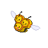

---

## South

### Morning

| Sprite | Pokémon | Encounter Type | Level | Chance |
|:------:|---------|:--------------:|-------|--------|
|  | Kricketune | {: style='max-width: 24px;' } | 28 - 30 | 20% |
|  | Nuzleaf | {: style='max-width: 24px;' } | 28 - 30 | 20% |
|  | Scyther | {: style='max-width: 24px;' } | 28 - 30 | 15% |
|  | Pinsir | {: style='max-width: 24px;' } | 28 - 30 | 10% |
|  | Miltank | {: style='max-width: 24px;' } | 28 - 30 | 10% |
|  | Tauros | {: style='max-width: 24px;' } | 28 - 30 | 10% |
|  | Pidgeotto | {: style='max-width: 24px;' } | 28 - 30 | 10% |
|  | Rapidash | {: style='max-width: 24px;' } | 28 - 30 | 5% |

### Day

| Sprite | Pokémon | Encounter Type | Level | Chance |
|:------:|---------|:--------------:|-------|--------|
|  | Kricketune | {: style='max-width: 24px;' } | 28 - 30 | 20% |
|  | Nuzleaf | {: style='max-width: 24px;' } | 28 - 30 | 20% |
|  | Scyther | {: style='max-width: 24px;' } | 28 - 30 | 15% |
|  | Pinsir | {: style='max-width: 24px;' } | 28 - 30 | 10% |
|  | Miltank | {: style='max-width: 24px;' } | 28 - 30 | 10% |
|  | Tauros | {: style='max-width: 24px;' } | 28 - 30 | 10% |
|  | Pidgeotto | {: style='max-width: 24px;' } | 28 - 30 | 10% |
|  | Rapidash | {: style='max-width: 24px;' } | 28 - 30 | 5% |

### Night

| Sprite | Pokémon | Encounter Type | Level | Chance |
|:------:|---------|:--------------:|-------|--------|
|  | Kricketune | {: style='max-width: 24px;' } | 28 - 30 | 20% |
|  | Nuzleaf | {: style='max-width: 24px;' } | 28 - 30 | 20% |
|  | Scyther | {: style='max-width: 24px;' } | 28 - 30 | 15% |
|  | Pinsir | {: style='max-width: 24px;' } | 28 - 30 | 10% |
|  | Miltank | {: style='max-width: 24px;' } | 28 - 30 | 10% |
|  | Tauros | {: style='max-width: 24px;' } | 28 - 30 | 10% |
|  | Noctowl | {: style='max-width: 24px;' } | 28 - 30 | 10% |
|  | Rapidash | {: style='max-width: 24px;' } | 28 - 30 | 5% |

### Poke Radar

| Sprite | Pokémon | Encounter Type | Level | Chance |
|:------:|---------|:--------------:|-------|--------|
|  | Kecleon | {: style='max-width: 24px;' } | ? | 22% |

### Honey Tree

| Sprite | Pokémon | Encounter Type | Level | Chance |
|:------:|---------|:--------------:|-------|--------|
|  | Combee | {: style='max-width: 24px;' } | 29 | 30% |
|  | Pineco | {: style='max-width: 24px;' } | 29 | 20% |
|  | Silcoon | {: style='max-width: 24px;' } | 29 | 10% |
|  | Cascoon | {: style='max-width: 24px;' } | 29 | 10% |
|  | Wormadam | {: style='max-width: 24px;' } | 29 | 10% |
|  | Mothim | {: style='max-width: 24px;' } | 29 | 10% |
|  | Heracross | {: style='max-width: 24px;' } | 29 | 10% |

---

## North

### Morning

| Sprite | Pokémon | Encounter Type | Level | Chance |
|:------:|---------|:--------------:|-------|--------|
|  | Swablu | {: style='max-width: 24px;' } | 34 - 38 | 20% |
|  | Fearow | {: style='max-width: 24px;' } | 34 - 38 | 20% |
|  | Machoke | {: style='max-width: 24px;' } | 34 - 38 | 10% |
|  | Drifblim | {: style='max-width: 24px;' } | 34 - 38 | 10% |
|  | Zangoose | {: style='max-width: 24px;' } | 34 - 38 | 10% |
|  | Seviper | {: style='max-width: 24px;' } | 34 - 38 | 10% |
|  | Skarmory | {: style='max-width: 24px;' } | 34 - 38 | 10% |
|  | Shelgon | {: style='max-width: 24px;' } | 34 - 38 | 10% |

### Day

| Sprite | Pokémon | Encounter Type | Level | Chance |
|:------:|---------|:--------------:|-------|--------|
|  | Swablu | {: style='max-width: 24px;' } | 34 - 38 | 20% |
|  | Fearow | {: style='max-width: 24px;' } | 34 - 38 | 20% |
|  | Machoke | {: style='max-width: 24px;' } | 34 - 38 | 10% |
|  | Drifblim | {: style='max-width: 24px;' } | 34 - 38 | 10% |
|  | Zangoose | {: style='max-width: 24px;' } | 34 - 38 | 10% |
|  | Seviper | {: style='max-width: 24px;' } | 34 - 38 | 10% |
|  | Skarmory | {: style='max-width: 24px;' } | 34 - 38 | 10% |
|  | Shelgon | {: style='max-width: 24px;' } | 34 - 38 | 10% |

### Night

| Sprite | Pokémon | Encounter Type | Level | Chance |
|:------:|---------|:--------------:|-------|--------|
|  | Swablu | {: style='max-width: 24px;' } | 34 - 38 | 20% |
|  | Fearow | {: style='max-width: 24px;' } | 34 - 38 | 20% |
|  | Machoke | {: style='max-width: 24px;' } | 34 - 38 | 10% |
|  | Drifblim | {: style='max-width: 24px;' } | 34 - 38 | 10% |
|  | Zangoose | {: style='max-width: 24px;' } | 34 - 38 | 10% |
|  | Seviper | {: style='max-width: 24px;' } | 34 - 38 | 10% |
|  | Skarmory | {: style='max-width: 24px;' } | 34 - 38 | 10% |
|  | Shelgon | {: style='max-width: 24px;' } | 34 - 38 | 10% |

### Poke Radar

| Sprite | Pokémon | Encounter Type | Level | Chance |
|:------:|---------|:--------------:|-------|--------|
|  | Altaria | {: style='max-width: 24px;' } | ? | 22% |

### Surf

| Sprite | Pokémon | Encounter Type | Level | Chance |
|:------:|---------|:--------------:|-------|--------|
|  | Psyduck | {: style='max-width: 24px;' } | 20 - 40 | 90% |
|  | Golduck | {: style='max-width: 24px;' } | 20 - 40 | 10% |

### Old Rod

| Sprite | Pokémon | Encounter Type | Level | Chance |
|:------:|---------|:--------------:|-------|--------|
|  | Magikarp | {: style='max-width: 24px;' } | 10 | 60% |
|  | Horsea | {: style='max-width: 24px;' } | 10 | 30% |
|  | Dratini | {: style='max-width: 24px;' } | 10 | 10% |

### Good Rod

| Sprite | Pokémon | Encounter Type | Level | Chance |
|:------:|---------|:--------------:|-------|--------|
|  | Magikarp | {: style='max-width: 24px;' } | 25 | 60% |
|  | Horsea | {: style='max-width: 24px;' } | 25 | 30% |
|  | Dratini | {: style='max-width: 24px;' } | 25 | 10% |

### Super Rod

| Sprite | Pokémon | Encounter Type | Level | Chance |
|:------:|---------|:--------------:|-------|--------|
|  | Gyarados | {: style='max-width: 24px;' } | 50 | 60% |
|  | Seadra | {: style='max-width: 24px;' } | 50 | 30% |
|  | Dragonair | {: style='max-width: 24px;' } | 50 | 10% |

### Honey Tree

| Sprite | Pokémon | Encounter Type | Level | Chance |
|:------:|---------|:--------------:|-------|--------|
|  | Staravia | {: style='max-width: 24px;' } | 37 | 30% |
|  | Pidgeotto | {: style='max-width: 24px;' } | 37 | 20% |
|  | Noctowl | {: style='max-width: 24px;' } | 37 | 20% |
|  | Swellow | {: style='max-width: 24px;' } | 37 | 20% |
|  | Farfetch'd | {: style='max-width: 24px;' } | 37 | 10% |

