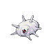

# Route 210 — Wild Pokémon

---

## South

### Walking

| Sprite | Pokémon | Encounter Type | Level | Chance |
|:------:|---------|:--------------:|-------|--------|
|  | [Kricketune](../../pokemon/kricketune.md/) | {: style='max-width: 24px;' } | 28 - 30 | 20% |
|  | [Nuzleaf](../../pokemon/nuzleaf.md/) | {: style='max-width: 24px;' } | 28 - 30 | 20% |
|  | [Scyther](../../pokemon/scyther.md/) | {: style='max-width: 24px;' } | 28 - 30 | 15% |
|  | [Pinsir](../../pokemon/pinsir.md/) | {: style='max-width: 24px;' } | 28 - 30 | 10% |
|  | [Miltank](../../pokemon/miltank.md/) | {: style='max-width: 24px;' } | 28 - 30 | 10% |
|  | [Tauros](../../pokemon/tauros.md/) | {: style='max-width: 24px;' } | 28 - 30 | 10% |
|  | [Pidgeotto](../../pokemon/pidgeotto.md/) | {: style='max-width: 24px;' } | 28 - 30 | 10% |
|  | [Rapidash](../../pokemon/rapidash.md/) | {: style='max-width: 24px;' } | 28 - 30 | 5% |
|  | [Kricketune](../../pokemon/kricketune.md/) | {: style='max-width: 24px;' } | 28 - 30 | 20% |
|  | [Nuzleaf](../../pokemon/nuzleaf.md/) | {: style='max-width: 24px;' } | 28 - 30 | 20% |
|  | [Scyther](../../pokemon/scyther.md/) | {: style='max-width: 24px;' } | 28 - 30 | 15% |
|  | [Pinsir](../../pokemon/pinsir.md/) | {: style='max-width: 24px;' } | 28 - 30 | 10% |
|  | [Miltank](../../pokemon/miltank.md/) | {: style='max-width: 24px;' } | 28 - 30 | 10% |
|  | [Tauros](../../pokemon/tauros.md/) | {: style='max-width: 24px;' } | 28 - 30 | 10% |
|  | [Pidgeotto](../../pokemon/pidgeotto.md/) | {: style='max-width: 24px;' } | 28 - 30 | 10% |
|  | [Rapidash](../../pokemon/rapidash.md/) | {: style='max-width: 24px;' } | 28 - 30 | 5% |
|  | [Kricketune](../../pokemon/kricketune.md/) | {: style='max-width: 24px;' } | 28 - 30 | 20% |
|  | [Nuzleaf](../../pokemon/nuzleaf.md/) | {: style='max-width: 24px;' } | 28 - 30 | 20% |
|  | [Scyther](../../pokemon/scyther.md/) | {: style='max-width: 24px;' } | 28 - 30 | 15% |
|  | [Pinsir](../../pokemon/pinsir.md/) | {: style='max-width: 24px;' } | 28 - 30 | 10% |
|  | [Miltank](../../pokemon/miltank.md/) | {: style='max-width: 24px;' } | 28 - 30 | 10% |
|  | [Tauros](../../pokemon/tauros.md/) | {: style='max-width: 24px;' } | 28 - 30 | 10% |
|  | [Noctowl](../../pokemon/noctowl.md/) | {: style='max-width: 24px;' } | 28 - 30 | 10% |
|  | [Rapidash](../../pokemon/rapidash.md/) | {: style='max-width: 24px;' } | 28 - 30 | 5% |
|  | [Kecleon](../../pokemon/kecleon.md/) | {: style='max-width: 24px;' } | 28 - 30 | 22% |

### Honey Tree

| Sprite | Pokémon | Encounter Type | Level | Chance |
|:------:|---------|:--------------:|-------|--------|
|  | [Combee](../../pokemon/combee.md/) | {: style='max-width: 24px;' } | 29 | 30% |
|  | [Pineco](../../pokemon/pineco.md/) | {: style='max-width: 24px;' } | 29 | 20% |
|  | [Silcoon](../../pokemon/silcoon.md/) | {: style='max-width: 24px;' } | 29 | 10% |
|  | [Cascoon](../../pokemon/cascoon.md/) | {: style='max-width: 24px;' } | 29 | 10% |
|  | [Wormadam](../../pokemon/wormadam-plant.md/) | {: style='max-width: 24px;' } | 29 | 10% |
|  | [Mothim](../../pokemon/mothim.md/) | {: style='max-width: 24px;' } | 29 | 10% |
|  | [Heracross](../../pokemon/heracross.md/) | {: style='max-width: 24px;' } | 29 | 10% |

---

## North

### Walking

| Sprite | Pokémon | Encounter Type | Level | Chance |
|:------:|---------|:--------------:|-------|--------|
|  | [Swablu](../../pokemon/swablu.md/) | {: style='max-width: 24px;' } | 34 - 38 | 20% |
|  | [Fearow](../../pokemon/fearow.md/) | {: style='max-width: 24px;' } | 34 - 38 | 20% |
|  | [Machoke](../../pokemon/machoke.md/) | {: style='max-width: 24px;' } | 34 - 38 | 10% |
|  | [Drifblim](../../pokemon/drifblim.md/) | {: style='max-width: 24px;' } | 34 - 38 | 10% |
|  | [Zangoose](../../pokemon/zangoose.md/) | {: style='max-width: 24px;' } | 34 - 38 | 10% |
|  | [Seviper](../../pokemon/seviper.md/) | {: style='max-width: 24px;' } | 34 - 38 | 10% |
|  | [Skarmory](../../pokemon/skarmory.md/) | {: style='max-width: 24px;' } | 34 - 38 | 10% |
|  | [Shelgon](../../pokemon/shelgon.md/) | {: style='max-width: 24px;' } | 34 - 38 | 10% |
|  | [Swablu](../../pokemon/swablu.md/) | {: style='max-width: 24px;' } | 34 - 38 | 20% |
|  | [Fearow](../../pokemon/fearow.md/) | {: style='max-width: 24px;' } | 34 - 38 | 20% |
|  | [Machoke](../../pokemon/machoke.md/) | {: style='max-width: 24px;' } | 34 - 38 | 10% |
|  | [Drifblim](../../pokemon/drifblim.md/) | {: style='max-width: 24px;' } | 34 - 38 | 10% |
|  | [Zangoose](../../pokemon/zangoose.md/) | {: style='max-width: 24px;' } | 34 - 38 | 10% |
|  | [Seviper](../../pokemon/seviper.md/) | {: style='max-width: 24px;' } | 34 - 38 | 10% |
|  | [Skarmory](../../pokemon/skarmory.md/) | {: style='max-width: 24px;' } | 34 - 38 | 10% |
|  | [Shelgon](../../pokemon/shelgon.md/) | {: style='max-width: 24px;' } | 34 - 38 | 10% |
|  | [Swablu](../../pokemon/swablu.md/) | {: style='max-width: 24px;' } | 34 - 38 | 20% |
|  | [Fearow](../../pokemon/fearow.md/) | {: style='max-width: 24px;' } | 34 - 38 | 20% |
|  | [Machoke](../../pokemon/machoke.md/) | {: style='max-width: 24px;' } | 34 - 38 | 10% |
|  | [Drifblim](../../pokemon/drifblim.md/) | {: style='max-width: 24px;' } | 34 - 38 | 10% |
|  | [Zangoose](../../pokemon/zangoose.md/) | {: style='max-width: 24px;' } | 34 - 38 | 10% |
|  | [Seviper](../../pokemon/seviper.md/) | {: style='max-width: 24px;' } | 34 - 38 | 10% |
|  | [Skarmory](../../pokemon/skarmory.md/) | {: style='max-width: 24px;' } | 34 - 38 | 10% |
|  | [Shelgon](../../pokemon/shelgon.md/) | {: style='max-width: 24px;' } | 34 - 38 | 10% |
|  | [Altaria](../../pokemon/altaria.md/) | {: style='max-width: 24px;' } | 34 - 38 | 22% |

### Surfing

| Sprite | Pokémon | Encounter Type | Level | Chance |
|:------:|---------|:--------------:|-------|--------|
|  | [Psyduck](../../pokemon/psyduck.md/) | {: style='max-width: 24px;' } | 20 - 40 | 90% |
|  | [Golduck](../../pokemon/golduck.md/) | {: style='max-width: 24px;' } | 20 - 40 | 10% |

### Fishing

| Sprite | Pokémon | Encounter Type | Level | Chance |
|:------:|---------|:--------------:|-------|--------|
|  | [Magikarp](../../pokemon/magikarp.md/) | {: style='max-width: 24px;' } | 10 | 60% |
|  | [Horsea](../../pokemon/horsea.md/) | {: style='max-width: 24px;' } | 10 | 30% |
|  | [Dratini](../../pokemon/dratini.md/) | {: style='max-width: 24px;' } | 10 | 10% |
|  | [Magikarp](../../pokemon/magikarp.md/) | {: style='max-width: 24px;' } | 25 | 60% |
|  | [Horsea](../../pokemon/horsea.md/) | {: style='max-width: 24px;' } | 25 | 30% |
|  | [Dratini](../../pokemon/dratini.md/) | {: style='max-width: 24px;' } | 25 | 10% |
|  | [Gyarados](../../pokemon/gyarados.md/) | {: style='max-width: 24px;' } | 50 | 60% |
|  | [Seadra](../../pokemon/seadra.md/) | {: style='max-width: 24px;' } | 50 | 30% |
|  | [Dragonair](../../pokemon/dragonair.md/) | {: style='max-width: 24px;' } | 50 | 10% |

### Honey Tree

| Sprite | Pokémon | Encounter Type | Level | Chance |
|:------:|---------|:--------------:|-------|--------|
|  | [Staravia](../../pokemon/staravia.md/) | {: style='max-width: 24px;' } | 37 | 30% |
|  | [Pidgeotto](../../pokemon/pidgeotto.md/) | {: style='max-width: 24px;' } | 37 | 20% |
|  | [Noctowl](../../pokemon/noctowl.md/) | {: style='max-width: 24px;' } | 37 | 20% |
|  | [Swellow](../../pokemon/swellow.md/) | {: style='max-width: 24px;' } | 37 | 20% |
|  | [Farfetch'd](../../pokemon/farfetchd.md/) | {: style='max-width: 24px;' } | 37 | 10% |

