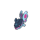

# Trainer Rosters

---

## West)

---

## Generic Trainers

| Trainer | P1 | P2 | P3 | P4 | P5 | P6 |
|:-------:|:--:|:--:|:--:|:--:|:--:|:--:|
|  Fisherman Joseph (!) |  Goldeen Lv. 18 |  Poliwag Lv. 18 |  Corphish Lv. 18 |
|  Fisherman Andrew |  Magikarp Lv. 18 |  Feebas Lv. 18 |  Magikarp Lv. 18 |
|  Fisherman Zachary |  Krabby Lv. 19 |  Finneon Lv. 19 |
---

## East)

---

## Generic Trainers

| Trainer | P1 | P2 | P3 | P4 | P5 | P6 |
|:-------:|:--:|:--:|:--:|:--:|:--:|:--:|
|  Ninja Boy Zach (!) |  Zubat Lv. 19 |  Skorupi Lv. 19 |  Zubat Lv. 19 |
|  Hiker Louis |  Geodude Lv. 19 |  Slugma Lv. 19 |  Beldum Lv. 19 |
|  Bird Keeper Alexandra |  Natu Lv. 20 |  Swablu Lv. 20 |  Staravia Lv. 20 |
