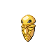

# Route 211 — Wild Pokémon

---

## West

### Walking

| Sprite | Pokémon | Encounter Type | Level | Chance |
|:------:|---------|:--------------:|-------|--------|
|  | [Meditite](../../pokemon/meditite.md/) | {: style='max-width: 24px;' } | 16 - 18 | 30% |
|  | [Machop](../../pokemon/machop.md/) | {: style='max-width: 24px;' } | 16 - 18 | 20% |
|  | [Swablu](../../pokemon/swablu.md/) | {: style='max-width: 24px;' } | 16 - 18 | 20% |
|  | [Teddiursa](../../pokemon/teddiursa.md/) | {: style='max-width: 24px;' } | 16 - 18 | 10% |
|  | [Natu](../../pokemon/natu.md/) | {: style='max-width: 24px;' } | 16 - 18 | 10% |
|  | [Chingling](../../pokemon/chingling.md/) | {: style='max-width: 24px;' } | 16 - 18 | 10% |
|  | [Meditite](../../pokemon/meditite.md/) | {: style='max-width: 24px;' } | 16 - 18 | 30% |
|  | [Machop](../../pokemon/machop.md/) | {: style='max-width: 24px;' } | 16 - 18 | 20% |
|  | [Swablu](../../pokemon/swablu.md/) | {: style='max-width: 24px;' } | 16 - 18 | 20% |
|  | [Teddiursa](../../pokemon/teddiursa.md/) | {: style='max-width: 24px;' } | 16 - 18 | 10% |
|  | [Natu](../../pokemon/natu.md/) | {: style='max-width: 24px;' } | 16 - 18 | 10% |
|  | [Chingling](../../pokemon/chingling.md/) | {: style='max-width: 24px;' } | 16 - 18 | 10% |
|  | [Meditite](../../pokemon/meditite.md/) | {: style='max-width: 24px;' } | 16 - 18 | 30% |
|  | [Machop](../../pokemon/machop.md/) | {: style='max-width: 24px;' } | 16 - 18 | 20% |
|  | [Swablu](../../pokemon/swablu.md/) | {: style='max-width: 24px;' } | 16 - 18 | 20% |
|  | [Teddiursa](../../pokemon/teddiursa.md/) | {: style='max-width: 24px;' } | 16 - 18 | 10% |
|  | [Natu](../../pokemon/natu.md/) | {: style='max-width: 24px;' } | 16 - 18 | 10% |
|  | [Chingling](../../pokemon/chingling.md/) | {: style='max-width: 24px;' } | 16 - 18 | 10% |
|  | [Tyrogue](../../pokemon/tyrogue.md/) | {: style='max-width: 24px;' } | 16 - 18 | 22% |

---

## East

### Walking

| Sprite | Pokémon | Encounter Type | Level | Chance |
|:------:|---------|:--------------:|-------|--------|
|  | [Meditite](../../pokemon/meditite.md/) | {: style='max-width: 24px;' } | 18 - 19 | 30% |
|  | [Machop](../../pokemon/machop.md/) | {: style='max-width: 24px;' } | 18 - 19 | 20% |
|  | [Swablu](../../pokemon/swablu.md/) | {: style='max-width: 24px;' } | 18 - 19 | 20% |
|  | [Teddiursa](../../pokemon/teddiursa.md/) | {: style='max-width: 24px;' } | 18 - 19 | 10% |
|  | [Natu](../../pokemon/natu.md/) | {: style='max-width: 24px;' } | 18 - 19 | 10% |
|  | [Bagon](../../pokemon/bagon.md/) | {: style='max-width: 24px;' } | 18 - 19 | 10% |
|  | [Meditite](../../pokemon/meditite.md/) | {: style='max-width: 24px;' } | 18 - 19 | 30% |
|  | [Machop](../../pokemon/machop.md/) | {: style='max-width: 24px;' } | 18 - 19 | 20% |
|  | [Swablu](../../pokemon/swablu.md/) | {: style='max-width: 24px;' } | 18 - 19 | 20% |
|  | [Teddiursa](../../pokemon/teddiursa.md/) | {: style='max-width: 24px;' } | 18 - 19 | 10% |
|  | [Natu](../../pokemon/natu.md/) | {: style='max-width: 24px;' } | 18 - 19 | 10% |
|  | [Bagon](../../pokemon/bagon.md/) | {: style='max-width: 24px;' } | 18 - 19 | 10% |
|  | [Meditite](../../pokemon/meditite.md/) | {: style='max-width: 24px;' } | 18 - 19 | 30% |
|  | [Machop](../../pokemon/machop.md/) | {: style='max-width: 24px;' } | 18 - 19 | 20% |
|  | [Swablu](../../pokemon/swablu.md/) | {: style='max-width: 24px;' } | 18 - 19 | 20% |
|  | [Teddiursa](../../pokemon/teddiursa.md/) | {: style='max-width: 24px;' } | 18 - 19 | 10% |
|  | [Natu](../../pokemon/natu.md/) | {: style='max-width: 24px;' } | 18 - 19 | 10% |
|  | [Bagon](../../pokemon/bagon.md/) | {: style='max-width: 24px;' } | 18 - 19 | 10% |
|  | [Tyrogue](../../pokemon/tyrogue.md/) | {: style='max-width: 24px;' } | 18 - 19 | 22% |

### Honey Tree

| Sprite | Pokémon | Encounter Type | Level | Chance |
|:------:|---------|:--------------:|-------|--------|
|  | [Aipom](../../pokemon/aipom.md/) | {: style='max-width: 24px;' } | 18 | 30% |
|  | [Slakoth](../../pokemon/slakoth.md/) | {: style='max-width: 24px;' } | 18 | 20% |
|  | [Metapod](../../pokemon/metapod.md/) | {: style='max-width: 24px;' } | 18 | 20% |
|  | [Kakuna](../../pokemon/kakuna.md/) | {: style='max-width: 24px;' } | 18 | 20% |
|  | [Munchlax](../../pokemon/munchlax.md/) | {: style='max-width: 24px;' } | 18 | 10% |

