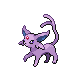

# Important Trainers

---

## North

### Commander Saturn

| Pokémon | Attributes | Moves |
|:-------:|------------|-------|
|  | **Lv. 33** Bronzong **Ability:** Levitate **Nature:** ? **Item:** Leftovers | **1.** Hypnosis **2.** Gyro Ball **3.** Zen Headbutt **4.** Confuse Ray |
|  | **Lv. 33** Octillery **Ability:** Suction Cups **Nature:** ? **Item:** Wise Glasses | **1.** Octazooka **2.** Signal Beam **3.** Ice Beam **4.** Flamethrower |
|  | **Lv. 34** Toxicroak **Ability:** Dry Skin **Nature:** ? **Item:** Muscle Band | **1.** Drain Punch **2.** Poison Jab **3.** Fake Out **4.** Vacuum Wave |

### Gentleman Backlot

| Pokémon | Attributes | Moves |
|:-------:|------------|-------|
|  | **Lv. 33** Wigglytuff **Ability:** Cute Charm **Nature:** ? **Item:** Zoom Lens | **1.** Moonblast **2.** Hyper Voice **3.** Sing **4.** Thunderbolt |
|  | **Lv. 33** Raichu **Ability:** Static **Nature:** ? **Item:** Wise Glasses | **1.** Fake Out **2.** Thunderbolt **3.** Grass Knot **4.** Teeter Dance |
|  | **Lv. 33** Espeon **Ability:** Synchronize **Nature:** ? **Item:** Sitrus Berry | **1.** Psychic **2.** Power Gem **3.** Dazzling Gleam **4.** Protect |

