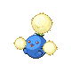
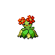

# Trainer Rosters

---

## North

### Generic Trainers

| Trainer | P1 | P2 | P3 | P4 | P5 | P6 |
|:-------:|:--:|:--:|:--:|:--:|:--:|:--:|
|  Galactic Grunt |  [Mightyena](../../pokemon/mightyena.md/) Lv. 29 |  [Arbok](../../pokemon/arbok.md/) Lv. 29 |
|  Galactic Grunt |  [Kricketune](../../pokemon/kricketune.md/) Lv. 30 |
|  Galactic Grunt |  [Glameow](../../pokemon/glameow.md/) Lv. 28 |  [Koffing](../../pokemon/koffing.md/) Lv. 28 |  [Dustox](../../pokemon/dustox.md/) Lv. 28 |
|  Galactic Grunt |  [Lunatone](../../pokemon/lunatone.md/) Lv. 29 |  [Solrock](../../pokemon/solrock.md/) Lv. 29 |
|  Galactic Grunt |  [Solrock](../../pokemon/solrock.md/) Lv. 29 |  [Lunatone](../../pokemon/lunatone.md/) Lv. 29 |
|  Galactic Grunt |  [Nincada](../../pokemon/nincada.md/) Lv. 30 |
|  Galactic Grunt |  [Ninjask](../../pokemon/ninjask.md/) Lv. 30 |
|  Galactic Grunt |  [Shedinja](../../pokemon/shedinja.md/) Lv. 30 |
|  Galactic Grunt |  [Beedrill](../../pokemon/beedrill.md/) Lv. 29 |  [Golbat](../../pokemon/golbat.md/) Lv. 29 |
|  Galactic Grunt |  [Croagunk](../../pokemon/croagunk.md/) Lv. 28 |  [Seviper](../../pokemon/seviper.md/) Lv. 28 |  [Butterfree](../../pokemon/butterfree.md/) Lv. 28 |
|  Galactic Grunt |  [Murkrow](../../pokemon/murkrow.md/) Lv. 30 |
|  Galactic Grunt |  [Stunky](../../pokemon/stunky.md/) Lv. 28 |  [Venonat](../../pokemon/venonat.md/) Lv. 28 |  [Arbok](../../pokemon/arbok.md/) Lv. 28 |
|  Rich Boy Jason |  [Prinplup](../../pokemon/prinplup.md/) Lv. 30 |  [Azumarill](../../pokemon/azumarill.md/) Lv. 30 |
| ") Lady Melissa [(!)](#rematches) |  [Cherrim](../../pokemon/cherrim.md/) Lv. 30 |  [Jumpluff](../../pokemon/jumpluff.md/) Lv. 30 |
| ") Gentleman Jeremy [(!)](#rematches) |  [Chatot](../../pokemon/chatot.md/) Lv. 31 |
| ") Socialite Reina [(!)](#rematches) |  [Delcatty](../../pokemon/delcatty.md/) Lv. 31 |
|  Policeman Bobby |  [Noctowl](../../pokemon/noctowl.md/) Lv. 31 |
|  Policeman Alex |  [Machamp](../../pokemon/machamp.md/) Lv. 31 |
|  Policeman Dylan |  [Arcanine](../../pokemon/arcanine.md/) Lv. 31 |
|  Policeman Caleb |  [Granbull](../../pokemon/granbull.md/) Lv. 31 |

### Rematches

| Trainer | P1 | P2 | P3 | P4 | P5 | P6 |
|:-------:|:--:|:--:|:--:|:--:|:--:|:--:|
| ") Lady Melissa (5) |  [Gloom](../../pokemon/gloom.md/) Lv. 38 |  [Cherrim](../../pokemon/cherrim.md/) Lv. 38 |  [Jumpluff](../../pokemon/jumpluff.md/) Lv. 38 |
| ") Lady Melissa (8) |  [Bellossom](../../pokemon/bellossom.md/) Lv. 59 |  [Cherrim](../../pokemon/cherrim.md/) Lv. 59 |  [Jumpluff](../../pokemon/jumpluff.md/) Lv. 59 |
| ") Lady Melissa (C) |  [Bellossom](../../pokemon/bellossom.md/) Lv. 70 |  [Cherrim](../../pokemon/cherrim.md/) Lv. 70 |  [Jumpluff](../../pokemon/jumpluff.md/) Lv. 70 |
| ") Gentleman Jeremy (5) |  [Chatot](../../pokemon/chatot.md/) Lv. 41 |
| ") Gentleman Jeremy (8) |  [Chatot](../../pokemon/chatot.md/) Lv. 62 |
| ") Gentleman Jeremy (C) |  [Chatot](../../pokemon/chatot.md/) Lv. 73 |
| ") Socialite Reina (8) |  [Delcatty](../../pokemon/delcatty.md/) Lv. 62 |
| ") Socialite Reina (C) |  [Delcatty](../../pokemon/delcatty.md/) Lv. 73 |

### Important Trainers

1. [Commander Saturn](important_trainers.md#commander-saturn)
1. [Gentleman Backlot](important_trainers.md#gentleman-backlot)

---

## South

### Generic Trainers

| Trainer | P1 | P2 | P3 | P4 | P5 | P6 |
|:-------:|:--:|:--:|:--:|:--:|:--:|:--:|
|  Parasol Lady Sabrina |  [Castform](../../pokemon/castform.md/) Lv. 39 |
| ") Scientist Shaun [(!)](#rematches) |  [Magneton](../../pokemon/magneton.md/) Lv. 37 |  [Electrode](../../pokemon/electrode.md/) Lv. 37 |  [Porygon2](../../pokemon/porygon2.md/) Lv. 37 |
| ") PKMN Ranger Taylor [(!)](#rematches) |  [Carnivine](../../pokemon/carnivine.md/) Lv. 39 |  [Kecleon](../../pokemon/kecleon.md/) Lv. 39 |  [Electabuzz](../../pokemon/electabuzz.md/) Lv. 39 |
| ") Parasol Lady Alexa [(!)](#rematches) |  [Seadra](../../pokemon/seadra.md/) Lv. 38 |  [Golduck](../../pokemon/golduck.md/) Lv. 38 |
|  Fisherman Juan |  [Shellder](../../pokemon/shellder.md/) Lv. 36 |  [Clamperl](../../pokemon/clamperl.md/) Lv. 36 |  [Cloyster](../../pokemon/cloyster.md/) Lv. 39 |
|  Fisherman Josh |  [Remoraid](../../pokemon/remoraid.md/) Lv. 36 |  [Goldeen](../../pokemon/goldeen.md/) Lv. 36 |  [Octillery](../../pokemon/octillery.md/) Lv. 39 |
|  Fisherman Travis |  [Barboach](../../pokemon/barboach.md/) Lv. 38 |  [Qwilfish](../../pokemon/qwilfish.md/) Lv. 38 |
|  Collector Dean |  [Espeon](../../pokemon/espeon.md/) Lv. 37 |  [Umbreon](../../pokemon/umbreon.md/) Lv. 37 |  [Glaceon](../../pokemon/glaceon.md/) Lv. 37 |
|  Policeman Danny |  [Growlithe](../../pokemon/growlithe.md/) Lv. 37 |  [Machoke](../../pokemon/machoke.md/) Lv. 37 |  [Noctowl](../../pokemon/noctowl.md/) Lv. 37 |
|  Scientist Stefano |  [Weezing](../../pokemon/weezing.md/) Lv. 38 |  [Muk](../../pokemon/muk.md/) Lv. 38 |
| ") PKMN Ranger Allison [(!)](#rematches) |  [Milotic](../../pokemon/milotic.md/) Lv. 39 |  [Leafeon](../../pokemon/leafeon.md/) Lv. 39 |  [Jynx](../../pokemon/jynx.md/) Lv. 39 |
|  PKMN Ranger Jeffrey |  [Magmar](../../pokemon/magmar.md/) Lv. 39 |  [Manectric](../../pokemon/manectric.md/) Lv. 39 |  [Nidoking](../../pokemon/nidoking.md/) Lv. 39 |

### Rematches

| Trainer | P1 | P2 | P3 | P4 | P5 | P6 |
|:-------:|:--:|:--:|:--:|:--:|:--:|:--:|
| ") Scientist Shaun (5) |  [Magneton](../../pokemon/magneton.md/) Lv. 38 |  [Electrode](../../pokemon/electrode.md/) Lv. 38 |  [Porygon2](../../pokemon/porygon2.md/) Lv. 38 |
| ") Scientist Shaun (8) |  [Magneton](../../pokemon/magneton.md/) Lv. 59 |  [Electrode](../../pokemon/electrode.md/) Lv. 59 |  [Porygon2](../../pokemon/porygon2.md/) Lv. 59 |
| ") Scientist Shaun (C) |  [Magnezone](../../pokemon/magnezone.md/) Lv. 70 |  [Electrode](../../pokemon/electrode.md/) Lv. 70 |  [Porygon-Z](../../pokemon/porygon-z.md/) Lv. 70 |
| ") PKMN Ranger Taylor (5) |  [Carnivine](../../pokemon/carnivine.md/) Lv. 40 |  [Kecleon](../../pokemon/kecleon.md/) Lv. 40 |  [Electabuzz](../../pokemon/electabuzz.md/) Lv. 40 |
| ") PKMN Ranger Taylor (8) |  [Carnivine](../../pokemon/carnivine.md/) Lv. 60 |  [Kecleon](../../pokemon/kecleon.md/) Lv. 60 |  [Electivire](../../pokemon/electivire.md/) Lv. 60 |
| ") PKMN Ranger Taylor (C) |  [Carnivine](../../pokemon/carnivine.md/) Lv. 71 |  [Kecleon](../../pokemon/kecleon.md/) Lv. 71 |  [Electivire](../../pokemon/electivire.md/) Lv. 71 |
| ") PKMN Ranger Allison (5) |  [Milotic](../../pokemon/milotic.md/) Lv. 40 |  [Leafeon](../../pokemon/leafeon.md/) Lv. 40 |  [Jynx](../../pokemon/jynx.md/) Lv. 40 |
| ") PKMN Ranger Allison (8) |  [Milotic](../../pokemon/milotic.md/) Lv. 60 |  [Leafeon](../../pokemon/leafeon.md/) Lv. 60 |  [Jynx](../../pokemon/jynx.md/) Lv. 60 |
| ") PKMN Ranger Allison (C) |  [Milotic](../../pokemon/milotic.md/) Lv. 71 |  [Leafeon](../../pokemon/leafeon.md/) Lv. 71 |  [Jynx](../../pokemon/jynx.md/) Lv. 71 |
| ") Parasol Lady Alexa (5) |  [Seadra](../../pokemon/seadra.md/) Lv. 39 |  [Golduck](../../pokemon/golduck.md/) Lv. 39 |
| ") Parasol Lady Alexa (8) |  [Kingdra](../../pokemon/kingdra.md/) Lv. 60 |  [Golduck](../../pokemon/golduck.md/) Lv. 60 |
| ") Parasol Lady Alexa (C) |  [Kingdra](../../pokemon/kingdra.md/) Lv. 71 |  [Golduck](../../pokemon/golduck.md/) Lv. 71 |

