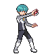
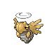
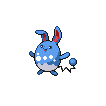
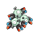

# Trainer Rosters

---

## North

### Generic Trainers

| Trainer | P1 | P2 | P3 | P4 | P5 | P6 |
|:-------:|:--:|:--:|:--:|:--:|:--:|:--:|
|  Galactic Grunt |  Mightyena Lv. 29 |  Arbok Lv. 29 |
|  Galactic Grunt |  Kricketune Lv. 30 |
|  Galactic Grunt |  Glameow Lv. 28 |  Koffing Lv. 28 |  Dustox Lv. 28 |
|  Galactic Grunt |  Lunatone Lv. 29 |  Solrock Lv. 29 |
|  Galactic Grunt |  Solrock Lv. 29 |  Lunatone Lv. 29 |
|  Galactic Grunt |  Nincada Lv. 30 |
|  Galactic Grunt |  Ninjask Lv. 30 |
|  Galactic Grunt |  Shedinja Lv. 30 |
|  Galactic Grunt |  Beedrill Lv. 29 |  Golbat Lv. 29 |
|  Galactic Grunt |  Croagunk Lv. 28 |  Seviper Lv. 28 |  Butterfree Lv. 28 |
|  Galactic Grunt |  Murkrow Lv. 30 |
|  Galactic Grunt |  Stunky Lv. 28 |  Venonat Lv. 28 |  Arbok Lv. 28 |
|  Rich Boy Jason |  Prinplup Lv. 30 |  Azumarill Lv. 30 |
| ](../../assets/trainers/lady.png) Lady Melissa [(!)](#rematches) |  Cherrim Lv. 30 |  Jumpluff Lv. 30 |
| ](../../assets/trainers/gentleman.png) Gentleman Jeremy [(!)](#rematches) |  Chatot Lv. 31 |
| ](../../assets/trainers/socialite.png) Socialite Reina [(!)](#rematches) |  Delcatty Lv. 31 |
|  Policeman Bobby |  Noctowl Lv. 31 |
|  Policeman Alex |  Machamp Lv. 31 |
|  Policeman Dylan |  Arcanine Lv. 31 |
|  Policeman Caleb |  Granbull Lv. 31 |

### Rematches

| Trainer | P1 | P2 | P3 | P4 | P5 | P6 |
|:-------:|:--:|:--:|:--:|:--:|:--:|:--:|
|  Lady Melissa (5) |  Gloom Lv. 38 |  Cherrim Lv. 38 |  Jumpluff Lv. 38 |
|  Lady Melissa (8) |  Bellossom Lv. 59 |  Cherrim Lv. 59 |  Jumpluff Lv. 59 |
|  Lady Melissa (C) |  Bellossom Lv. 70 |  Cherrim Lv. 70 |  Jumpluff Lv. 70 |
|  Gentleman Jeremy (5) |  Chatot Lv. 41 |
|  Gentleman Jeremy (8) |  Chatot Lv. 62 |
|  Gentleman Jeremy (C) |  Chatot Lv. 73 |
|  Socialite Reina (8) |  Delcatty Lv. 62 |
|  Socialite Reina (C) |  Delcatty Lv. 73 |

---

## South

### Generic Trainers

| Trainer | P1 | P2 | P3 | P4 | P5 | P6 |
|:-------:|:--:|:--:|:--:|:--:|:--:|:--:|
|  Parasol Lady Sabrina |  Castform Lv. 39 |
| ](../../assets/trainers/scientist.png) Scientist Shaun [(!)](#rematches) |  Magneton Lv. 37 |  Electrode Lv. 37 |  Porygon2 Lv. 37 |
| ](../../assets/trainers/pkmn_ranger.png) PKMN Ranger Taylor [(!)](#rematches) |  Carnivine Lv. 39 |  Kecleon Lv. 39 |  Electabuzz Lv. 39 |
| ](../../assets/trainers/parasol_lady.png) Parasol Lady Alexa [(!)](#rematches) |  Seadra Lv. 38 |  Golduck Lv. 38 |
|  Fisherman Juan |  Shellder Lv. 36 |  Clamperl Lv. 36 |  Cloyster Lv. 39 |
|  Fisherman Josh |  Remoraid Lv. 36 |  Goldeen Lv. 36 |  Octillery Lv. 39 |
|  Fisherman Travis |  Barboach Lv. 38 |  Qwilfish Lv. 38 |
|  Collector Dean |  Espeon Lv. 37 |  Umbreon Lv. 37 |  Glaceon Lv. 37 |
|  Policeman Danny |  Growlithe Lv. 37 |  Machoke Lv. 37 |  Noctowl Lv. 37 |
|  Scientist Stefano |  Weezing Lv. 38 |  Muk Lv. 38 |
| ](../../assets/trainers/pkmn_ranger.png) PKMN Ranger Allison [(!)](#rematches) |  Milotic Lv. 39 |  Leafeon Lv. 39 |  Jynx Lv. 39 |
|  PKMN Ranger Jeffrey |  Magmar Lv. 39 |  Manectric Lv. 39 |  Nidoking Lv. 39 |

### Rematches

| Trainer | P1 | P2 | P3 | P4 | P5 | P6 |
|:-------:|:--:|:--:|:--:|:--:|:--:|:--:|
|  Scientist Shaun (5) |  Magneton Lv. 38 |  Electrode Lv. 38 |  Porygon2 Lv. 38 |
|  Scientist Shaun (8) |  Magneton Lv. 59 |  Electrode Lv. 59 |  Porygon2 Lv. 59 |
|  Scientist Shaun (C) |  Magnezone Lv. 70 |  Electrode Lv. 70 |  Porygon-Z Lv. 70 |
|  PKMN Ranger Taylor (5) |  Carnivine Lv. 40 |  Kecleon Lv. 40 |  Electabuzz Lv. 40 |
|  PKMN Ranger Taylor (8) |  Carnivine Lv. 60 |  Kecleon Lv. 60 |  Electivire Lv. 60 |
|  PKMN Ranger Taylor (C) |  Carnivine Lv. 71 |  Kecleon Lv. 71 |  Electivire Lv. 71 |
|  PKMN Ranger Allison (5) |  Milotic Lv. 40 |  Leafeon Lv. 40 |  Jynx Lv. 40 |
|  PKMN Ranger Allison (8) |  Milotic Lv. 60 |  Leafeon Lv. 60 |  Jynx Lv. 60 |
|  PKMN Ranger Allison (C) |  Milotic Lv. 71 |  Leafeon Lv. 71 |  Jynx Lv. 71 |
|  Parasol Lady Alexa (5) |  Seadra Lv. 39 |  Golduck Lv. 39 |
|  Parasol Lady Alexa (8) |  Kingdra Lv. 60 |  Golduck Lv. 60 |
|  Parasol Lady Alexa (C) |  Kingdra Lv. 71 |  Golduck Lv. 71 |

