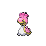

---

## North

### Walking

| Sprite | Pokémon | Encounter Type | Level | Chance |
|:------:|---------|:--------------:|-------|--------|
|  | Staravia | {: style='max-width: 24px;' } | 24 - 26 | 30% |
|  | Marill | {: style='max-width: 24px;' } | 24 - 26 | 20% |
|  | Roselia | {: style='max-width: 24px;' } | 24 - 26 | 10% |
|  | Weepinbell | {: style='max-width: 24px;' } | 24 - 26 | 10% |
|  | Gloom | {: style='max-width: 24px;' } | 24 - 26 | 10% |
|  | Kirlia | {: style='max-width: 24px;' } | 24 - 26 | 10% |
|  | Smeargle | {: style='max-width: 24px;' } | 24 - 26 | 10% |
|  | Staravia | {: style='max-width: 24px;' } | 24 - 26 | 30% |
|  | Marill | {: style='max-width: 24px;' } | 24 - 26 | 20% |
|  | Roselia | {: style='max-width: 24px;' } | 24 - 26 | 10% |
|  | Weepinbell | {: style='max-width: 24px;' } | 24 - 26 | 10% |
|  | Gloom | {: style='max-width: 24px;' } | 24 - 26 | 10% |
|  | Kirlia | {: style='max-width: 24px;' } | 24 - 26 | 10% |
|  | Smeargle | {: style='max-width: 24px;' } | 24 - 26 | 10% |
|  | Staravia | {: style='max-width: 24px;' } | 24 - 26 | 30% |
|  | Marill | {: style='max-width: 24px;' } | 24 - 26 | 20% |
|  | Roselia | {: style='max-width: 24px;' } | 24 - 26 | 10% |
|  | Weepinbell | {: style='max-width: 24px;' } | 24 - 26 | 10% |
|  | Gloom | {: style='max-width: 24px;' } | 24 - 26 | 10% |
|  | Kirlia | {: style='max-width: 24px;' } | 24 - 26 | 10% |
|  | Smeargle | {: style='max-width: 24px;' } | 24 - 26 | 10% |
|  | Farfetch'd | {: style='max-width: 24px;' } | 24 - 26 | 22% |

### Surfing

| Sprite | Pokémon | Encounter Type | Level | Chance |
|:------:|---------|:--------------:|-------|--------|
|  | Marill | {: style='max-width: 24px;' } | 20 - 40 | 90% |
|  | Azumarill | {: style='max-width: 24px;' } | 20 - 40 | 10% |

### Fishing

| Sprite | Pokémon | Encounter Type | Level | Chance |
|:------:|---------|:--------------:|-------|--------|
|  | Magikarp | {: style='max-width: 24px;' } | 10 | 65% |
|  | Goldeen | {: style='max-width: 24px;' } | 10 | 35% |
|  | Magikarp | {: style='max-width: 24px;' } | 25 | 65% |
|  | Goldeen | {: style='max-width: 24px;' } | 25 | 35% |
|  | Gyarados | {: style='max-width: 24px;' } | 50 | 65% |
|  | Seaking | {: style='max-width: 24px;' } | 50 | 35% |

### Honey Tree

| Sprite | Pokémon | Encounter Type | Level | Chance |
|:------:|---------|:--------------:|-------|--------|
|  | Cherubi | {: style='max-width: 24px;' } | 25 | 30% |
|  | Shroomish | {: style='max-width: 24px;' } | 25 | 20% |
|  | Exeggcute | {: style='max-width: 24px;' } | 25 | 20% |
|  | Nuzleaf | {: style='max-width: 24px;' } | 25 | 20% |
|  | Tangela | {: style='max-width: 24px;' } | 25 | 10% |

---

## South

### Walking

| Sprite | Pokémon | Encounter Type | Level | Chance |
|:------:|---------|:--------------:|-------|--------|
|  | Croagunk | {: style='max-width: 24px;' } | 33 - 36 | 20% |
|  | Grimer | {: style='max-width: 24px;' } | 33 - 36 | 20% |
|  | Koffing | {: style='max-width: 24px;' } | 33 - 36 | 15% |
|  | Ekans | {: style='max-width: 24px;' } | 33 - 36 | 15% |
|  | Weepinbell | {: style='max-width: 24px;' } | 33 - 36 | 10% |
|  | Lombre | {: style='max-width: 24px;' } | 33 - 36 | 10% |
|  | Arbok | {: style='max-width: 24px;' } | 33 - 36 | 5% |
|  | Toxicroak | {: style='max-width: 24px;' } | 33 - 36 | 5% |
|  | Croagunk | {: style='max-width: 24px;' } | 33 - 36 | 20% |
|  | Grimer | {: style='max-width: 24px;' } | 33 - 36 | 20% |
|  | Koffing | {: style='max-width: 24px;' } | 33 - 36 | 15% |
|  | Ekans | {: style='max-width: 24px;' } | 33 - 36 | 15% |
|  | Weepinbell | {: style='max-width: 24px;' } | 33 - 36 | 10% |
|  | Lombre | {: style='max-width: 24px;' } | 33 - 36 | 10% |
|  | Arbok | {: style='max-width: 24px;' } | 33 - 36 | 5% |
|  | Toxicroak | {: style='max-width: 24px;' } | 33 - 36 | 5% |
|  | Croagunk | {: style='max-width: 24px;' } | 33 - 36 | 20% |
|  | Grimer | {: style='max-width: 24px;' } | 33 - 36 | 20% |
|  | Koffing | {: style='max-width: 24px;' } | 33 - 36 | 15% |
|  | Ekans | {: style='max-width: 24px;' } | 33 - 36 | 15% |
|  | Weepinbell | {: style='max-width: 24px;' } | 33 - 36 | 10% |
|  | Lombre | {: style='max-width: 24px;' } | 33 - 36 | 10% |
|  | Arbok | {: style='max-width: 24px;' } | 33 - 36 | 5% |
|  | Toxicroak | {: style='max-width: 24px;' } | 33 - 36 | 5% |
|  | Muk | {: style='max-width: 24px;' } | 33 - 36 | 11% |
|  | Weezing | {: style='max-width: 24px;' } | 33 - 36 | 11% |

### Surfing

| Sprite | Pokémon | Encounter Type | Level | Chance |
|:------:|---------|:--------------:|-------|--------|
|  | Shellos | {: style='max-width: 24px;' } | 20 - 40 | 60% |
|  | Wooper | {: style='max-width: 24px;' } | 20 - 40 | 30% |
|  | Gastrodon | {: style='max-width: 24px;' } | 20 - 40 | 5% |
|  | Quagsire | {: style='max-width: 24px;' } | 20 - 40 | 5% |

### Fishing

| Sprite | Pokémon | Encounter Type | Level | Chance |
|:------:|---------|:--------------:|-------|--------|
|  | Magikarp | {: style='max-width: 24px;' } | 10 | 60% |
|  | Barboach | {: style='max-width: 24px;' } | 10 | 30% |
|  | Remoraid | {: style='max-width: 24px;' } | 10 | 10% |
|  | Magikarp | {: style='max-width: 24px;' } | 25 | 60% |
|  | Barboach | {: style='max-width: 24px;' } | 25 | 30% |
|  | Remoraid | {: style='max-width: 24px;' } | 25 | 10% |
|  | Gyarados | {: style='max-width: 24px;' } | 50 | 60% |
|  | Whiscash | {: style='max-width: 24px;' } | 50 | 30% |
|  | Octillery | {: style='max-width: 24px;' } | 50 | 10% |

### Honey Tree

| Sprite | Pokémon | Encounter Type | Level | Chance |
|:------:|---------|:--------------:|-------|--------|
|  | Cherrim | {: style='max-width: 24px;' } | 34 | 30% |
|  | Shroomish | {: style='max-width: 24px;' } | 34 | 20% |
|  | Exeggcute | {: style='max-width: 24px;' } | 34 | 20% |
|  | Nuzleaf | {: style='max-width: 24px;' } | 34 | 20% |
|  | Tangela | {: style='max-width: 24px;' } | 34 | 10% |

