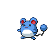
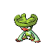

---

## North

### Walking

| Sprite | Pokémon | Encounter Type | Level | Chance |
|:------:|---------|:--------------:|-------|--------|
|  | [Staravia](../../pokemon/staravia.md/) | {: style='max-width: 24px;' } | 24 - 26 | 30% |
|  | [Marill](../../pokemon/marill.md/) | {: style='max-width: 24px;' } | 24 - 26 | 20% |
|  | [Roselia](../../pokemon/roselia.md/) | {: style='max-width: 24px;' } | 24 - 26 | 10% |
|  | [Weepinbell](../../pokemon/weepinbell.md/) | {: style='max-width: 24px;' } | 24 - 26 | 10% |
|  | [Gloom](../../pokemon/gloom.md/) | {: style='max-width: 24px;' } | 24 - 26 | 10% |
|  | [Kirlia](../../pokemon/kirlia.md/) | {: style='max-width: 24px;' } | 24 - 26 | 10% |
|  | [Smeargle](../../pokemon/smeargle.md/) | {: style='max-width: 24px;' } | 24 - 26 | 10% |
|  | [Staravia](../../pokemon/staravia.md/) | {: style='max-width: 24px;' } | 24 - 26 | 30% |
|  | [Marill](../../pokemon/marill.md/) | {: style='max-width: 24px;' } | 24 - 26 | 20% |
|  | [Roselia](../../pokemon/roselia.md/) | {: style='max-width: 24px;' } | 24 - 26 | 10% |
|  | [Weepinbell](../../pokemon/weepinbell.md/) | {: style='max-width: 24px;' } | 24 - 26 | 10% |
|  | [Gloom](../../pokemon/gloom.md/) | {: style='max-width: 24px;' } | 24 - 26 | 10% |
|  | [Kirlia](../../pokemon/kirlia.md/) | {: style='max-width: 24px;' } | 24 - 26 | 10% |
|  | [Smeargle](../../pokemon/smeargle.md/) | {: style='max-width: 24px;' } | 24 - 26 | 10% |
|  | [Staravia](../../pokemon/staravia.md/) | {: style='max-width: 24px;' } | 24 - 26 | 30% |
|  | [Marill](../../pokemon/marill.md/) | {: style='max-width: 24px;' } | 24 - 26 | 20% |
|  | [Roselia](../../pokemon/roselia.md/) | {: style='max-width: 24px;' } | 24 - 26 | 10% |
|  | [Weepinbell](../../pokemon/weepinbell.md/) | {: style='max-width: 24px;' } | 24 - 26 | 10% |
|  | [Gloom](../../pokemon/gloom.md/) | {: style='max-width: 24px;' } | 24 - 26 | 10% |
|  | [Kirlia](../../pokemon/kirlia.md/) | {: style='max-width: 24px;' } | 24 - 26 | 10% |
|  | [Smeargle](../../pokemon/smeargle.md/) | {: style='max-width: 24px;' } | 24 - 26 | 10% |
|  | [Farfetch'd](../../pokemon/farfetchd.md/) | {: style='max-width: 24px;' } | 24 - 26 | 22% |

### Surfing

| Sprite | Pokémon | Encounter Type | Level | Chance |
|:------:|---------|:--------------:|-------|--------|
|  | [Marill](../../pokemon/marill.md/) | {: style='max-width: 24px;' } | 20 - 40 | 90% |
|  | [Azumarill](../../pokemon/azumarill.md/) | {: style='max-width: 24px;' } | 20 - 40 | 10% |

### Fishing

| Sprite | Pokémon | Encounter Type | Level | Chance |
|:------:|---------|:--------------:|-------|--------|
|  | [Magikarp](../../pokemon/magikarp.md/) | {: style='max-width: 24px;' } | 10 | 65% |
|  | [Goldeen](../../pokemon/goldeen.md/) | {: style='max-width: 24px;' } | 10 | 35% |
|  | [Magikarp](../../pokemon/magikarp.md/) | {: style='max-width: 24px;' } | 25 | 65% |
|  | [Goldeen](../../pokemon/goldeen.md/) | {: style='max-width: 24px;' } | 25 | 35% |
|  | [Gyarados](../../pokemon/gyarados.md/) | {: style='max-width: 24px;' } | 50 | 65% |
|  | [Seaking](../../pokemon/seaking.md/) | {: style='max-width: 24px;' } | 50 | 35% |

### Honey Tree

| Sprite | Pokémon | Encounter Type | Level | Chance |
|:------:|---------|:--------------:|-------|--------|
|  | [Cherubi](../../pokemon/cherubi.md/) | {: style='max-width: 24px;' } | 25 | 30% |
|  | [Shroomish](../../pokemon/shroomish.md/) | {: style='max-width: 24px;' } | 25 | 20% |
|  | [Exeggcute](../../pokemon/exeggcute.md/) | {: style='max-width: 24px;' } | 25 | 20% |
|  | [Nuzleaf](../../pokemon/nuzleaf.md/) | {: style='max-width: 24px;' } | 25 | 20% |
|  | [Tangela](../../pokemon/tangela.md/) | {: style='max-width: 24px;' } | 25 | 10% |

---

## South

### Walking

| Sprite | Pokémon | Encounter Type | Level | Chance |
|:------:|---------|:--------------:|-------|--------|
|  | [Croagunk](../../pokemon/croagunk.md/) | {: style='max-width: 24px;' } | 33 - 36 | 20% |
|  | [Grimer](../../pokemon/grimer.md/) | {: style='max-width: 24px;' } | 33 - 36 | 20% |
|  | [Koffing](../../pokemon/koffing.md/) | {: style='max-width: 24px;' } | 33 - 36 | 15% |
|  | [Ekans](../../pokemon/ekans.md/) | {: style='max-width: 24px;' } | 33 - 36 | 15% |
|  | [Weepinbell](../../pokemon/weepinbell.md/) | {: style='max-width: 24px;' } | 33 - 36 | 10% |
|  | [Lombre](../../pokemon/lombre.md/) | {: style='max-width: 24px;' } | 33 - 36 | 10% |
|  | [Arbok](../../pokemon/arbok.md/) | {: style='max-width: 24px;' } | 33 - 36 | 5% |
|  | [Toxicroak](../../pokemon/toxicroak.md/) | {: style='max-width: 24px;' } | 33 - 36 | 5% |
|  | [Croagunk](../../pokemon/croagunk.md/) | {: style='max-width: 24px;' } | 33 - 36 | 20% |
|  | [Grimer](../../pokemon/grimer.md/) | {: style='max-width: 24px;' } | 33 - 36 | 20% |
|  | [Koffing](../../pokemon/koffing.md/) | {: style='max-width: 24px;' } | 33 - 36 | 15% |
|  | [Ekans](../../pokemon/ekans.md/) | {: style='max-width: 24px;' } | 33 - 36 | 15% |
|  | [Weepinbell](../../pokemon/weepinbell.md/) | {: style='max-width: 24px;' } | 33 - 36 | 10% |
|  | [Lombre](../../pokemon/lombre.md/) | {: style='max-width: 24px;' } | 33 - 36 | 10% |
|  | [Arbok](../../pokemon/arbok.md/) | {: style='max-width: 24px;' } | 33 - 36 | 5% |
|  | [Toxicroak](../../pokemon/toxicroak.md/) | {: style='max-width: 24px;' } | 33 - 36 | 5% |
|  | [Croagunk](../../pokemon/croagunk.md/) | {: style='max-width: 24px;' } | 33 - 36 | 20% |
|  | [Grimer](../../pokemon/grimer.md/) | {: style='max-width: 24px;' } | 33 - 36 | 20% |
|  | [Koffing](../../pokemon/koffing.md/) | {: style='max-width: 24px;' } | 33 - 36 | 15% |
|  | [Ekans](../../pokemon/ekans.md/) | {: style='max-width: 24px;' } | 33 - 36 | 15% |
|  | [Weepinbell](../../pokemon/weepinbell.md/) | {: style='max-width: 24px;' } | 33 - 36 | 10% |
|  | [Lombre](../../pokemon/lombre.md/) | {: style='max-width: 24px;' } | 33 - 36 | 10% |
|  | [Arbok](../../pokemon/arbok.md/) | {: style='max-width: 24px;' } | 33 - 36 | 5% |
|  | [Toxicroak](../../pokemon/toxicroak.md/) | {: style='max-width: 24px;' } | 33 - 36 | 5% |
|  | [Muk](../../pokemon/muk.md/) | {: style='max-width: 24px;' } | 33 - 36 | 11% |
|  | [Weezing](../../pokemon/weezing.md/) | {: style='max-width: 24px;' } | 33 - 36 | 11% |

### Surfing

| Sprite | Pokémon | Encounter Type | Level | Chance |
|:------:|---------|:--------------:|-------|--------|
|  | [Shellos](../../pokemon/shellos.md/) | {: style='max-width: 24px;' } | 20 - 40 | 60% |
|  | [Wooper](../../pokemon/wooper.md/) | {: style='max-width: 24px;' } | 20 - 40 | 30% |
|  | [Gastrodon](../../pokemon/gastrodon.md/) | {: style='max-width: 24px;' } | 20 - 40 | 5% |
|  | [Quagsire](../../pokemon/quagsire.md/) | {: style='max-width: 24px;' } | 20 - 40 | 5% |

### Fishing

| Sprite | Pokémon | Encounter Type | Level | Chance |
|:------:|---------|:--------------:|-------|--------|
|  | [Magikarp](../../pokemon/magikarp.md/) | {: style='max-width: 24px;' } | 10 | 60% |
|  | [Barboach](../../pokemon/barboach.md/) | {: style='max-width: 24px;' } | 10 | 30% |
|  | [Remoraid](../../pokemon/remoraid.md/) | {: style='max-width: 24px;' } | 10 | 10% |
|  | [Magikarp](../../pokemon/magikarp.md/) | {: style='max-width: 24px;' } | 25 | 60% |
|  | [Barboach](../../pokemon/barboach.md/) | {: style='max-width: 24px;' } | 25 | 30% |
|  | [Remoraid](../../pokemon/remoraid.md/) | {: style='max-width: 24px;' } | 25 | 10% |
|  | [Gyarados](../../pokemon/gyarados.md/) | {: style='max-width: 24px;' } | 50 | 60% |
|  | [Whiscash](../../pokemon/whiscash.md/) | {: style='max-width: 24px;' } | 50 | 30% |
|  | [Octillery](../../pokemon/octillery.md/) | {: style='max-width: 24px;' } | 50 | 10% |

### Honey Tree

| Sprite | Pokémon | Encounter Type | Level | Chance |
|:------:|---------|:--------------:|-------|--------|
|  | [Cherrim](../../pokemon/cherrim.md/) | {: style='max-width: 24px;' } | 34 | 30% |
|  | [Shroomish](../../pokemon/shroomish.md/) | {: style='max-width: 24px;' } | 34 | 20% |
|  | [Exeggcute](../../pokemon/exeggcute.md/) | {: style='max-width: 24px;' } | 34 | 20% |
|  | [Nuzleaf](../../pokemon/nuzleaf.md/) | {: style='max-width: 24px;' } | 34 | 20% |
|  | [Tangela](../../pokemon/tangela.md/) | {: style='max-width: 24px;' } | 34 | 10% |

