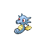

# Route 213 — Trainer Rosters

### Generic Trainers

| Trainer | P1 | P2 | P3 | P4 | P5 | P6 |
|:-------:|:--:|:--:|:--:|:--:|:--:|:--:|
| ") Beauty Cyndy [(!)](#rematches) |  [Delcatty](../../pokemon/delcatty.md/) Lv. 37 |  [Persian](../../pokemon/persian.md/) Lv. 37 |
|  Fisherman Kenneth |  [Carvanha](../../pokemon/carvanha.md/) Lv. 36 |  [Remoraid](../../pokemon/remoraid.md/) Lv. 36 |  [Horsea](../../pokemon/horsea.md/) Lv. 36 |
| ") Tuber Jared [(!)](#rematches) |  [Gastrodon](../../pokemon/gastrodon.md/) Lv. 37 |
| ") Tuber Chelsea [(!)](#rematches) |  [Azumarill](../../pokemon/azumarill.md/) Lv. 37 |
|  Swimmer Haley |  [Golduck](../../pokemon/golduck.md/) Lv. 43 |  [Mantine](../../pokemon/mantine.md/) Lv. 43 |  [Corsola](../../pokemon/corsola.md/) Lv. 43 |
|  Swimmer Sheltin |  [Gyarados](../../pokemon/gyarados.md/) Lv. 43 |  [Gyarados](../../pokemon/gyarados.md/) Lv. 43 |  [Gyarados](../../pokemon/gyarados.md/) Lv. 43 |
|  Sailor Paul |  [Politoed](../../pokemon/politoed.md/) Lv. 45 |
|  Swimmer Evan |  [Quagsire](../../pokemon/quagsire.md/) Lv. 44 |  [Sharpedo](../../pokemon/sharpedo.md/) Lv. 44 |
|  Swimmer Mary |  [Pelipper](../../pokemon/pelipper.md/) Lv. 44 |  [Lumineon](../../pokemon/lumineon.md/) Lv. 44 |
|  Galactic Grunt |  [Toxicroak](../../pokemon/toxicroak.md/) Lv. 41 |

### Rematches

| Trainer | P1 | P2 | P3 | P4 | P5 | P6 |
|:-------:|:--:|:--:|:--:|:--:|:--:|:--:|
| ") Beauty Cyndy (8) |  [Delcatty](../../pokemon/delcatty.md/) Lv. 59 |  [Persian](../../pokemon/persian.md/) Lv. 59 |  [Purugly](../../pokemon/purugly.md/) Lv. 59 |
| ") Beauty Cyndy (C) |  [Delcatty](../../pokemon/delcatty.md/) Lv. 70 |  [Persian](../../pokemon/persian.md/) Lv. 70 |  [Purugly](../../pokemon/purugly.md/) Lv. 70 |
| ") Tuber Jared (5) |  [Gastrodon](../../pokemon/gastrodon.md/) Lv. 39 |
| ") Tuber Jared (C) |  [Gastrodon](../../pokemon/gastrodon.md/) Lv. 69 |
| ") Tuber Chelsea (8) |  [Azumarill](../../pokemon/azumarill.md/) Lv. 59 |
| ") Tuber Chelsea (C) |  [Azumarill](../../pokemon/azumarill.md/) Lv. 69 |

