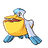
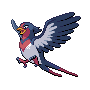
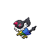
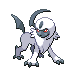
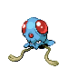
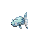

# Route 213 — Wild Pokémon

### Walking

| Sprite | Pokémon | Encounter Type | Level | Chance |
|:------:|---------|:--------------:|-------|--------|
|  | [Gastrodon](../../pokemon/gastrodon.md/) | {: style='max-width: 24px;' } | 32 - 34 | 25% |
|  | [Floatzel](../../pokemon/floatzel.md/) | {: style='max-width: 24px;' } | 32 - 34 | 20% |
|  | [Pelipper](../../pokemon/pelipper.md/) | {: style='max-width: 24px;' } | 32 - 34 | 20% |
|  | [Swellow](../../pokemon/swellow.md/) | {: style='max-width: 24px;' } | 32 - 34 | 20% |
|  | [Chatot](../../pokemon/chatot.md/) | {: style='max-width: 24px;' } | 32 - 34 | 10% |
|  | [Shuckle](../../pokemon/shuckle.md/) | {: style='max-width: 24px;' } | 32 - 34 | 5% |
|  | [Gastrodon](../../pokemon/gastrodon.md/) | {: style='max-width: 24px;' } | 32 - 34 | 25% |
|  | [Floatzel](../../pokemon/floatzel.md/) | {: style='max-width: 24px;' } | 32 - 34 | 20% |
|  | [Pelipper](../../pokemon/pelipper.md/) | {: style='max-width: 24px;' } | 32 - 34 | 20% |
|  | [Swellow](../../pokemon/swellow.md/) | {: style='max-width: 24px;' } | 32 - 34 | 20% |
|  | [Chatot](../../pokemon/chatot.md/) | {: style='max-width: 24px;' } | 32 - 34 | 10% |
|  | [Shuckle](../../pokemon/shuckle.md/) | {: style='max-width: 24px;' } | 32 - 34 | 5% |
|  | [Gastrodon](../../pokemon/gastrodon.md/) | {: style='max-width: 24px;' } | 32 - 34 | 35% |
|  | [Floatzel](../../pokemon/floatzel.md/) | {: style='max-width: 24px;' } | 32 - 34 | 20% |
|  | [Pelipper](../../pokemon/pelipper.md/) | {: style='max-width: 24px;' } | 32 - 34 | 20% |
|  | [Swellow](../../pokemon/swellow.md/) | {: style='max-width: 24px;' } | 32 - 34 | 20% |
|  | [Shuckle](../../pokemon/shuckle.md/) | {: style='max-width: 24px;' } | 32 - 34 | 5% |
|  | [Absol](../../pokemon/absol.md/) | {: style='max-width: 24px;' } | 32 - 34 | 22% |

### Surfing

| Sprite | Pokémon | Encounter Type | Level | Chance |
|:------:|---------|:--------------:|-------|--------|
|  | [Tentacool](../../pokemon/tentacool.md/) | {: style='max-width: 24px;' } | 20 - 40 | 60% |
|  | [Wingull](../../pokemon/wingull.md/) | {: style='max-width: 24px;' } | 20 - 40 | 30% |
|  | [Tentacruel](../../pokemon/tentacruel.md/) | {: style='max-width: 24px;' } | 20 - 40 | 5% |
|  | [Pelipper](../../pokemon/pelipper.md/) | {: style='max-width: 24px;' } | 20 - 40 | 5% |

### Fishing

| Sprite | Pokémon | Encounter Type | Level | Chance |
|:------:|---------|:--------------:|-------|--------|
|  | [Magikarp](../../pokemon/magikarp.md/) | {: style='max-width: 24px;' } | 10 | 60% |
|  | [Remoraid](../../pokemon/remoraid.md/) | {: style='max-width: 24px;' } | 10 | 30% |
|  | [Wailmer](../../pokemon/wailmer.md/) | {: style='max-width: 24px;' } | 10 | 10% |
|  | [Magikarp](../../pokemon/magikarp.md/) | {: style='max-width: 24px;' } | 25 | 60% |
|  | [Remoraid](../../pokemon/remoraid.md/) | {: style='max-width: 24px;' } | 25 | 30% |
|  | [Wailmer](../../pokemon/wailmer.md/) | {: style='max-width: 24px;' } | 25 | 10% |
|  | [Gyarados](../../pokemon/gyarados.md/) | {: style='max-width: 24px;' } | 50 | 60% |
|  | [Octillery](../../pokemon/octillery.md/) | {: style='max-width: 24px;' } | 50 | 30% |
|  | [Wailord](../../pokemon/wailord.md/) | {: style='max-width: 24px;' } | 50 | 10% |

### Honey Tree

| Sprite | Pokémon | Encounter Type | Level | Chance |
|:------:|---------|:--------------:|-------|--------|
|  | [Staravia](../../pokemon/staravia.md/) | {: style='max-width: 24px;' } | 33 | 30% |
|  | [Pidgeotto](../../pokemon/pidgeotto.md/) | {: style='max-width: 24px;' } | 33 | 20% |
|  | [Noctowl](../../pokemon/noctowl.md/) | {: style='max-width: 24px;' } | 33 | 20% |
|  | [Swellow](../../pokemon/swellow.md/) | {: style='max-width: 24px;' } | 33 | 20% |
|  | [Farfetch'd](../../pokemon/farfetchd.md/) | {: style='max-width: 24px;' } | 33 | 10% |

