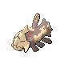
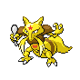

# Trainer Rosters

### Generic Trainers

| Trainer | P1 | P2 | P3 | P4 | P5 | P6 |
|:-------:|:--:|:--:|:--:|:--:|:--:|:--:|
| ](../../assets/trainers/pi.png) PI Carlos [(!)](#rematches) |  Dugtrio Lv. 36 |
|  Collector Douglas |  Jolteon Lv. 33 |  Vaporeon Lv. 33 |  Flareon Lv. 33 |
|  Collector Brady |  Kangaskhan Lv. 33 |  Tropius Lv. 33 |  Swalot Lv. 33 |
|  Ruin Maniac Bryan |  Anorith Lv. 33 |  Lileep Lv. 33 |  Aerodactyl Lv. 33 |
|  Ruin Maniac Ronald |  Relicanth Lv. 35 |
|  Collector Jamal |  Lapras Lv. 35 |
|  Beauty Devon |  Wormadam Lv. 33 |  Wormadam Lv. 33 |  Wormadam Lv. 33 |
| ](../../assets/trainers/psychic.png) Psychic Mitchell [(!)](#rematches) |  Kadabra Lv. 34 |  Grumpig Lv. 34 |  Hypno Lv. 34 |
| ](../../assets/trainers/psychic.png) Psychic Abigail [(!)](#rematches) |  Kirlia Lv. 34 |  Chimecho Lv. 34 |  Girafarig Lv. 34 |

### Rematches

| Trainer | P1 | P2 | P3 | P4 | P5 | P6 |
|:-------:|:--:|:--:|:--:|:--:|:--:|:--:|
|  PI Carlos (8) |  Dugtrio Lv. 62 |
|  PI Carlos (C) |  Dugtrio Lv. 70 |  Lapras Lv. 70 |  Kingler Lv. 70 |
|  Psychic Mitchell (8) |  Alakazam Lv. 60 |  Grumpig Lv. 60 |  Hypno Lv. 60 |
|  Psychic Mitchell (C) |  Alakazam Lv. 72 |  Grumpig Lv. 72 |  Hypno Lv. 72 |
|  Psychic Abigail (8) |  Gardevoir Lv. 60 |  Chimecho Lv. 60 |  Girafarig Lv. 60 |
|  Psychic Abigail (C) |  Gardevoir Lv. 72 |  Chimecho Lv. 72 |  Girafarig Lv. 72 |

