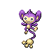

### Walking

| Sprite | Pokémon | Encounter Type | Level | Chance |
|:------:|---------|:--------------:|-------|--------|
|  | [Graveler](../../pokemon/graveler.md/) | {: style='max-width: 24px;' } | 28 - 32 | 30% |
|  | [Houndour](../../pokemon/houndour.md/) | {: style='max-width: 24px;' } | 28 - 32 | 20% |
|  | [Rhyhorn](../../pokemon/rhyhorn.md/) | {: style='max-width: 24px;' } | 28 - 32 | 15% |
|  | [Numel](../../pokemon/numel.md/) | {: style='max-width: 24px;' } | 28 - 32 | 15% |
|  | [Spoink](../../pokemon/spoink.md/) | {: style='max-width: 24px;' } | 28 - 32 | 10% |
|  | [Cacnea](../../pokemon/cacnea.md/) | {: style='max-width: 24px;' } | 28 - 32 | 10% |
|  | [Graveler](../../pokemon/graveler.md/) | {: style='max-width: 24px;' } | 28 - 32 | 30% |
|  | [Houndour](../../pokemon/houndour.md/) | {: style='max-width: 24px;' } | 28 - 32 | 20% |
|  | [Rhyhorn](../../pokemon/rhyhorn.md/) | {: style='max-width: 24px;' } | 28 - 32 | 15% |
|  | [Numel](../../pokemon/numel.md/) | {: style='max-width: 24px;' } | 28 - 32 | 15% |
|  | [Spoink](../../pokemon/spoink.md/) | {: style='max-width: 24px;' } | 28 - 32 | 10% |
|  | [Cacnea](../../pokemon/cacnea.md/) | {: style='max-width: 24px;' } | 28 - 32 | 10% |
|  | [Graveler](../../pokemon/graveler.md/) | {: style='max-width: 24px;' } | 28 - 32 | 30% |
|  | [Houndour](../../pokemon/houndour.md/) | {: style='max-width: 24px;' } | 28 - 32 | 20% |
|  | [Rhyhorn](../../pokemon/rhyhorn.md/) | {: style='max-width: 24px;' } | 28 - 32 | 15% |
|  | [Numel](../../pokemon/numel.md/) | {: style='max-width: 24px;' } | 28 - 32 | 15% |
|  | [Spoink](../../pokemon/spoink.md/) | {: style='max-width: 24px;' } | 28 - 32 | 10% |
|  | [Cacnea](../../pokemon/cacnea.md/) | {: style='max-width: 24px;' } | 28 - 32 | 10% |
|  | [Spinda](../../pokemon/spinda.md/) | {: style='max-width: 24px;' } | 28 - 32 | 22% |

### Surfing

| Sprite | Pokémon | Encounter Type | Level | Chance |
|:------:|---------|:--------------:|-------|--------|
|  | [Psyduck](../../pokemon/psyduck.md/) | {: style='max-width: 24px;' } | 20 - 40 | 90% |
|  | [Golduck](../../pokemon/golduck.md/) | {: style='max-width: 24px;' } | 20 - 40 | 10% |

### Fishing

| Sprite | Pokémon | Encounter Type | Level | Chance |
|:------:|---------|:--------------:|-------|--------|
|  | [Magikarp](../../pokemon/magikarp.md/) | {: style='max-width: 24px;' } | 10 | 65% |
|  | [Goldeen](../../pokemon/goldeen.md/) | {: style='max-width: 24px;' } | 10 | 35% |
|  | [Magikarp](../../pokemon/magikarp.md/) | {: style='max-width: 24px;' } | 25 | 65% |
|  | [Goldeen](../../pokemon/goldeen.md/) | {: style='max-width: 24px;' } | 25 | 35% |
|  | [Gyarados](../../pokemon/gyarados.md/) | {: style='max-width: 24px;' } | 50 | 65% |
|  | [Seaking](../../pokemon/seaking.md/) | {: style='max-width: 24px;' } | 50 | 35% |

### Honey Tree

| Sprite | Pokémon | Encounter Type | Level | Chance |
|:------:|---------|:--------------:|-------|--------|
|  | [Aipom](../../pokemon/aipom.md/) | {: style='max-width: 24px;' } | 30 | 30% |
|  | [Vigoroth](../../pokemon/vigoroth.md/) | {: style='max-width: 24px;' } | 30 | 20% |
|  | [Butterfree](../../pokemon/butterfree.md/) | {: style='max-width: 24px;' } | 30 | 20% |
|  | [Beedrill](../../pokemon/beedrill.md/) | {: style='max-width: 24px;' } | 30 | 20% |
|  | [Munchlax](../../pokemon/munchlax.md/) | {: style='max-width: 24px;' } | 30 | 10% |

