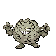
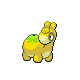

### Morning

| Sprite | Pokémon | Encounter Type | Level | Chance |
|:------:|---------|:--------------:|-------|--------|
|  | Graveler | {: style='max-width: 24px;' } | 28 - 32 | 30% |
|  | Houndour | {: style='max-width: 24px;' } | 28 - 32 | 20% |
|  | Rhyhorn | {: style='max-width: 24px;' } | 28 - 32 | 15% |
|  | Numel | {: style='max-width: 24px;' } | 28 - 32 | 15% |
|  | Spoink | {: style='max-width: 24px;' } | 28 - 32 | 10% |
|  | Cacnea | {: style='max-width: 24px;' } | 28 - 32 | 10% |

### Day

| Sprite | Pokémon | Encounter Type | Level | Chance |
|:------:|---------|:--------------:|-------|--------|
|  | Graveler | {: style='max-width: 24px;' } | 28 - 32 | 30% |
|  | Houndour | {: style='max-width: 24px;' } | 28 - 32 | 20% |
|  | Rhyhorn | {: style='max-width: 24px;' } | 28 - 32 | 15% |
|  | Numel | {: style='max-width: 24px;' } | 28 - 32 | 15% |
|  | Spoink | {: style='max-width: 24px;' } | 28 - 32 | 10% |
|  | Cacnea | {: style='max-width: 24px;' } | 28 - 32 | 10% |

### Night

| Sprite | Pokémon | Encounter Type | Level | Chance |
|:------:|---------|:--------------:|-------|--------|
|  | Graveler | {: style='max-width: 24px;' } | 28 - 32 | 30% |
|  | Houndour | {: style='max-width: 24px;' } | 28 - 32 | 20% |
|  | Rhyhorn | {: style='max-width: 24px;' } | 28 - 32 | 15% |
|  | Numel | {: style='max-width: 24px;' } | 28 - 32 | 15% |
|  | Spoink | {: style='max-width: 24px;' } | 28 - 32 | 10% |
|  | Cacnea | {: style='max-width: 24px;' } | 28 - 32 | 10% |

### Poke Radar

| Sprite | Pokémon | Encounter Type | Level | Chance |
|:------:|---------|:--------------:|-------|--------|
|  | Spinda | {: style='max-width: 24px;' } | ? | 22% |

### Surf

| Sprite | Pokémon | Encounter Type | Level | Chance |
|:------:|---------|:--------------:|-------|--------|
|  | Psyduck | {: style='max-width: 24px;' } | 20 - 40 | 90% |
|  | Golduck | {: style='max-width: 24px;' } | 20 - 40 | 10% |

### Old Rod

| Sprite | Pokémon | Encounter Type | Level | Chance |
|:------:|---------|:--------------:|-------|--------|
|  | Magikarp | {: style='max-width: 24px;' } | 10 | 65% |
|  | Goldeen | {: style='max-width: 24px;' } | 10 | 35% |

### Good Rod

| Sprite | Pokémon | Encounter Type | Level | Chance |
|:------:|---------|:--------------:|-------|--------|
|  | Magikarp | {: style='max-width: 24px;' } | 25 | 65% |
|  | Goldeen | {: style='max-width: 24px;' } | 25 | 35% |

### Super Rod

| Sprite | Pokémon | Encounter Type | Level | Chance |
|:------:|---------|:--------------:|-------|--------|
|  | Gyarados | {: style='max-width: 24px;' } | 50 | 65% |
|  | Seaking | {: style='max-width: 24px;' } | 50 | 35% |

### Honey Tree

| Sprite | Pokémon | Encounter Type | Level | Chance |
|:------:|---------|:--------------:|-------|--------|
|  | Aipom | {: style='max-width: 24px;' } | 30 | 30% |
|  | Vigoroth | {: style='max-width: 24px;' } | 30 | 20% |
|  | Butterfree | {: style='max-width: 24px;' } | 30 | 20% |
|  | Beedrill | {: style='max-width: 24px;' } | 30 | 20% |
|  | Munchlax | {: style='max-width: 24px;' } | 30 | 10% |

