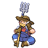

# Trainer Rosters

---

## Generic Trainers

| Trainer | P1 | P2 | P3 | P4 | P5 | P6 |
|:-------:|:--:|:--:|:--:|:--:|:--:|:--:|
|  Twins Teri & Tia |  Furret Lv. 32 |  Linoone Lv. 32 |
|  Jogger Wyatt |  Electrode Lv. 33 |
|  PKMN Breeder Kahlil |  Riolu Lv. 31 |  Chingling Lv. 31 |  Munchlax Lv. 31 |
|  PKMN Breeder Amber |  Mantyke Lv. 31 |  Happiny Lv. 31 |  Wynaut Lv. 31 |
|  Belle & Pa Ava & Matt |  Tauros Lv. 33 |  Miltank Lv. 33 |
|  Rancher Marco (!) |  Rapidash Lv. 33 |
|  Collector Fernando |  Dratini Lv. 31 |  Dragonair Lv. 33 |
|  Collector Edwin |  Bagon Lv. 31 |  Shelgon Lv. 33 |
|  Waitress Kati |  Clefable Lv. 33 |
