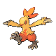

# Route 215 — Trainer Rosters

### Generic Trainers

| Trainer | P1 | P2 | P3 | P4 | P5 | P6 |
|:-------:|:--:|:--:|:--:|:--:|:--:|:--:|
|  Black Belt Derek |  [Combusken](../../pokemon/combusken.md/) Lv. 34 |  [Hitmonlee](../../pokemon/hitmonlee.md/) Lv. 34 |
|  Black Belt Gregory |  [Primeape](../../pokemon/primeape.md/) Lv. 34 |  [Hitmonchan](../../pokemon/hitmonchan.md/) Lv. 34 |
|  Black Belt Nathaniel |  [Machoke](../../pokemon/machoke.md/) Lv. 34 |  [Hitmontop](../../pokemon/hitmontop.md/) Lv. 34 |
|  Jogger Scott |  [Staraptor](../../pokemon/staraptor.md/) Lv. 34 |
|  Ruin Maniac Calvin |  [Marowak](../../pokemon/marowak.md/) Lv. 33 |  [Rampardos](../../pokemon/rampardos.md/) Lv. 33 |
| ") Jogger Craig [(!)](#rematches) |  [Luxray](../../pokemon/luxray.md/) Lv. 34 |
| ") Ace Trainer Dennis [(!)](#rematches) |  [Gligar](../../pokemon/gligar.md/) Lv. 35 |  [Gyarados](../../pokemon/gyarados.md/) Lv. 35 |  [Drifblim](../../pokemon/drifblim.md/) Lv. 35 |
| ") Ace Trainer Maya [(!)](#rematches) |  [Lickitung](../../pokemon/lickitung.md/) Lv. 35 |  [Gardevoir](../../pokemon/gardevoir.md/) Lv. 35 |  [Roserade](../../pokemon/roserade.md/) Lv. 35 |

### Rematches

| Trainer | P1 | P2 | P3 | P4 | P5 | P6 |
|:-------:|:--:|:--:|:--:|:--:|:--:|:--:|
| ") Jogger Craig (8) |  [Luxray](../../pokemon/luxray.md/) Lv. 60 |  [Luxray](../../pokemon/luxray.md/) Lv. 60 |
| ") Jogger Craig (C) |  [Luxray](../../pokemon/luxray.md/) Lv. 72 |  [Luxray](../../pokemon/luxray.md/) Lv. 72 |
| ") Ace Trainer Dennis (7) |  [Gliscor](../../pokemon/gliscor.md/) Lv. 62 |  [Gyarados](../../pokemon/gyarados.md/) Lv. 62 |  [Drifblim](../../pokemon/drifblim.md/) Lv. 62 |
| ") Ace Trainer Dennis (S) |  [Gliscor](../../pokemon/gliscor.md/) Lv. 77 |  [Gyarados](../../pokemon/gyarados.md/) Lv. 77 |  [Drifblim](../../pokemon/drifblim.md/) Lv. 77 |
| ") Ace Trainer Maya (7) |  [Lickilicky](../../pokemon/lickilicky.md/) Lv. 62 |  [Gardevoir](../../pokemon/gardevoir.md/) Lv. 62 |  [Roserade](../../pokemon/roserade.md/) Lv. 62 |
| ") Ace Trainer Maya (S) |  [Lickilicky](../../pokemon/lickilicky.md/) Lv. 77 |  [Gardevoir](../../pokemon/gardevoir.md/) Lv. 77 |  [Roserade](../../pokemon/roserade.md/) Lv. 77 |

