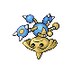
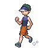

# Trainer Rosters

### Generic Trainers

| Trainer | P1 | P2 | P3 | P4 | P5 | P6 |
|:-------:|:--:|:--:|:--:|:--:|:--:|:--:|
|  Black Belt Derek |  Combusken Lv. 34 |  Hitmonlee Lv. 34 |
|  Black Belt Gregory |  Primeape Lv. 34 |  Hitmonchan Lv. 34 |
|  Black Belt Nathaniel |  Machoke Lv. 34 |  Hitmontop Lv. 34 |
|  Jogger Scott |  Staraptor Lv. 34 |
|  Ruin Maniac Calvin |  Marowak Lv. 33 |  Rampardos Lv. 33 |
| ](../../assets/trainers/jogger.png) Jogger Craig [(!)](#rematches) |  Luxray Lv. 34 |
| ](../../assets/trainers/ace_trainer.png) Ace Trainer Dennis [(!)](#rematches) |  Gligar Lv. 35 |  Gyarados Lv. 35 |  Drifblim Lv. 35 |
| ](../../assets/trainers/ace_trainer.png) Ace Trainer Maya [(!)](#rematches) |  Lickitung Lv. 35 |  Gardevoir Lv. 35 |  Roserade Lv. 35 |

### Rematches

| Trainer | P1 | P2 | P3 | P4 | P5 | P6 |
|:-------:|:--:|:--:|:--:|:--:|:--:|:--:|
|  Jogger Craig (8) |  Luxray Lv. 60 |  Luxray Lv. 60 |
|  Jogger Craig (C) |  Luxray Lv. 72 |  Luxray Lv. 72 |
|  Ace Trainer Dennis (7) |  Gliscor Lv. 62 |  Gyarados Lv. 62 |  Drifblim Lv. 62 |
|  Ace Trainer Dennis (S) |  Gliscor Lv. 77 |  Gyarados Lv. 77 |  Drifblim Lv. 77 |
|  Ace Trainer Maya (7) |  Lickilicky Lv. 62 |  Gardevoir Lv. 62 |  Roserade Lv. 62 |
|  Ace Trainer Maya (S) |  Lickilicky Lv. 77 |  Gardevoir Lv. 77 |  Roserade Lv. 77 |

