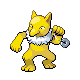
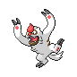

### Walking

| Sprite | Pokémon | Encounter Type | Level | Chance |
|:------:|---------|:--------------:|-------|--------|
|  | Marill | {: style='max-width: 24px;' } | 27 - 30 | 25% |
|  | Drowzee | {: style='max-width: 24px;' } | 27 - 30 | 20% |
|  | Lickitung | {: style='max-width: 24px;' } | 27 - 30 | 15% |
|  | Kadabra | {: style='max-width: 24px;' } | 27 - 30 | 15% |
|  | Mightyena | {: style='max-width: 24px;' } | 27 - 30 | 10% |
|  | Linoone | {: style='max-width: 24px;' } | 27 - 30 | 10% |
|  | Hypno | {: style='max-width: 24px;' } | 27 - 30 | 5% |
|  | Marill | {: style='max-width: 24px;' } | 27 - 30 | 25% |
|  | Drowzee | {: style='max-width: 24px;' } | 27 - 30 | 20% |
|  | Lickitung | {: style='max-width: 24px;' } | 27 - 30 | 15% |
|  | Kadabra | {: style='max-width: 24px;' } | 27 - 30 | 15% |
|  | Mightyena | {: style='max-width: 24px;' } | 27 - 30 | 10% |
|  | Linoone | {: style='max-width: 24px;' } | 27 - 30 | 10% |
|  | Hypno | {: style='max-width: 24px;' } | 27 - 30 | 5% |
|  | Marill | {: style='max-width: 24px;' } | 27 - 30 | 25% |
|  | Drowzee | {: style='max-width: 24px;' } | 27 - 30 | 20% |
|  | Lickitung | {: style='max-width: 24px;' } | 27 - 30 | 15% |
|  | Kadabra | {: style='max-width: 24px;' } | 27 - 30 | 15% |
|  | Mightyena | {: style='max-width: 24px;' } | 27 - 30 | 10% |
|  | Linoone | {: style='max-width: 24px;' } | 27 - 30 | 10% |
|  | Hypno | {: style='max-width: 24px;' } | 27 - 30 | 5% |
|  | Absol | {: style='max-width: 24px;' } | 27 - 30 | 22% |

### Honey Tree

| Sprite | Pokémon | Encounter Type | Level | Chance |
|:------:|---------|:--------------:|-------|--------|
|  | Aipom | {: style='max-width: 24px;' } | 28 | 30% |
|  | Vigoroth | {: style='max-width: 24px;' } | 28 | 20% |
|  | Metapod | {: style='max-width: 24px;' } | 28 | 20% |
|  | Kakuna | {: style='max-width: 24px;' } | 28 | 20% |
|  | Munchlax | {: style='max-width: 24px;' } | 28 | 10% |

