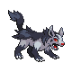

# Route 215 — Wild Pokémon

### Walking

| Sprite | Pokémon | Encounter Type | Level | Chance |
|:------:|---------|:--------------:|-------|--------|
|  | [Marill](../../pokemon/marill.md/) | {: style='max-width: 24px;' } | 27 - 30 | 25% |
|  | [Drowzee](../../pokemon/drowzee.md/) | {: style='max-width: 24px;' } | 27 - 30 | 20% |
|  | [Lickitung](../../pokemon/lickitung.md/) | {: style='max-width: 24px;' } | 27 - 30 | 15% |
|  | [Kadabra](../../pokemon/kadabra.md/) | {: style='max-width: 24px;' } | 27 - 30 | 15% |
|  | [Mightyena](../../pokemon/mightyena.md/) | {: style='max-width: 24px;' } | 27 - 30 | 10% |
|  | [Linoone](../../pokemon/linoone.md/) | {: style='max-width: 24px;' } | 27 - 30 | 10% |
|  | [Hypno](../../pokemon/hypno.md/) | {: style='max-width: 24px;' } | 27 - 30 | 5% |
|  | [Marill](../../pokemon/marill.md/) | {: style='max-width: 24px;' } | 27 - 30 | 25% |
|  | [Drowzee](../../pokemon/drowzee.md/) | {: style='max-width: 24px;' } | 27 - 30 | 20% |
|  | [Lickitung](../../pokemon/lickitung.md/) | {: style='max-width: 24px;' } | 27 - 30 | 15% |
|  | [Kadabra](../../pokemon/kadabra.md/) | {: style='max-width: 24px;' } | 27 - 30 | 15% |
|  | [Mightyena](../../pokemon/mightyena.md/) | {: style='max-width: 24px;' } | 27 - 30 | 10% |
|  | [Linoone](../../pokemon/linoone.md/) | {: style='max-width: 24px;' } | 27 - 30 | 10% |
|  | [Hypno](../../pokemon/hypno.md/) | {: style='max-width: 24px;' } | 27 - 30 | 5% |
|  | [Marill](../../pokemon/marill.md/) | {: style='max-width: 24px;' } | 27 - 30 | 25% |
|  | [Drowzee](../../pokemon/drowzee.md/) | {: style='max-width: 24px;' } | 27 - 30 | 20% |
|  | [Lickitung](../../pokemon/lickitung.md/) | {: style='max-width: 24px;' } | 27 - 30 | 15% |
|  | [Kadabra](../../pokemon/kadabra.md/) | {: style='max-width: 24px;' } | 27 - 30 | 15% |
|  | [Mightyena](../../pokemon/mightyena.md/) | {: style='max-width: 24px;' } | 27 - 30 | 10% |
|  | [Linoone](../../pokemon/linoone.md/) | {: style='max-width: 24px;' } | 27 - 30 | 10% |
|  | [Hypno](../../pokemon/hypno.md/) | {: style='max-width: 24px;' } | 27 - 30 | 5% |
|  | [Absol](../../pokemon/absol.md/) | {: style='max-width: 24px;' } | 27 - 30 | 22% |

### Honey Tree

| Sprite | Pokémon | Encounter Type | Level | Chance |
|:------:|---------|:--------------:|-------|--------|
|  | [Aipom](../../pokemon/aipom.md/) | {: style='max-width: 24px;' } | 28 | 30% |
|  | [Vigoroth](../../pokemon/vigoroth.md/) | {: style='max-width: 24px;' } | 28 | 20% |
|  | [Metapod](../../pokemon/metapod.md/) | {: style='max-width: 24px;' } | 28 | 20% |
|  | [Kakuna](../../pokemon/kakuna.md/) | {: style='max-width: 24px;' } | 28 | 20% |
|  | [Munchlax](../../pokemon/munchlax.md/) | {: style='max-width: 24px;' } | 28 | 10% |

