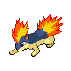

# Route 216 — Trainer Rosters

### Generic Trainers

| Trainer | P1 | P2 | P3 | P4 | P5 | P6 |
|:-------:|:--:|:--:|:--:|:--:|:--:|:--:|
|  Ace Trainer Blake |  [Porygon](../../pokemon/porygon.md/) Lv. 23 |  [Vigoroth](../../pokemon/vigoroth.md/) Lv. 23 |
|  Ace Trainer Maria |  [Quagsire](../../pokemon/quagsire.md/) Lv. 22 |  [Quilava](../../pokemon/quilava.md/) Lv. 22 |  [Sudowoodo](../../pokemon/sudowoodo.md/) Lv. 22 |
|  Ace Trainer Laura |  [Togetic](../../pokemon/togetic.md/) Lv. 23 |  [Swellow](../../pokemon/swellow.md/) Lv. 23 |
| ") Skier Edward [(!)](#rematches) |  [Snover](../../pokemon/snover.md/) Lv. 20 |  [Snorunt](../../pokemon/snorunt.md/) Lv. 20 |  [Swinub](../../pokemon/swinub.md/) Lv. 20 |
|  Ace Trainer Garrett |  [Mr. Mime](../../pokemon/mr-mime.md/) Lv. 22 |  [Nuzleaf](../../pokemon/nuzleaf.md/) Lv. 22 |  [Scyther](../../pokemon/scyther.md/) Lv. 22 |
| ") Black Belt Philip [(!)](#rematches) |  [Hariyama](../../pokemon/hariyama.md/) Lv. 56 |  [Machamp](../../pokemon/machamp.md/) Lv. 56 |
|  Skier Bradley |  [Piloswine](../../pokemon/piloswine.md/) Lv. 54 |  [Glalie](../../pokemon/glalie.md/) Lv. 54 |
|  Skier Kaitlyn |  [Lapras](../../pokemon/lapras.md/) Lv. 55 |
| ") Skier Andrea [(!)](#rematches) |  [Abomasnow](../../pokemon/abomasnow.md/) Lv. 55 |

### Rematches

| Trainer | P1 | P2 | P3 | P4 | P5 | P6 |
|:-------:|:--:|:--:|:--:|:--:|:--:|:--:|
| ") Skier Edward (8) |  [Abomasnow](../../pokemon/abomasnow.md/) Lv. 59 |  [Glalie](../../pokemon/glalie.md/) Lv. 59 |  [Piloswine](../../pokemon/piloswine.md/) Lv. 59 |
| ") Skier Edward (C) |  [Abomasnow](../../pokemon/abomasnow.md/) Lv. 70 |  [Glalie](../../pokemon/glalie.md/) Lv. 70 |  [Mamoswine](../../pokemon/mamoswine.md/) Lv. 70 |
| ") Black Belt Philip (C) |  [Hariyama](../../pokemon/hariyama.md/) Lv. 70 |  [Machamp](../../pokemon/machamp.md/) Lv. 70 |  [Poliwrath](../../pokemon/poliwrath.md/) Lv. 70 |
| ") Skier Andrea (8) |  [Abomasnow](../../pokemon/abomasnow.md/) Lv. 61 |
| ") Skier Andrea (C) |  [Abomasnow](../../pokemon/abomasnow.md/) Lv. 72 |

