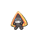

# Route 216 — Wild Pokémon

### Walking

| Sprite | Pokémon | Encounter Type | Level | Chance |
|:------:|---------|:--------------:|-------|--------|
|  | [Snover](../../pokemon/snover.md/) | {: style='max-width: 24px;' } | 18 - 20 | 30% |
|  | [Swinub](../../pokemon/swinub.md/) | {: style='max-width: 24px;' } | 18 - 20 | 25% |
|  | [Smoochum](../../pokemon/smoochum.md/) | {: style='max-width: 24px;' } | 18 - 20 | 20% |
|  | [Snorunt](../../pokemon/snorunt.md/) | {: style='max-width: 24px;' } | 18 - 20 | 15% |
|  | [Sneasel](../../pokemon/sneasel.md/) | {: style='max-width: 24px;' } | 18 - 20 | 10% |
|  | [Snover](../../pokemon/snover.md/) | {: style='max-width: 24px;' } | 18 - 20 | 30% |
|  | [Swinub](../../pokemon/swinub.md/) | {: style='max-width: 24px;' } | 18 - 20 | 25% |
|  | [Smoochum](../../pokemon/smoochum.md/) | {: style='max-width: 24px;' } | 18 - 20 | 20% |
|  | [Snorunt](../../pokemon/snorunt.md/) | {: style='max-width: 24px;' } | 18 - 20 | 15% |
|  | [Sneasel](../../pokemon/sneasel.md/) | {: style='max-width: 24px;' } | 18 - 20 | 10% |
|  | [Snover](../../pokemon/snover.md/) | {: style='max-width: 24px;' } | 18 - 20 | 30% |
|  | [Swinub](../../pokemon/swinub.md/) | {: style='max-width: 24px;' } | 18 - 20 | 25% |
|  | [Smoochum](../../pokemon/smoochum.md/) | {: style='max-width: 24px;' } | 18 - 20 | 20% |
|  | [Snorunt](../../pokemon/snorunt.md/) | {: style='max-width: 24px;' } | 18 - 20 | 15% |
|  | [Sneasel](../../pokemon/sneasel.md/) | {: style='max-width: 24px;' } | 18 - 20 | 10% |
|  | [Delibird](../../pokemon/delibird.md/) | {: style='max-width: 24px;' } | 18 - 20 | 22% |

