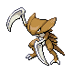

# Route 218 — Trainer Rosters

### Generic Trainers

| Trainer | P1 | P2 | P3 | P4 | P5 | P6 |
|:-------:|:--:|:--:|:--:|:--:|:--:|:--:|
| ") Fisherman Miguel [(!)](#rematches) |  [Huntail](../../pokemon/huntail.md/) Lv. 44 |  [Gorebyss](../../pokemon/gorebyss.md/) Lv. 44 |
|  Fisherman Luc |  [Crawdaunt](../../pokemon/crawdaunt.md/) Lv. 45 |
|  Sailor Skyler |  [Omastar](../../pokemon/omastar.md/) Lv. 43 |  [Kabutops](../../pokemon/kabutops.md/) Lv. 43 |  [Relicanth](../../pokemon/relicanth.md/) Lv. 43 |
| ") Guitarist Tony [(!)](#rematches) |  [Kricketune](../../pokemon/kricketune.md/) Lv. 44 |  [Exploud](../../pokemon/exploud.md/) Lv. 44 |

### Rematches

| Trainer | P1 | P2 | P3 | P4 | P5 | P6 |
|:-------:|:--:|:--:|:--:|:--:|:--:|:--:|
| ") Fisherman Miguel (C) |  [Clamperl](../../pokemon/clamperl.md/) Lv. 70 |  [Huntail](../../pokemon/huntail.md/) Lv. 70 |  [Gorebyss](../../pokemon/gorebyss.md/) Lv. 70 |
| ") Guitarist Tony (C) |  [Kricketune](../../pokemon/kricketune.md/) Lv. 71 |  [Exploud](../../pokemon/exploud.md/) Lv. 71 |

