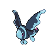
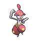

# Trainer Rosters

### Generic Trainers

| Trainer | P1 | P2 | P3 | P4 | P5 | P6 |
|:-------:|:--:|:--:|:--:|:--:|:--:|:--:|
|  Swimmer Jessica |  Seadra Lv. 43 |  Luvdisc Lv. 43 |  Seaking Lv. 43 |
|  Swimmer Erica |  Lumineon Lv. 44 |  Corsola Lv. 44 |
|  Swimmer Adrian |  Octillery Lv. 43 |  Tentacruel Lv. 43 |  Slowking Lv. 43 |
|  Swimmer Vincent |  Wailord Lv. 45 |
|  Swimmer Claire |  Starmie Lv. 44 |  Blastoise Lv. 44 |
|  Swimmer Erik |  Politoed Lv. 44 |  Lanturn Lv. 44 |
|  Swimmer Katelyn |  Floatzel Lv. 43 |  Medicham Lv. 43 |  Seaking Lv. 43 |

