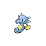
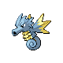

# Route 220 — Wild Pokémon

### Surfing

| Sprite | Pokémon | Encounter Type | Level | Chance |
|:------:|---------|:--------------:|-------|--------|
|  | [Wingull](../../pokemon/wingull.md/) | {: style='max-width: 24px;' } | 20 - 40 | 60% |
|  | [Mantyke](../../pokemon/mantyke.md/) | {: style='max-width: 24px;' } | 20 - 40 | 30% |
|  | [Pelipper](../../pokemon/pelipper.md/) | {: style='max-width: 24px;' } | 20 - 40 | 5% |
|  | [Mantine](../../pokemon/mantine.md/) | {: style='max-width: 24px;' } | 20 - 40 | 5% |

### Fishing

| Sprite | Pokémon | Encounter Type | Level | Chance |
|:------:|---------|:--------------:|-------|--------|
|  | [Luvdisc](../../pokemon/luvdisc.md/) | {: style='max-width: 24px;' } | 10 | 60% |
|  | [Horsea](../../pokemon/horsea.md/) | {: style='max-width: 24px;' } | 10 | 30% |
|  | [Corsola](../../pokemon/corsola.md/) | {: style='max-width: 24px;' } | 10 | 10% |
|  | [Luvdisc](../../pokemon/luvdisc.md/) | {: style='max-width: 24px;' } | 25 | 60% |
|  | [Horsea](../../pokemon/horsea.md/) | {: style='max-width: 24px;' } | 25 | 30% |
|  | [Corsola](../../pokemon/corsola.md/) | {: style='max-width: 24px;' } | 25 | 10% |
|  | [Luvdisc](../../pokemon/luvdisc.md/) | {: style='max-width: 24px;' } | 50 | 60% |
|  | [Seadra](../../pokemon/seadra.md/) | {: style='max-width: 24px;' } | 50 | 30% |
|  | [Corsola](../../pokemon/corsola.md/) | {: style='max-width: 24px;' } | 50 | 10% |

