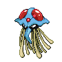

# Route 221 — Wild Pokémon

### Walking

| Sprite | Pokémon | Encounter Type | Level | Chance |
|:------:|---------|:--------------:|-------|--------|
|  | [Sudowoodo](../../pokemon/sudowoodo.md/) | {: style='max-width: 24px;' } | 38 - 40 | 20% |
|  | [Skuntank](../../pokemon/skuntank.md/) | {: style='max-width: 24px;' } | 38 - 40 | 20% |
|  | [Nidorina](../../pokemon/nidorina.md/) | {: style='max-width: 24px;' } | 38 - 40 | 15% |
|  | [Nidorino](../../pokemon/nidorino.md/) | {: style='max-width: 24px;' } | 38 - 40 | 15% |
|  | [Farfetch'd](../../pokemon/farfetchd.md/) | {: style='max-width: 24px;' } | 38 - 40 | 10% |
|  | [Girafarig](../../pokemon/girafarig.md/) | {: style='max-width: 24px;' } | 38 - 40 | 10% |
|  | [Dodrio](../../pokemon/dodrio.md/) | {: style='max-width: 24px;' } | 38 - 40 | 10% |
|  | [Sudowoodo](../../pokemon/sudowoodo.md/) | {: style='max-width: 24px;' } | 38 - 40 | 20% |
|  | [Skuntank](../../pokemon/skuntank.md/) | {: style='max-width: 24px;' } | 38 - 40 | 20% |
|  | [Nidorina](../../pokemon/nidorina.md/) | {: style='max-width: 24px;' } | 38 - 40 | 15% |
|  | [Nidorino](../../pokemon/nidorino.md/) | {: style='max-width: 24px;' } | 38 - 40 | 15% |
|  | [Farfetch'd](../../pokemon/farfetchd.md/) | {: style='max-width: 24px;' } | 38 - 40 | 10% |
|  | [Girafarig](../../pokemon/girafarig.md/) | {: style='max-width: 24px;' } | 38 - 40 | 10% |
|  | [Dodrio](../../pokemon/dodrio.md/) | {: style='max-width: 24px;' } | 38 - 40 | 10% |
|  | [Sudowoodo](../../pokemon/sudowoodo.md/) | {: style='max-width: 24px;' } | 38 - 40 | 20% |
|  | [Skuntank](../../pokemon/skuntank.md/) | {: style='max-width: 24px;' } | 38 - 40 | 20% |
|  | [Nidorina](../../pokemon/nidorina.md/) | {: style='max-width: 24px;' } | 38 - 40 | 15% |
|  | [Nidorino](../../pokemon/nidorino.md/) | {: style='max-width: 24px;' } | 38 - 40 | 15% |
|  | [Farfetch'd](../../pokemon/farfetchd.md/) | {: style='max-width: 24px;' } | 38 - 40 | 10% |
|  | [Girafarig](../../pokemon/girafarig.md/) | {: style='max-width: 24px;' } | 38 - 40 | 10% |
|  | [Dodrio](../../pokemon/dodrio.md/) | {: style='max-width: 24px;' } | 38 - 40 | 10% |

### Surfing

| Sprite | Pokémon | Encounter Type | Level | Chance |
|:------:|---------|:--------------:|-------|--------|
|  | [Wingull](../../pokemon/wingull.md/) | {: style='max-width: 24px;' } | 30 - 45 | 60% |
|  | [Tentacool](../../pokemon/tentacool.md/) | {: style='max-width: 24px;' } | 30 - 45 | 30% |
|  | [Pelipper](../../pokemon/pelipper.md/) | {: style='max-width: 24px;' } | 30 - 45 | 5% |
|  | [Tentacruel](../../pokemon/tentacruel.md/) | {: style='max-width: 24px;' } | 30 - 45 | 5% |

### Fishing

| Sprite | Pokémon | Encounter Type | Level | Chance |
|:------:|---------|:--------------:|-------|--------|
|  | [Krabby](../../pokemon/krabby.md/) | {: style='max-width: 24px;' } | 10 | 60% |
|  | [Horsea](../../pokemon/horsea.md/) | {: style='max-width: 24px;' } | 10 | 30% |
|  | [Clamperl](../../pokemon/clamperl.md/) | {: style='max-width: 24px;' } | 10 | 10% |
|  | [Krabby](../../pokemon/krabby.md/) | {: style='max-width: 24px;' } | 25 | 60% |
|  | [Horsea](../../pokemon/horsea.md/) | {: style='max-width: 24px;' } | 25 | 30% |
|  | [Clamperl](../../pokemon/clamperl.md/) | {: style='max-width: 24px;' } | 25 | 10% |
|  | [Kingler](../../pokemon/kingler.md/) | {: style='max-width: 24px;' } | 50 | 60% |
|  | [Horsea](../../pokemon/horsea.md/) | {: style='max-width: 24px;' } | 50 | 30% |
|  | [Huntail](../../pokemon/huntail.md/) | {: style='max-width: 24px;' } | 50 | 5% |
|  | [Gorebyss](../../pokemon/gorebyss.md/) | {: style='max-width: 24px;' } | 50 | 5% |

### Honey Tree

| Sprite | Pokémon | Encounter Type | Level | Chance |
|:------:|---------|:--------------:|-------|--------|
|  | [Cherrim](../../pokemon/cherrim.md/) | {: style='max-width: 24px;' } | 39 | 30% |
|  | [Shroomish](../../pokemon/shroomish.md/) | {: style='max-width: 24px;' } | 39 | 20% |
|  | [Exeggcute](../../pokemon/exeggcute.md/) | {: style='max-width: 24px;' } | 39 | 20% |
|  | [Nuzleaf](../../pokemon/nuzleaf.md/) | {: style='max-width: 24px;' } | 39 | 20% |
|  | [Tangela](../../pokemon/tangela.md/) | {: style='max-width: 24px;' } | 39 | 10% |

