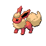

# Route 222 — Trainer Rosters

### Generic Trainers

| Trainer | P1 | P2 | P3 | P4 | P5 | P6 |
|:-------:|:--:|:--:|:--:|:--:|:--:|:--:|
| ") Rich Boy Trey [(!)](#rematches) |  [Luxray](../../pokemon/luxray.md/) Lv. 57 |  [Sceptile](../../pokemon/sceptile.md/) Lv. 57 |  [Linoone](../../pokemon/linoone.md/) Lv. 57 |
|  Beauty Nicola |  [Lopunny](../../pokemon/lopunny.md/) Lv. 57 |  [Flareon](../../pokemon/flareon.md/) Lv. 57 |  [Meganium](../../pokemon/meganium.md/) Lv. 57 |
|  Policeman Thomas |  [Noctowl](../../pokemon/noctowl.md/) Lv. 59 |
| ") Sailor Marc [(!)](#rematches) |  [Lanturn](../../pokemon/lanturn.md/) Lv. 57 |  [Machamp](../../pokemon/machamp.md/) Lv. 57 |  [Mantine](../../pokemon/mantine.md/) Lv. 57 |
|  Tuber Conner |  [Remoraid](../../pokemon/remoraid.md/) Lv. 57 |  [Remoraid](../../pokemon/remoraid.md/) Lv. 57 |
|  Sailor Luther |  [Pelipper](../../pokemon/pelipper.md/) Lv. 56 |  [Gastrodon](../../pokemon/gastrodon.md/) Lv. 56 |  [Poliwrath](../../pokemon/poliwrath.md/) Lv. 56 |  [Kingler](../../pokemon/kingler.md/) Lv. 56 |
| ") Fisherman Alec [(!)](#rematches) |  [Gyarados](../../pokemon/gyarados.md/) Lv. 57 |  [Gyarados](../../pokemon/gyarados.md/) Lv. 57 |  [Gyarados](../../pokemon/gyarados.md/) Lv. 57 |
|  Fisherman George |  [Octillery](../../pokemon/octillery.md/) Lv. 58 |  [Lumineon](../../pokemon/lumineon.md/) Lv. 58 |
|  Fisherman Brett |  [Qwilfish](../../pokemon/qwilfish.md/) Lv. 59 |
|  Fisherman Cole |  [Seaking](../../pokemon/seaking.md/) Lv. 57 |  [Sharpedo](../../pokemon/sharpedo.md/) Lv. 57 |  [Kingdra](../../pokemon/kingdra.md/) Lv. 57 |
|  Tuber Holly |  [Azumarill](../../pokemon/azumarill.md/) Lv. 58 |
|  Poke Kid Janet |  [Pikachu](../../pokemon/pikachu.md/) Lv. 57 |  [Pikachu](../../pokemon/pikachu.md/) Lv. 57 |

### Rematches

| Trainer | P1 | P2 | P3 | P4 | P5 | P6 |
|:-------:|:--:|:--:|:--:|:--:|:--:|:--:|
| ") Rich Boy Trey (C) |  [Luxray](../../pokemon/luxray.md/) Lv. 70 |  [Sceptile](../../pokemon/sceptile.md/) Lv. 70 |  [Linoone](../../pokemon/linoone.md/) Lv. 70 |
| ") Rich Boy Trey (S) |  [Luxray](../../pokemon/luxray.md/) Lv. 75 |  [Sceptile](../../pokemon/sceptile.md/) Lv. 75 |  [Linoone](../../pokemon/linoone.md/) Lv. 75 |
| ") Sailor Marc (C) |  [Lanturn](../../pokemon/lanturn.md/) Lv. 70 |  [Machamp](../../pokemon/machamp.md/) Lv. 70 |  [Mantine](../../pokemon/mantine.md/) Lv. 70 |
| ") Sailor Marc (S) |  [Lanturn](../../pokemon/lanturn.md/) Lv. 75 |  [Machamp](../../pokemon/machamp.md/) Lv. 75 |  [Mantine](../../pokemon/mantine.md/) Lv. 75 |
| ") Fisherman Alec (C) |  [Gyarados](../../pokemon/gyarados.md/) Lv. 70 |  [Gyarados](../../pokemon/gyarados.md/) Lv. 70 |  [Gyarados](../../pokemon/gyarados.md/) Lv. 70 |

