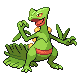

# Trainer Rosters

### Generic Trainers

| Trainer | P1 | P2 | P3 | P4 | P5 | P6 |
|:-------:|:--:|:--:|:--:|:--:|:--:|:--:|
| ](../../assets/trainers/rich_boy.png "Rich Boy Trey [(!)](#rematches)") Rich Boy Trey [(!)](#rematches) |  Luxray Lv. 57 |  Sceptile Lv. 57 |  Linoone Lv. 57 |
|  Beauty Nicola |  Lopunny Lv. 57 |  Flareon Lv. 57 |  Meganium Lv. 57 |
|  Policeman Thomas |  Noctowl Lv. 59 |
| ](../../assets/trainers/sailor.png "Sailor Marc [(!)](#rematches)") Sailor Marc [(!)](#rematches) |  Lanturn Lv. 57 |  Machamp Lv. 57 |  Mantine Lv. 57 |
|  Tuber Conner |  Remoraid Lv. 57 |  Remoraid Lv. 57 |
|  Sailor Luther |  Pelipper Lv. 56 |  Gastrodon Lv. 56 |  Poliwrath Lv. 56 |  Kingler Lv. 56 |
| ](../../assets/trainers/fisherman.png "Fisherman Alec [(!)](#rematches)") Fisherman Alec [(!)](#rematches) |  Gyarados Lv. 57 |  Gyarados Lv. 57 |  Gyarados Lv. 57 |
|  Fisherman George |  Octillery Lv. 58 |  Lumineon Lv. 58 |
|  Fisherman Brett |  Qwilfish Lv. 59 |
|  Fisherman Cole |  Seaking Lv. 57 |  Sharpedo Lv. 57 |  Kingdra Lv. 57 |
|  Tuber Holly |  Azumarill Lv. 58 |
|  Poke Kid Janet |  Pikachu Lv. 57 |  Pikachu Lv. 57 |

### Rematches

| Trainer | P1 | P2 | P3 | P4 | P5 | P6 |
|:-------:|:--:|:--:|:--:|:--:|:--:|:--:|
| ") Rich Boy Trey (C) |  Luxray Lv. 70 |  Sceptile Lv. 70 |  Linoone Lv. 70 |
| ") Rich Boy Trey (S) |  Luxray Lv. 75 |  Sceptile Lv. 75 |  Linoone Lv. 75 |
| ") Sailor Marc (C) |  Lanturn Lv. 70 |  Machamp Lv. 70 |  Mantine Lv. 70 |
| ") Sailor Marc (S) |  Lanturn Lv. 75 |  Machamp Lv. 75 |  Mantine Lv. 75 |
| ") Fisherman Alec (C) |  Gyarados Lv. 70 |  Gyarados Lv. 70 |  Gyarados Lv. 70 |

